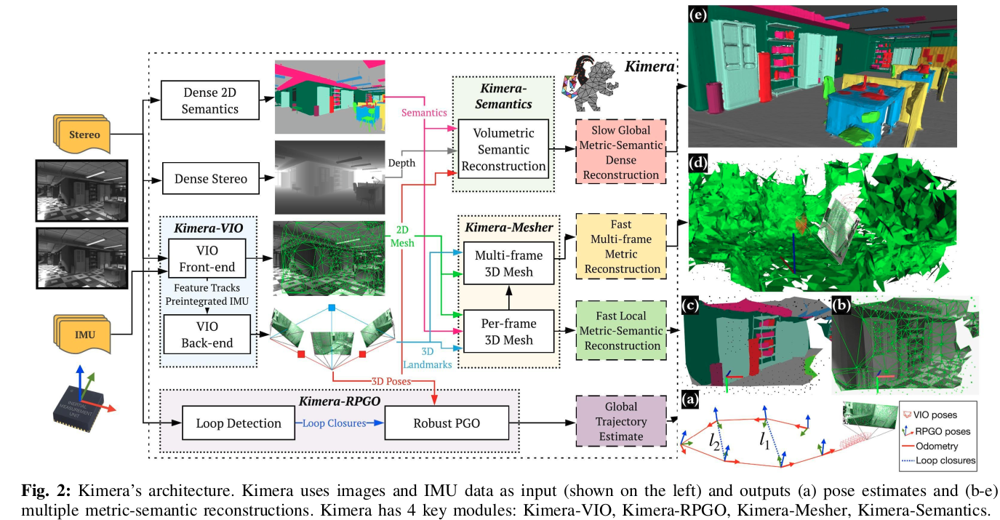
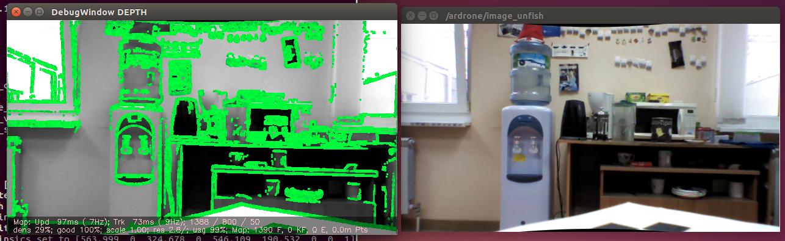

= plan for documenting
22.12.2021

:toc: macro

.Необходимо описать
1. Использование камер глубины в задачах навигации внутри и вне помещений. - 20 стр.
2. Использование RGB-камер (моно, стерео) в задачах навигации внутри и вне помещений. - 20 стр.
3. Описание алгоритмов ORB SLAM, особенно методов ИИ, используемых в них. - 50 стр.

Ссылки на литературу, листинги отдельных алгоритмов, примеры, картинки.
Сделать 3 отдельных word документа (14 шрифт, полуторный интервал).
Контекст - документ ПЗ для Интеллект Н.

===================================

посмотреть то же для автомобилей, как используется

* "Камеры глубины — тихая революция (когда роботы будут видеть) Часть 1 / Хабр" https://habr.com/ru/post/457524/
* "Depth Sensing Takes Machine Vision into Another Dimension - EE Times Europe" https://www.eetimes.eu/depth-sensing-takes-machine-vision-into-another-dimension/
* "Real-Time High Resolution 3D Depth Sensing Enters the Next Round – Metrology and Quality News - Online Magazine" https://metrology.news/real-time-high-resolution-3d-depth-sensing-enters-the-next-round/
* "Products – Nerian Vision Technologies" https://nerian.com/products/
* "Depth Sensing Overview | Stereolabs" https://www.stereolabs.com/docs/depth-sensing/
* "Depth Sensors: Precision & Personal Privacy | Terabee" https://www.terabee.com/depth-sensors-precision-personal-privacy/
* "MIT-SPARK/Kimera-VIO: Visual Inertial Odometry with SLAM capabilities and 3D Mesh generation." https://github.com/MIT-SPARK/Kimera-VIO
* "[1910.02490] Kimera: an Open-Source Library for Real-Time Metric-Semantic Localization and Mapping" https://arxiv.org/abs/1910.02490
* "Vision-based SLAM: стерео- и depth-SLAM / Хабр" https://habr.com/ru/company/singularis/blog/279035/a

посмотреть алгоритмы с учетом сегментации, сделать обзор

image::images/visual-slam-d4d65.png[]

.Kimera: an Open-Source Library for Real-Time Metric-Semantic Localization and Mapping https://arxiv.org/abs/1910.02490

https://github.com/MIT-SPARK/Kimera-VIO

- review-taxonomy-of-slams-backend-optimization
https://gisbi.medium.com/review-taxonomy-of-slams-backend-optimization-d1fa08ffec39

- reference awesome-SLAM-list Visual Odometry (image based only)
https://github.com/OpenSLAM/awesome-SLAM-list

- Real-Time Appearance-Based Mapping http://introlab.github.io/rtabmap/
- Four Kilometers Walk in Forest (an uncut real-time visual SLAM demo) https://www.youtube.com/watch?v=G-5jesjNfLc

- Vision-based SLAM: стерео- и depth-SLAM https://habr.com/ru/company/singularis/blog/279035/

- Kimera: an Open-Source Library for Real-Time Metric-Semantic Localization and Mapping https://arxiv.org/abs/1910.02490

===================================

Цель состоит в том, чтобы создать систему навигации с точностью менее 10 см

Например, LiDAR являются основным датчиком для обнаружения объектов на больших расстояниях, до сотен метров. 

Существует множество реализации SLAM методов с использованием нейросетей, включая: 
- Рекуррентные сверточные нейронные сети (Recurrent Convolutional Neural Networks, RCNNs).
- Рекуррентная нейронная сеть c обучением (с) без учителя (Recurrent Neural Network for (Un-)Supervised Learning).
- Глубокие нейронные сети (Deep Neural Networks (DNNs)) и другие.
Будет выбрана лучшая реализация на основании оценки точности позиционирования и требований к ресурсам вычислителя.

Для этого будут использованы современные методы искусственного интеллекта и машинного обучения в сочетании с методами оптимизации.
Для позиционирования на НУ будут использованы сжатые-AI модели, обученные на стороне сервера и в последствии оптимизированные для работы на НУ. 
За основу AI-алгоритмов могут быть взяты рекуррентные нейронные сети.
====

описать как разделить slam между сервером и устройством, загрузка карты, локализация

// - LiDAR вместо камеры глубины. Лазеры, измеряющие время полета, - наиболее точный принцип измерения расстояний. На сегодняшний день лидары - самые надежные датчики для измерения объектов на большом расстоянии (более 100 м). Недостатком этого датчика является разрешение и плотность точек. Примеры производителей - Velodyne или Ouster.

- slam - готовый обзор по методам
- аппроксимация радиокарты - найти, видел статьи, кодирование ээг сигналов, по аналогии??
- позиционирование - 

== Использование камер глубины в задачах навигации внутри и вне помещений. - 20 стр.

.задачи навигации внутри и вне помещений
* какие задачи (навигация объекта, контроль с внешних камер(локализация, навигация, трекинг))
* какие носители (коптер, робот, автомобиль, человек со смартфоном )
* контекст

.задачи навигации внутри и вне помещений
* движение по маршруту, позиционирование
* контроль окружения (определение объектов, людей) - избежание столкновений
* todo about navigation

Vision-based SLAM: стерео- и depth-SLAM
https://habr.com/ru/company/singularis/blog/279035/

== Использование RGB-камер (моно, стерео) в задачах навигации внутри и вне помещений. - 20 стр.

LSD-SLAM: Large-Scale Direct Monocular SLAM
https://vision.in.tum.de/research/vslam/lsdslam?redirect=1

http://vision.in.tum.de/_media/research/lsdslam/pointcloud.jpg

SLAM (с англ. одновременная локализация и картография),
Навигация в плотных (и не очень) облаках точек, Планирование по Карте Препятствий (OccupancyMap)
https://habr.com/ru/post/327888/ - статья с картинками

Когда использовать LSD SLAM? https://habr.com/ru/company/singularis/blog/277537/
// Если Вам необходима плотная карта местности (например, для построения карты препятствий), или окружение не содержит достаточно фич (features), то есть включает слаботекстурированные крупные объекты, и Ваша платформа предоставляет достаточные вычислительные возможности, тогда Вам подойдет LSD SLAM.
//

.LSD SLAM

.ORB SLAMv2
image::images/plan-696cf.png[width=280]

//
// smoothing-and-mapping: https://github.com/ccorcos/robotics-smoothing-and-mapping/blob/master/README.md

== Описание алгоритмов ORB SLAM, особенно методов ИИ, используемых в них. - 50 стр.

статья по методам ии, описание текстом, смотрю сейчас
https://programmersought.com/article/87761070085/
//
// ORB SLAM2 https://github.com/raulmur/ORB_SLAM2
//

=== ORB SLAM3

прочитать статью, сделать общий обзор

ORB-SLAM3 paper summary https://programmersought.com/article/85105331899/

разобрать https://programmersought.com/article/87761070085/

Feature Matching https://docs.opencv.org/3.0-beta/doc/py_tutorials/py_feature2d/py_matcher/py_matcher.html
