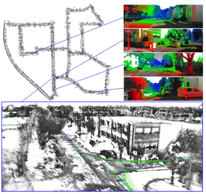
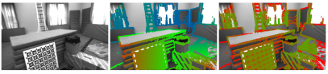
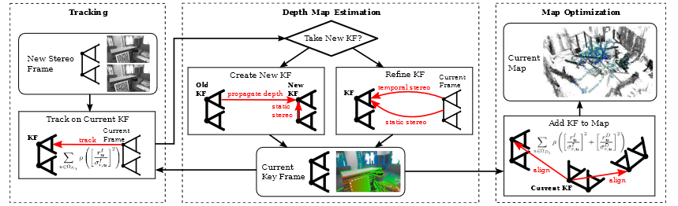
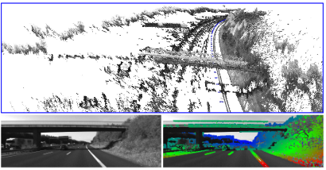
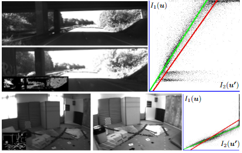
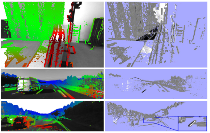
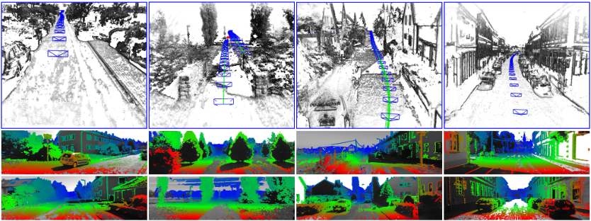

= Крупномасштабная Прямая SLAM с стерео камеры

Рассмотрим метод LSD-SLAM в качестве альтернативы для метода ORB-SLAM в контексте применения для локализациии и навигации по камере.

Полномасштабный алгоритм для стерео камеры (stereo LSD-SLAM), который работает в режиме реального времени с высокой частотой на стандартных устройствах без необходиимости аппаратного ускорения.  

В отличие от в разреженных методов на основе характерных точек, этот метод напрямую выравнивает изображения основываясь на соответствии высокой контрастности всех пикселов изображений, в том числе положении характерных элементов углов, кромок, градиентов и текстурных элементов. 
Алгоритм одновременно оценивает глубину в этих пикселях по двум типам стереосигналов: статическое стерео с помощью калиброванной стереокамеры с фиксированным взаимным положением камер, а  также временное многовидовое стерео, использующее движение камеры.

Используя оба источника информации, алгоритм может даже оценить глубину пикселей, которые не являются полностью определеннными при использовании только фиксированного базового метода стереокамеры.  
Использование стереокамеры позволяет доограничивать систему для избежания масштабного дрейфа в предсказанных координатах глубины, что часто происходит в чистом моно SLAM методах.  

Авторы также предлагают разумный подход для использования условия инвариантности освещенности сцены, что должно позволитьработу в сценах с агрессивными изменениями яркости между кадрами. Зафиксировано значительно улучшение в производительности для реалистичных сценариев использования метода. 

== ВВЕДЕНИЕ

Большинство методов SLAM стремится на первоначальном этапе алгоритам минимизировать количество информации для обработки. Методы сжатия изображения, методы извлечения характерных точек - дескрипторов и аналогичные. На выходе эти методы дают небольшой набор данных с котором просто проводить операции, но в котором отсутствует большая часть информации сцены и карты. 
Вместо прямой обработки изображений они сопоставляют только характерные точки.

С развитием аппаратной базы компьютеров и методов обработки изображений стало возможно обработать достаточное количество изображений в реальном времени. 

Были предложены методы которые учитывая ограничения на поток света в сцене проводят реконструкцию глубины сцены непосредственно на пикселях, используя ограничение непрерывности градиента освещенности сцены. 

Предпосылка к переходу на прямые методы обработки изображений на замену методам основанным на характерных точках заключается в том, что информация изображения может использоваться плотно и без потери точности. Нет искуственного ручного дизайна алгоритма выбора точек интереса  и функций детекторов, дескрипторов, не требуются функции сопоставления изображений, нет ограничения для алгоритм на конкретный типа функции дескриптора, вся карта хранится в исзодном несжатом формате. Напротив, в прямых методах SLAM, полный набор данных позволяет улучшить качество оценки глубины и картирование.

В работе () пердставлен первый полноценный крупномасштабный алгоритм работы прямого визуального SLAM для стереокамер, который поддерживает работу в реальном времени. 

Метод вычисляет глубины с оценками неопределенности в пикселях с высокой интенсивностью градиента в изображении, восстановлением полуплотной карты глубины в режиме реального времени. Метод позволяет одновременно отслеживать движение твердого тела с помощью фотометрического выравнивания изображений, основанного на самих картах глубины.

В другой работе() представлен монокулярный SLAM (LSD-SLAM), где глубина в ключевых кадрах определяется по попиксельной разнице между ключевыми кадрами.

 

Рис. 1. Stereo LSD-SLAM - это полностью прямой метод SLAM для стереокамер . Он работает с частотой 30 Гц на процессоре, вычисляя точное движение камеры, а также полу-плотные вероятностные карты глубины. Мы используем как статическое, так и временное стерео и исправляем аффинные изменения молнии, что делает метод точным и надежным в реальных сценариях. Некоторые примеры приведены в с прикрепленным видео.

 
Движение камеры отслеживается по направлению к ключевому кадру посредством фотометрического выравнивания изображения. Для SLAM в глобальном масштабе, ключевые кадры будут выровнены по направлению друг к другу , и их позы оптимизированы путем оптимизации графика. Поскольку реконструкция масштаб не наблюдается в монокулярном SLAM, производится дополнительная оптимизация для масштаба как при процедуре выравнивания изображений так и при оптимизации графа положений камеры.

При работе со стереокамерой с фиксированным междукамерным расстоянием, можно применить LSD-SLAM со статическим стерео режимом, то есть использовать получение данных глубины с определенной точностью. Для всех пикселей помимо получения статических данных о глубине со стереокамеры LSD-SLAM интегрирует временные стерео сигналы в зависимости от их наличия. Это сочетает даннные полученные из монокулярной архитектуры метода полученные триалгуляцией изображения с разных поз с учетом движения и использует фиксированное решение с физической стереокамеры в едином SLAM методе. 

В то время как статическое стерео эффективно удаляет неизвестный масштаб (обычная проблема моно SLAM методов), 
испотзование разделенных по времени стереокадров позволяет  оценить глубину с точностью, выходящие за пределы точности стереокамеры с небольшим разрешением. Временное стерео не ограничено одним конкретным (например, горизонтальным) направлением, как статическое стерео. Скорее его базовая линия соответствует поступательному движению между кадрами. Кроме того, авторы демонстрируют метод обработки освещенности сцены что увеличивает стабтльность работы системы в реальных условиях.

== СВЯЗАННЫЕ РАБОТЫ 

Разреженный интерес точка подходы , основанные на визуальную одометрию и SLAM уже были широко исследованы в последние года. Термин визуальные одометрии уже были введены в в полуавтоматической конечной работе с Нистером и др др. [1] , который предложил редкие методы для оценки в движение от монокуляром а также , как стерео камеры путем последовательного кадра к кадру соответствия. Chiuso et al. [2] предложил один из первых монокулярных методов SLAM с возможностью реального времени, основанный на нелинейной фильтрации. Дэвисон [3] предложил MonoSLAM, способный в реальном времени, основанный на EKF метод, который демонстрирует SLAM в небольших рабочих пространствах. Редкие точки интереса отслеживаются в формуле EKF-SLAM, чтобы восстановить движение камеры и (глобальное) трехмерное положение точек интереса. Другой пример разреженного монокулярного SLAM - это параллельное отслеживание и сопоставление (PTAM [4]), которое разделяет и распараллеливает оптимизацию для отслеживания и сопоставления в структуре настройки связки . Совсем недавно Strasdat et al. [5] включили масштаб в качестве параметра в подход к оптимизации разреженного монокулярного SLAM на основе ключевых кадров .

При использовании стереокамеры с фиксированной базовой линией масштаб становится непосредственно наблюдаемым. Одна ранняя работа относится EKF-SLAM на редком множестве точек интереса [6]. Paz et al. [7] объединяют монокулярные стереосигналы со стереозвуком с фиксированной базовой линией в разреженной иерархической структуре EKF-SLAM .

Прямые методы, которые избегают обнаружения редких точек интереса , недавно привлекли внимание к визуальному SLAM. Одним из основных преимуществ прямых методов над разреженными является то, что они не полагаются на созданные вручную функции изображения, которые ограничивают тип информации, которая может использоваться на последующих этапах обработки. В области RGB-D [8], [9], [10], прямые методы уже стали государством-оф-арт для их высокой точности и эффективности. LSD-SLAM [11] был первым крупномасштабным прямым монокулярным методом SLAM. В LSD-SLAM движение камеры отслеживается по направлению к ключевым кадрам, для которых полуплотные карты глубины оцениваются с использованием вероятностной фильтрации. Поза графики оптимизация совмещается на ключевых кадрах в виде глобального масштаба осуществления союзника последовательного расположения. LSD-SLAM рассматривает в явной форме шкалы дрейф в позе графа оптимизации и находит в единую последовательную шкалу. Для стереокамер подход прямой визуальной одометрии был предложен Comport et al. [12]. Их подход вовсе не явно восстановить глубину, но использует quadrifo- ческие ограничения на пиксели , которые находятся в стерео соответствия для камеры движения оценки. В на прямом стерео методе в [13], карта разрыва интегрирована с течением времени, в то время как движение стереоскопической камеры отслеживается посредством прямого изображения выравнивания , используя расчетную глубину. Ключевые кадры в нашем подходе также интегрируют глубину, в то время как вместо этого мы используем вероятностную фильтрацию. Наш подход объединяет стереофонические реплики с фиксированной базовой линией из статической камеры с временным стереозвуком из различных базовых линий, вызванных движущейся камерой. Мы объединить это с системой SLAM Поза-график на основе , что глобально оптимизируется в позах из самых ключевых кадров. Далее важный вклад в нашу работу является коррекция для

Рис. 3. Каждый ключевой кадр сохраняет Гауссовое вероятностное распределение на инвертированной глубины всех пикселей, которые имеют достаточный градиент изображения таким образом, что глубина может быть оценена. Слева направо: изображение интенсивности, полуплотная карта обратной глубины, карта дисперсии обратной глубины .

Изменения аффинного освещения для обеспечения прямого выравнивания изображения в реалистичных настройках. В отличие от предыдущих методов [14], [15], мы оптимизируем параметры коррекции аффинного освещения поочередно, что позволяет применять различные схемы отклонения выбросов при выравнивании изображения и коррекции освещения .

 

== LSD-SLAM СО СТЕРЕО КАМЕРАМИ 

 
Рис. 2. Обзор на в стерео LSD-SLAM системы. 

ЛСД-SLAM [11] является одним из ключевых кадра на основе локализации и отображения подход , который использует в себя следующие основные этапы:

•    Движение в в камере будет отслеживаться по направлению к эталонному ключевому кадру в карте. Новые ключевые кадры создаются, если камера перемещается слишком далеко от существующих ключевых кадров на карте.

•    Глубина в текущем эталонном ключевом кадре оценивается из стерео соответствий на основе отслеживаемого mO- ции (временное стерео).

•    Позы ключевых кадров сделаны глобально согласованными за счет взаимного прямого выравнивания изображений и оптимизации графа поз .

В стерео LSD-SLAM, глубина в ключевых кадрах находится в дополнении непосредственно оцениваются от статического стерео (см. Фиг.2). У этого подхода есть ряд преимуществ, позволяющих полагаться исключительно на временное или исключительно на статическое стерео. Статическое стерео позволяет оценить абсолютный масштаб мира и не зависит от движения камеры. Тем не менее, статический стерео ограничен до постоянной базовой линии (с, во многих случаях, фиксированное направление), который эффективно ограничивает на производительность в диапазоне конкретного. Темпоральное стерео не ограничивает производительность конкретным диапазоном, как показано в [11]. Же , датчик может быть использован в очень малых и очень больших средах, и плавно переходит между в два. С с другой стороны, она не обеспечивает масштаб и требует невырожденной камеры движения. Дополнительное преимущество комбинирования временного и статическое стерео есть, что несколько базовых направления являются доступны: в то время как статические стерео , как правило , имеет в горизонтальную базовую линию - которая не позволяет для оценки глубины вдоль горизонтальных краев, временная стерео позволяет для завершения на глубину карты пути предоставления другого движения направления.

В деталях, мы сделать на следующие основные взносы:

•    Обобщим LSD-SLAM к стереокамерами, сочетающих ИНГ временной и статическую стерео в виде прямой, в режиме реального времени , способный SLAM метод.

•    Мы явно модели изменения освещения во время прямого изображения выравнивания, тем самым делая метод весьма надежными даже в сложной реальных условиях.

•    Мы выполнить более систематическую оценку на два бенчмарке
   

наборы данных из реалистичных робототехнических приложений, Украины показано ИНГ на внедренную производительность в нашем подходе.

=== Обозначение

·Мы используем жирные заглавные буквы , для матриц (например, R ) и полужирное нижний корпус письмо для векторов (например , как £ , ). Оператор [] п выбирает п-й строки матрицы. На протяжении всей работы мы используем d , чтобы обозначить в обратном от на глубине г в виде точки, т.е.

г = г - 1 .

the left and right image Il/r : Ω → R of the stereo camera,ii

}В Stereo LSD-SLAM карта поддерживается как набор ключевых кадров K i = I l , I r , D i , V i . Каждый ключевой кадр состоит из

камеры, но взяты в том же момент времени), а также от временного стерео (т.е. с использованием изображений с одной и той же физической камеры, взятой в различных точках в время).

а)  Статическое стерео: мы определяем статическое стерео несоответствие в пикселе путем поиска соответствия вдоль его эпиполярной линии в другом стереоизображении. В нашем случае стерео-ректифицированных изображений этот поиск может быть очень эффективно выполнен по горизонтальным линиям.

В качестве меры соответствия мы используем фотометрическую ошибку SSD на пять пикселей вдоль линии сканирования. После субпикселя

accurate refinement of the disparity, its variance is estimated

 

→→++⊂⊂

iя п v ERSE глубина карта D я : Ω D я  R и его v ariance отображение V я : Ω D я       R . Глубина и v ariance являются только сохранить для одного из изображений в стереопары, мы всегда используем левое изображение в качестве опорного кадра. Мы предполагаем, что область изображения Ω R 2 задана в координатах стерео-выпрямленного изображения, т. Е. Внутренние и внешние параметры камеры известны априори. Домена Ω D я П является пол-плотным ограничение на те пиксели , которые являются выбранными для глубины оценки.                          

T

Мы обозначают координаты пикселя на U = ( U х у у 1) T . Трехмерная позиция p = ( p x p y p z 1) T проецируется в плоскость изображения через отображение u = π ( p ): = K (( p x / p z ) ( p y / p z ) 1) Т , где К является камера матрица. Отображение р = π - 1 ( у , д ) : = d - 1 К - 1 у Т 1 инвертирует проекции с на обратной глубины д .                        

== Оценка глубины 

Оцениваем геометрию сцены в ключевых кадрах. Каждый ключевой кадр сохраняет гауссово распределение вероятностей на обратной глубине в виде подмножества из пикселей. Это подмножество является выбрано в качестве в пикселях с высоким изображением градиента величиной, так как эти пиксели дают богатую информацию о структуре и более надежные несоответствия оценок , чем пиксели в textureless областях.

[16]. Если Gaussian до со средним г и стандартом де- viation σ д о в обратной глубине есть в наличии, мы принуждать на поиск в [ г 2 σ д , д + 2 сг г ] . На практике, поиск интервал состоит только из очень немногих пикселей для всех , но вновь инициализируется гипотеза, значительно ускоряя на поиск и сокращение на вероятность о нахождении в неверном или неоднозначный матче. Согласно двум источникам ошибок, мы ожидаем, что пиксели с градиентом изображения, близким к вертикальному, или с низким градиентом изображения в горизонтальном направлении, не обеспечивают точных оценок диспаратности. Следовательно, мы пренебрегаем этими пикселями для статического стерео.

through the geometric and photometric error identified in

−Когда новый ключевой кадр будет инициализирован, мы сразу же выполнить статическое стерео для обновления и подрезать размножает карту глубины. В частности, отсечение удаляет пиксели, которые оказались закрытыми, и мы заполняем дыры, возникающие в результате деформации карты глубины вперед . В дальнейшем, мы также использовать статическое стерео из отслеживаемых , не являющихся ключевых кадров, и интегрировать полученную информацию несоответствий в ключевой кадр они были отслеживаемыми на: В качестве первого шага, обратная глубина гипотеза на пикселе ¯u в в ключевом кадре будет преобразована в новом Рамка,

Фигура 3 показывает , пример из такой в полу-плотной глубины

карта и связанная карта отклонений . Мы инициализируем на глубину

карта по распространяющейся глубине гипотезы от предыдущего

ключевой кадр. Глубина карта будет впоследствии обновляться с новым

наблюдения в рамках попиксельной фильтрации по глубине . Мы

также упорядочивать глубина карты пространственно и Выкрутить останцы.

в соответствии с с позой оценкой £ , . Размножают гипотеза

будет использоваться в качестве до для более стерео поиска, и соответствующие

В отличие от монокулярной SLAM, глубина будет оценена как

наблюдаемая глубина d ′

Наблюдения

и дисперсия наблюдения σ 2  является

d',obsиз статического стерео (т. е. с использованием изображений из разных физических  определенный. Наконец, наблюдение будет преобразовано обратно в

r(ξ)из этого остаточного [11]. Оптимизация цель для отслеживания в текущий кадр в направлении ключевого кадра является

1где ρ представляет надежный весовой функции; мы выбрать ρ , как в норме Huber. Обратите внимание, что в отличие от [12], мы выравниваем только I l по I l . В то время как можно было бы выбрать , чтобы добавить фотометрические ограничения на на новое право изображения I г , мы наблюдали , что это может уменьшить

1Точность в практике: как правило, в базовой линии от I л с я г

 
Рисунок 4.. Временный против статического Stereo: Пример сцены , где оба временных стерео (эпиполярные линии параллельны , чтобы в переулке маркировку на дороге) и статические стерео (эпиполярные линии являются параллельными , чтобы в горизонтальный мост) в одиночку не в состоянии, чтобы захватить все информация присутствует. Наш комбинированный подход сочетает информацию от обоих, и , следовательно , может восстановить все в на сцене.

это гораздо больше , чем в I л , что приводит к более выбросов от закупорки и отражений.

2Поскольку плавленый глубина является доступен в ключевых кадрах, мы добавить геометрические невязки для ключевого кадра-к-ключевого кадра выравнивания,

ключевой кадр с использованием

предоставление дополнительной информации , которая является не доступна , если

первоначально отслеживают новые кадры, поскольку с ними еще не связаны оценки глубины . Сочетание цели есть

ξ2

Наблюдения

и сливают в на глубину карте. Обратите внимание, что наблюдения из

не-ключевые кадры могут только быть генерируются для пикселей с к существующим ранее гипотезам - новая гипотеза являются только генерируется во время стерео на ключевом кадре, или из временного стерео. Этот процесс будет схематически показано на рис. 2.

б) Временное стерео: После того, как отслеживание, мы оцениваем dispar- ность между в текущем кадре и на опорной ключевой кадр и предохранителей в нем ключевой кадр. Опять же, мы используем только те пиксели, для которых ожидаемая обратная ошибка глубины достаточно мала. Мы определяем эту неопределенность по нескольким критериям: градиент изображения должен быть достаточно большим, не быть параллельным эпиполярной линии, а пиксель не должен быть близко к эпиполю. Мы любезно отсылаем к [16] для получения дополнительных сведений об этом методе. Хотя мы используем простую 5-пиксельную ошибку SSD, мы исправляем аффинные изменения освещения с помощью аффинного сопоставления, найденного во время

отслеживания, а будет быть описано в п. III-C. Обратите внимание, что для

Следует отметить , что эта формулировка использует полную информацию о глубине , доступной для обеих рам, в том числе распространяющихся и плавленых наблюдений от других стереофонических пар (см п. III-B). Это контрастирует с неявным квадрофокальным подходом, как, например, в [12].

Мы свести к минимуму этих целей с помощью итеративно повторно взвешено Левенберг-Marquardt алгоритма в лево- композиционной формулировка: Начиная с начальной оценкой £ , (0) , в каждой итерации левого умноженного приращения & delta ; £ , ( п ) будет вычислен путем решения для минимум второго порядка аппроксимации по Е , с фиксированными весами:

временное стерео, геометрическая ошибка , как правило , находится выше , чем

для статического стерео, поскольку относительная поза камеры проистекает из прямого совмещения изображений. Эта оценка позы часто является менее точной , чем в автономном откалибрована примесную калибровке между стерео камерой парой.

== Прямое совмещение изображения с коррекцией аффинного освещения 

Мы определить в камере движение между двумя изображениями , используя прямое выравнивание изображения. Мы используем этот метод для отслеживания движения камеры к опорному ключевому кадру. Он также используется для оценки относительных ограничений позы между ключевыми кадрами для оптимизации графа позы. Наконец, мы предлагаем надежный способ , чтобы компенсировать для аффинных освещения изменений.

1)  Прямое изображение Выравнивание: относительная поза между

это производная от по сложенному вектору из остатков г ( £ , ) с относительно к левому , умноженному приращению сек , J Т WJ в Гауссе-Ньютон приближение из в гессиане из Е , и Вт диагональной матрицы , содержащей весовые коэффициенты. Новая оценка будет затем получена путем умножения с по расчетному обновлению    

ξ ( n +1) = δ ξ ( n ) ◦ ξ ( n ) .     (12) Мы используем схему крупнозернистых к-штраф с целью повышение эффективности и таза от сближения с по оптимизации.

Если предположить , что остатки статистически независимы, то обратная из за гессианом от в последней итерации ( J Т WJ ) - 1 является оценкой ковариационной Е £ , из левого умноженный приращение ы на в окончательном минимума, что является

 
Рис. 5. Коррекция аффинного освещения : две сцены с сильными изменениями освещения . Справа мы показываем диаграмму рассеяния всех остатков после прямого совмещения изображений ; В зеленой линии показывает лучше всего подходит от нашего подхода, в то время как красная линия показывает на лучшую подгонку для всех пикселей. Обратите внимание , как он в значительной степени зависит от выбросов , вызванных окклюзией и передержке пикселей, которые легко узнаваемы в с рассеивают-сюжет.

 

scene. A well-known countermeasure is to use a cost function2)  Аффинное освещение Коррекция: Прямое выравнивание изображения в основном основана на в яркости постоянство предположении, которые в значительной степени нарушаются , например , когда камера экспозиция

Рис. 6. Результирующий граф позы для Последовательности 00 из теста Kitti, содержащий 1227 ключевых кадров и 3719 ограничений. В таблице показывает , как многие ограничения были были попытки , чтобы отслеживать вниз к которой пирамидальный уровню, а также , как в среднее времени , необходимое для взаимного изображения выравнивания на этом уровне пирамиды. Обратите внимание, как большинство кандидатов на некорректное замыкание цикла отбрасываются уже с очень грубым разрешением, что очень быстро. Над всей последовательности, только 43 больших попытки петли закрытия были необходимы, чтобы найти все петли-замыкания в в последовательности.

 

Минимизация в а, б будет сделано путем итеративного сведение к минимуму

время будет скорректировано , чтобы лучше соответствовать в средней яркости в

что является инвариантным к аффинному освещению изменяется , например , с помощью

нормализованная кросс - корреляция (НКК) вместо простой суммы из квадратов разностей (SSD) для сравнения. Здесь мы предлагаем аналогичный подход и модифицируем фотометрические невязки (6), чтобы они были инвариантными к аффинным изменениям освещения :

 
Вместо совместной оптимизации для а, Ь и £ , в общем эргодиче- ROR композиции, мы альтернативной между (1) одного Levenberg- Марквардтом обновлением шаг в £ , (фиксируя а, Ь ) и (2) с полной минимизацией над а, b (фиксируя ξ ), используя разные схемы взвешивания . Это мотивировано наблюдением, что ξ и a, b очень по- разному реагируют на выбросы:

{}•    На минимум в a, b сильно влияют закрытые и переэкспонированные пиксели, поскольку они имеют тенденцию «тянуть» в одном и том же неправильном направлении. С другой стороны, он обычно хорошо ограничивается уже лишь небольшим количеством промежуточных остатков - поэтому мы используем простую, агрессивную ошибку отсечки SSD, то есть ρ a, b ( r ): = min δ max , r 2 . На рис. 5 показаны два примера сцен и результирующее аффинное отображение с отклонением выбросов и без него .

•    Минимум в £ , будет гораздо меньше влияет на выбросы, поскольку они имеют тенденцию к «тянуть» в разных направлениях, отменяя друг друга. В свою очередь, это может случиться так, что некоторые в размерах того сий от £ , ограничены лишь небольшим количеством пикселей, которые изначально имеют высокую остаточную - извлекая их , как выбросы будут вызывать на оценку к сходятся к неправильному локального минимума. Поэтому использует схему взвешивания , предложенную в работе [11], который только понижающий вес , но никак не удалить остатки.

Найденные аффинные параметры a, b затем используются во время временного стерео и во время проверки согласованности при распространении по глубине .

    SLAM на основе ключевых кадров 

KПосле того, как в ключевой кадр я будет завершен - что есть, после того, как он будет заменен в качестве отслеживания ссылок и будет не получать какое - либо дополнительные глубины обновления - это будет добавлен к в позе-граф, который будет непрерывно оптимизированным в фоновом режиме. Ограничения получены путем выполнения SE (3) согласования с глубиной остаточной и аффинным освещением коррекцией в виде набор из возможных петель закрытия кандидатов: Отслеживание будет предпринято попытка на все ключевые кадры

≤где р является длиной от по кратчайшему соединительному пути в ключевом кадре графике между двумя ключевыми кадрами в метрах, который служит в качестве консервативного приближения к накоплю накопившейся относительной погрешности позы. Для очень больших карт можно найти дополнительные замыкания петель, используя методы поиска изображений на основе внешнего вида, такие как FAB-MAP [17]. Однако в наших экспериментах мы не обнаружили в этом необходимости. Для ключевых кадров с р 100 м , мы используем относительную позу , полученный путем составления ребер вдоль этого пути в качестве инициализации для прямого изображения выравнивания, в противном случае идентичность будет использоваться.  

ТАБЛИЦА I

mean 00-100.910.272.6671.140.4029mean 11-211.210.35–691.400.3628

·  t rel : поступательный среднеквадратичный дрейф (%), ср. свыше 100 м до 800 м интервалов.

·  г отно : вращательный СКО дрейф (град на 100 м), пр. свыше 100 м до 800 м интервалов.

·  t abs : абсолютное среднеквадратичное значение после выравнивания 6DoF , в метрах.

·  время: однопоточное вычисление времени в кадр, в миллисекундах.

 

Рис. 7. Наборы данных EuRoC с микро-летательного аппарата. Вверху: реконструкция по первой (слева) и третьей (справа) траектории. Внизу: Выбор изображений с по третьей траектории, отображающих сильные молнии изменения (первый на второе изображение), движение размытие (третье изображение) и вид с небольшой текстурой (четвёртое изображением).

 

B. Kitti Dataset

Мы оценили наш метод на хорошо известном наборе данных Kitti. В таблице I приведены результаты для Stereo LSD-SLAM с замыканием петли (VO) и без него . В результатах приведены

с уча

разница между точностью и скоростью вычислений - см. также

достаточно малы, они добавляются как ограничения к графу поз. Здесь Adj j k i - сопряженный к ξ j k i в SE (3). Для того, чтобы ускорить вверх по удалению из некорректных петли закрытия кандидатов,

мы применяем эту проверку согласованности после каждого уровня пирамиды. Только в случае успешного прохождения прямое выравнивание изображения продолжается при следующем более высоком разрешении. Это позволяет отказаться от большинства неверных кандидатов с только очень мало потраченных впустую вычислительных ре- источников: Рисунок 6 показывает , как много ограничений , где отслеживаются на каком уровне пирамиды для одной из самых длинных последовательностей в Kitti наборе данных.

==  РЕЗУЛЬТАТЫ

Представлены результаты , полученные с помощью Stereo LSD-SLAM (1) по хорошо известным Kitti набора данных, и (2) на трех последовательностей , записанных с микро летательного аппарата (МАВ) летящей в помещении, взятых из в EUROC Вызова 3. Мы оценить как время выполнения и точность для различных настроек параметров. Хотя наша реализация делает интенсивное использование нескольких процессорных ядер, все тайминги , приведенные в этой главе , относятся к одинарному резьбовому исполнению на Intel i7-4900MQ процессор работает на

2,8 ГГц.

A. Набор данных EuRoC

Бежит Stereo LSD-SLAM на EUROC наборе данных, взятый из более MAV летающего вокруг в комнате , которая находится оборудованная с системой захвата движения для приобретения земли правды. Набор данных содержит 3 траектории со все более агрессивным движением. На рис. 7 показана полученная реконструкция. Абсо- лютневая трансляционный СКО составляет 6,6 см, 7,4 см и 8,9 см для первой, второй и третьей траектории соответственно. В этом наборе мы убрали первые и последние 150 изображений для каждой траектории, а в некоторых из них только земля поверхность является видимой.

П. IV-D. На самых оценке последовательностей 11-21, мы достичь средней поступательной RMSE от 1,21% полного SLAM, который в настоящее время занимает второе место среди методов стерео. Stereo LSD- SLAM является однако гораздо быстрее , чем методы , достигающих такую же точность. Повышенная ошибка по сравнению с тестовыми последовательностями 00-10 связана с наличием большого количества движущихся объектов в 20 и 21, что иногда приводит к сбою прямого выравнивания изображения (раздел IV-F). Кроме того, в KITTI верстака знак только обеспечивает изображения , захваченные при 10 Гц в то время вождения со скоростью до 80 км / ч - который является сложной задачей для прямых методов, так как они хороши в эксплуатации небольших внутрикадрового движения.

 

== Визуальная одометрия против SLAM 

Здесь мы оцениваем возможность выполнения крупномасштабных петлевидные замыканий при запуске на полную SLAM системы, а также , как эффект только выполнение петли-закрытие в небольшом окне из самых последнего л кадров - эффективно превращая стерео LSD-SLAM в а Визуальные одометрии. Для л = 0 , нет изображения выравнивания с геометрической ошибкой не выполняется, и только поза от в начальном кадре выравнивания будет использоваться. Для этого сравнения, мы будем рассматривать только последовательность Kitti , которые содержат значительные петлевидные замыкания, то есть 00, 02, 05, 06 и 07. На рисунке 8 приведены результаты: Это ясно видно , что выполнение полного SLAM значительно снижает долгосрочный дрейф, который немного удивительно. Тем не менее, это происходит при повышенной вычислительной стоимости: при выполнении полной SLAM, общий вычислительный бюджет , необходимый более чем в два раза (также см Tab I.), Так как полный Поза-график должен быть оптимизирован и многие петли закрытия ограничения должны быть отслежены , Все номера в этом разделе относятся к работает стерео LSD-SLAM в половине разрешения.

translational RMSE drift (%)1.5

 

ТАБЛИЦА II.

С OMPUTATIONAL Т IME ТРЕБУЕМОЕ  

 

∞Рисунок 8.. Визуальные одометрии против SLAM: слева: поступательное смещение по различной оценке сегмента длиной, для различных размеров из в позе-граф оптимизации окно л . Для л = , наш метод выполняет полный SLAM; следовательно , поступательное смещение уменьшается при оценке более длинных сегментов (вплоть до 0,5%). Справа: 6 траекторий последовательности Китти 00, выровненных по линии DoF. Хотя выполнение локальной оптимизации графа позы немного увеличивает локальную точность, она не может устранить дрейф на длинных сегментах.    

 
Рис. 10. Примеры сцен с движущимися объектами и сильными окклюзиями. На праве, показано , интенсивность остаточного после прямого выравнивания изображения (малые значения являются показаны в сером, больших отрицательных / положительных остатки будут показаны в

comp. time per frame (ms)Рис. 9. Изображение разрешение: В сюжете показывает среднюю поступательная RMSE    

t отн. для разных разрешений изображения, а также необходимого времени расчета. Стерео LSD-SLAM позволяет плавно менять одно за другим - при разрешении изображения в восемь раз от оригинала он работает с частотой 400 Гц (VO) / 145 Гц (SLAM) в одном потоке, все еще достигая среднего дрейфа. всего 3,5% (VO) и 2,5% (SLAM).

 

 

== Эффект от изображения Разрешения 

××

×Красивая собственность в стерео LSD-SLAM является , что в достигнутой точности деградирует очень изящно с уменьшением разрешения изображения, в то время как вычислительный требуемым бюджет сжимается быстро. На самом деле, мы были в состоянии работать как полный SLAM так же , как VO на в Kitti наборе данных при пухе до одной восьмой части от первоначального разрешения, то есть, 154 46 пикселей, и до сих пор достичь разумного среднего трансляционного дрейфа 2,5% (SLAM) и 3,5% (вО) - при значительно сниженной стоимости вычислений, работающей в 15 в режиме реального времени (SLAM) и 40 в режиме реального времени (вО). Результатом является суммированы в рис. 9.

== Производительность анализа 

В таблице II, мы суммировать в вычислительное время , необходимое для каждой части алгоритма. Все тайминги указаны в миллисекундах на кадр. Для более низких разрешений изображения подвергаются понижающей дискретизации на этапе предварительной обработки, поскольку обычно это можно сделать без дополнительных затрат на оборудование (объединение пикселей). Он может четко быть наблюдается , что все части из за алгоритм - за исключением для оптимизации Позы-граф - непосредственно масштабироваться с количеством пикселей в изображении. Только при очень низком разрешении, resolution- независимые операции - как инвертирующий гессианом при LM минимизации - начать , чтобы иметь более визуальное воздействие.

== Движущиеся объекты и окклюзии 

Замечательное свойство из прямого изображения выравнивания подхо- proaches является «блокировка свойства» [18]: В в присутствии

черно-белый). В то время как в первых двух примерах прямое выравнивание изображения фиксируется на правильном движении, в последнем оно фиксируется на неправильном движении в сцене - движущихся автомобилях - и не может правильно выровнять два изображения. Это может быть видно по остаточному вокруг на полосе разметки.

многократных движений или выбросов, подход грубых к штрафу вызывает прямые методы для блокировки на в основном господствующего движения в пределах от действия радиуса от на линеаризации. Затем надежная функция взвешивания позволяет минимизировать влияние пикселей, не принадлежащих этому движению. На рисунке 10 показаны три примера, в которых большие части изображения перемещаются или становятся закрытыми: в первых двух примерах доминирующее движение идентифицируется правильно, тогда как в третьем примере выравнивание изображения фиксируется на движущихся автомобилях на переднем плане . Мы наблюдали эту проблему только в Последовательности 20 теста Kitti, поскольку многие автомобили движутся с одинаковой скоростью - возможно, делая доминирующее движение в сцене, что и автомобили. Для онлайн-оценки мы решаем эту проблему , удаляя все точки в определенном объеме перед автомобилем только для этой последовательности. Тем не менее, в будущих работах можно использовать преимущества нашего подхода, например, путем сегментирования движения сцены на ряд движений твердого тела ([18], [19], [20]).

 

== Качественные результаты 

Покажем на рис. 11 некоторые качественные результаты оце- спаренных полу-плотные глубинные карты, и в результате точечных облаков. Обратите внимание на то, как оценивается глубина почти во всех областях, имеющих информацию о градиенте, и сколько мелких деталей (знаков, фонарных столбов) восстанавливается. Кроме того , включение временной стерео позволяет , чтобы оценить глубину для строго горизонтальных структур, как и на мощность передачи линии , видимых в некоторых из тех изображений.

 
Рис. 11. Точечные облака и глубина карты для в Kitti набора данных (последовательности 08,14,15,18), работает в полном разрешении. Также см на прилагаемые видео.    

 
== ВЫВОДЫ

Мы предложили Stereo LSD-SLAM, новый прямой подход к SLAM со стереокамерами. В нашем методе используются статические стереофонические сигналы с фиксированной базовой линией, а также временные стереофонические сигналы с переменной базовой линией. Статическая стереосистема обеспечивает точную глубину в пределах эффективного рабочего диапазона стереокамеры. Это также устраняет неоднозначность масштаба и трудности с вырожденным движением вдоль линии обзора, проблему, присущую монокулярному SLAM, который использует только временное стерео. С временным стерео, с другой стороны, глубина может быть оценена в переменных базовых направлениях , которые соответствуют , чтобы в поступательное движение между кадрами.

Наш метод напрямую выравнивает изображения с использованием фотометрических и геометрических остатков на полуплотном наборе пикселей. Мы выбираем пиксели, в которых имеется достаточно информации для оценки статического или временного стерео. В отличие от разреженных процентных точечно методов , основанных, наш подход не ограничивается конкретным типом из графических функций , которые являются извлекаемых в виде несвязанной обработки стадии до для изображения выравнивания.

В наших экспериментах, стерео LSD-SLAM демонстрирует внедренные результаты на в популярном Kitti эталонного наборе данных для стерео одометрии и SLAM на автономных автомобилях. Стерео LSD-SLAM также выполняет очень точным на сложных последовательности , записанные с помощью микро летательного аппарата (MAV) для в EUROC Вызова 3. Оба набора данных являются очень сложными для чисто монокулярной SLAM подхода, поскольку движение в основном вдоль по линии из вида (легковые автомобили) , или может в основном состоять из вращений (MAV).

В будущей работе, мы рассмотреть вопрос о расширении нашего подхода к мульти-камеры установок за пределами бинокулярного стерео камер. Датчик слитый с инерционной или GPS информацией может дополнительно повысить точность и надежность на местном и в глобальном масштабе. Наконец, мы планируем заняться сегментацией и оценкой движения нескольких тел . Таким образом, наш метод будет не только восстановить в доминирующее движение в тех изображениях, но и в движение от дальнейших независимых движущихся объектов.

[1]	D. Nister, O. Naroditsky, and J. Bergen, “Visual odometry,” in
Int. Conf. on Computer Vision and Pattern Recognition (CVPR), 2004.
[2]	A. Chiuso, P. Favaro, H. Jin, and S. Soatto, “Structure from motion causally integrated over time,” vol. 24, no. 4, pp. 523–535, Apr 2002.
[3]	A. Davison, I. Reid, N. Molton, and O. Stasse, “MonoSLAM: Real- time single camera SLAM,” Trans. on Pattern Analysis and Machine Intelligence (TPAMI), vol. 29, 2007.
[4]	G. Klein and D. Murray, “Parallel tracking and mapping for small AR workspaces,” in Int. Symp. on Mixed and Augmented Reality (ISMAR), 2007.
[5]	H. Strasdat, J. Montiel, and A. Davison, “Scale drift-aware large scale monocular slam.” in Robotics: Science and Systems (RSS), 2010.
[6]	A. J. Davison and D. W. Murray, “Simultaneous localization and map- building using active vision,” IEEE Trans. Pattern Anal. Mach. Intell., vol. 24, no. 7, pp. 865–880, July 2002.
[7]	L. M. Paz, P. Pinies, J. Tardos, and J. Neira, “Large-scale 6-dof slam with stereo-in-hand,” Transaction on Robotics, Oct 2008.
[8]	C. Kerl, J. Sturm, and D. Cremers, “Robust odometry estimation for RGB-D cameras,” in Int. Conf. on Robotics and Automation (ICRA), 2013.
[9]	——, “Dense visual SLAM for RGB-D cameras,” in Int. Conf. on Intelligent Robot Systems (IROS), 2013.
[10]	M. Meilland and A. Comport, “On unifying key-frame and voxel- based dense visual SLAM at large scales,” in Int. Conf. on Intelligent Robot Systems (IROS), 2013.
[11]	J. Engel, T. Scho¨ps, and D. Cremers, “LSD-SLAM: Large-scale direct monocular SLAM,” in European Conference on Computer Vision (ECCV), 2014.
[12]	A. Comport, E. Malis, and P. Rives, “Accurate quadri-focal tracking for robust 3d visual odometry,” in Int. Conf. on Robotics and Automation (ICRA), 2007.
[13]	T. Tykkala and A. Comport, “A dense structure model for image based stereo SLAM,” in Int. Conf. on Robotics and Automation (ICRA), 2011.
[14]	S. Klose, P. Heise, and A. Knoll, “Efficient compositional approaches for real-time robust direct visual odometry from RGB-D data,” in Int. Conf. on Intelligent Robot Systems (IROS), 2013.
[15]	T. Goncalves and A. Comport, “Real-time direct tracking of color images in the presence of illumination variation,,” in Int. Conf. on Robotics and Automation (ICRA), 2011.
[16]	J. Engel, J. Sturm, and D. Cremers, “Semi-dense visual odometry for a monocular camera,” in Int. Conf. on Computer Vision (ICCV), 2013.
[17]	M. Cummins and P. Newman, “Appearance-only SLAM at large scale with FAB-MAP 2.0,” Int. J. Robotics Research, 2010.
[18]	M. Irani and P. Anandan, “All about direct methods,” 1999.
[19]	G. Zhang, J. Jia, and H. Bao, “Simultaneous multi-body stereo and segmentation,” in Int. Conf. on Computer Vision (ICCV), 2011.
[20]	J. Stu¨ckler and S. Behnke, “Efficient dense rigid-body motion segmen- tation and estimation in RGB-D video,” Int. J. Comput. Vision (IJCV), Jan. 2015.
