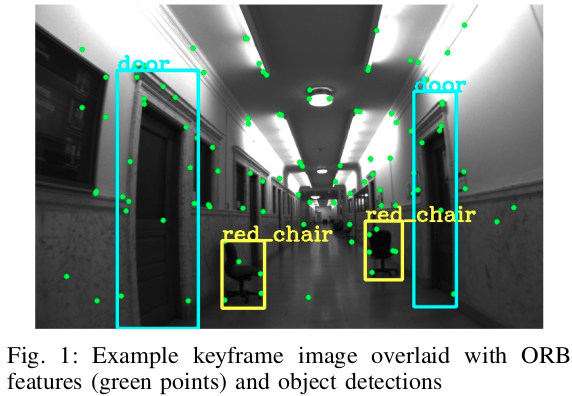
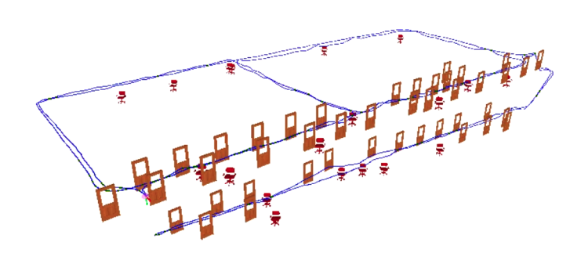
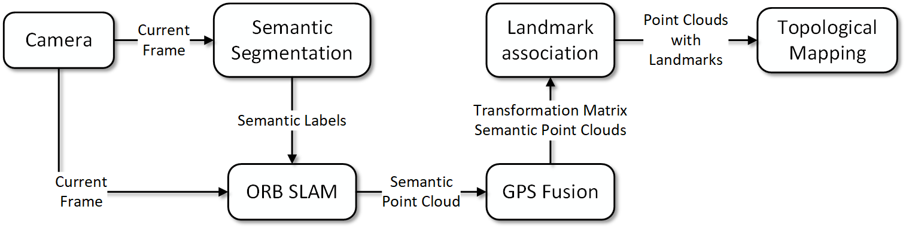
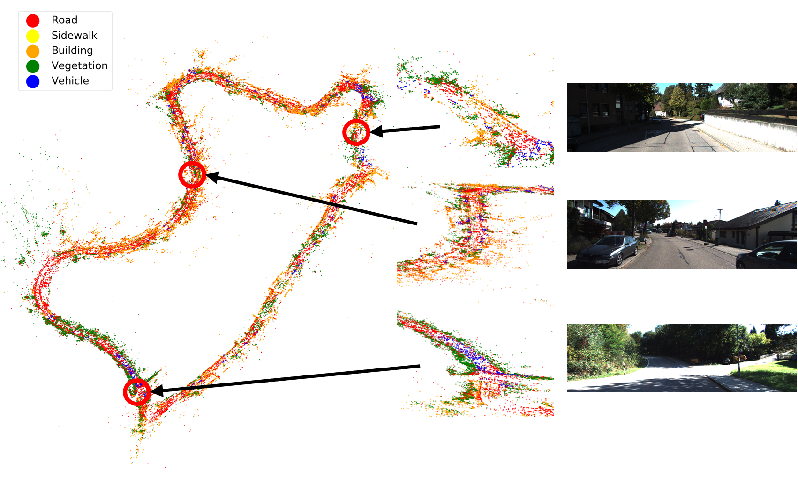
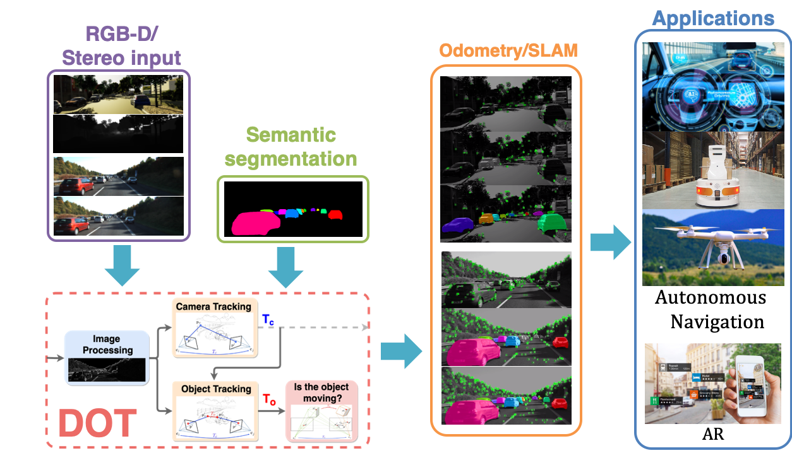
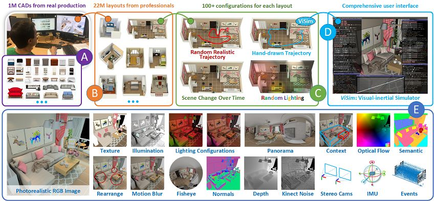
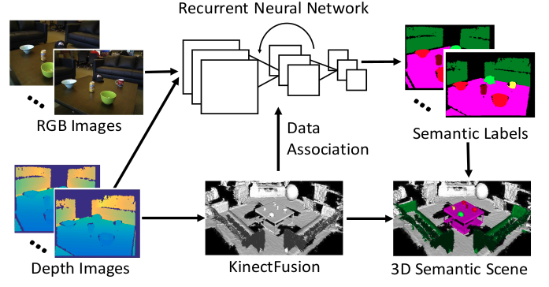
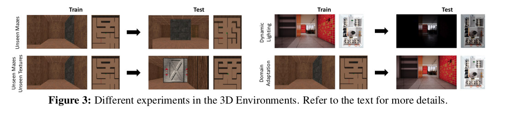
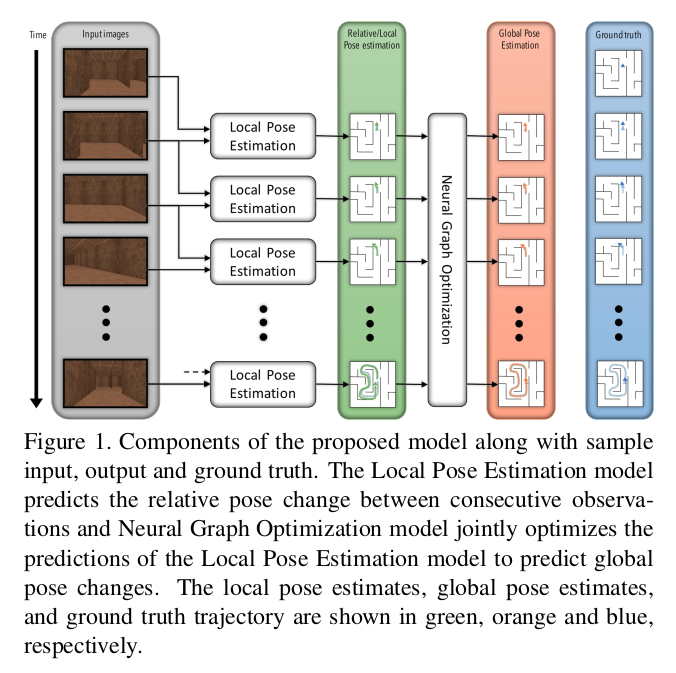

// • Модуля нейросети модели распространения сигнала
// • Модуля нейросети для работы с разнородным набором навигационных данных
:imagesdir: images
:toc: preamble

:author: timur chikichev
:email: t.chikichev@navigine.ru

:pygments-style: Coderay

нейросети модели распространения сигнала

нейросети для работы с разнородным набором навигационных данных

global bayes optimization

encoder decoder

3. Описание алгоритмов ORB SLAM, 
описание методов ИИ, используемых в SLAM.
50 стр.

chimera, semantic segmentation

navigation approaches,

navigation for drone, car, robot, pedestrian
sensor fusion, radiomap & map data, representation, data collection, full pipeline

neural networks for navigation
// list papers from link

encoding radiomap using deep nn

adaptive sensor fusion using nn
adaptive calman filter using nn
adaptive slam using nn

using semantic segmentation 
for tracking, mapping, other aproaches
for better accuracy
for robustness
for easy data collection, data fusion

use of all sources of information together, how to fuse data from different devices, 
dence map, architecture, create sparse map from dense map & obserations

multimodal map for multiple agents navigation

== reading

Probabilistic Data Association for Semantic SLAM

// Abstract— Traditional approaches to simultaneous localiza-
// tion and mapping (SLAM) rely on low-level geometric features
// such as points, lines, and planes. They are unable to assign
// semantic labels to landmarks observed in the environment.
// Furthermore, loop closure recognition based on low-level fea-
// tures is often viewpoint-dependent and subject to failure in
// ambiguous or repetitive environments. On the other hand,
// object recognition methods can infer landmark classes and
// scales, resulting in a small set of easily recognizable landmarks,
// ideal for view-independent unambiguous loop closure. In a
// map with several objects of the same class, however, a crucial
// data association problem exists. While data association and
// recognition are discrete problems usually solved using discrete
// inference, classical SLAM is a continuous optimization over
// metric information. In this paper, we formulate an optimization
// problem over sensor states and semantic landmark positions
// that integrates metric information, semantic information, and
// data associations, and decompose it into two interconnected
// problems: an estimation of discrete data association and land-
// mark class probabilities, and a continuous optimization over the
// metric states. The estimated landmark and robot poses affect
// the association and class distributions, which in turn affect
// the robot-landmark pose optimization. The performance of our
// algorithm is demonstrated on indoor and outdoor datasets.

// .Example keyframe image overlaid with ORB features (green points) and object detections
//  

// .Estimated sensor trajectory (blue) and landmark positions and classes using inertial, geometric, and semantic measurements such as those in Fig. 1. The accompanying video shows the estimation process in real time.
//  

Semantic information
The last type of measurement used are object detections
S t extracted from every keyframe image. An object detection
s k = (s ck , s sk , s bk ) ∈ S t extracted from keyframe t consists of
a detected class s ck ∈ C, a score s sk quantifying the detection
confidence, and a bounding box s bk . Such information can be
obtained from any modern approach for object recognition
such as [5], [34]–[36]. In our implementation, we use a
deformable parts model (DPM) detector [4], [37], [38],
which runs on a CPU in real time

Problem (Semantic SLAM). Given inertial I , {I t } Tt=1 ,
geometric Y , {Y t } Tt=1 , and semantic S , {S t } Tt=1
measurements, estimate the sensor state trajectory X and the
positions and classes L of the objects in the environment.

The inertial and geometric measurements are used to
track the sensor trajectory locally and, similar to a visual
odometry approach, the geometric structure is not recovered.
The semantic measurements, in contrast, are used to construct
a map of objects that can be used to perform loop closure that
is robust to ambiguities and viewpoint and is more efficient
than a SLAM approach that maintains full geometric structure.

использование реальных объектов в качестве точек 
привязки на карте незначительно улучшило точность позиционирования для монокулярного SLAM, 
при этом само наличие семантических объектов в карте или семантической карты может оказать совершенно другой эффект.

Зная семантику карты, можно предлагать пользователю более точный и понятный маршрут. Объекты карты (дверь, окно, ...) могут быть поняты и восприняты человеком.

В отличии от методов SLAM без извлечения семантики карты, где характерная точка на изображении это яркая точка на стене в которой определенным образом изменяется градиент яркости, что невозможно использовать для объяснения маршрута пользователю.

Использование семантики для построения маршрута это отдельная глобальная задача. Когда навигатор диктует пользователю инструкции движения по маршруту, определенная семантика карты при этом используется.

Значительное количество исследований посвящены использованию более деальной семантики карты для навигации в городских условиях и внутри помещений.

// tag:semantic_map[]
from: Visual Semantic SLAM with Landmarks for Large-Scale Outdoor
Environment

In this paper, a Monocular camera-based semantic SLAM
system with landmarks is developed for large-scale outdoor
localization and navigation. Existing works have focused only
on accuracy or real-time performance, which might be difficult
for real improvement of overall cognitive level of robots.

.The flowchart of whole system.
 

// .семантический граф, объекты на графе включают в себя: автомобили, организации, людей
// image::4-12-2021-18-01-49-PM.png[] 

Topological semantic mapping: The semantic SLAM
can also generate a topological semantic map which only
contains reachable relationships between landmarks and their
geometrical relationships. There will be only edges and nodes
in the semantic map and be more suitable for global path
planning.
The topological map is built through the following steps.
First, after the mapping process in SLAM system, the trajec-
tory of camera will be saved. The landmark will be associated
with its closest key frame. Second, there will be two kinds of
key frame that are saved, i.e. the key frames associated with
landmarks and the key frames in where to turn. Third, the
map will be optimized if the place is visited for more than
one times. The previous nodes will be fused with the new
node if they represent the same location or landmark. The
Topological semantic map is shown in the figure 3.

// использование нн для рекомендации и оптимизации использования семантики

It will be useful for large-scale landmark-based
navigation tasks or human-robot interaction.
Experiment shows that semantic information will allow
the robots to know more about the environments not only
the meaningless features but also their semantic meanings.
Besides, based on semantic meaning, the robots will re-
localize themselves with more robust features such as features
on buildings, roads, sidewalks, walls, rather than vehicles,
trees, person, etc.

The experiments were designed by using ROS and Keras,
our computing platform involves Intel Core i7 CPU and
NVIDIA GeForce GTX 1080Ti GPU platform.
We have tested the system run time when they work
together. The overall system can run in nearly 1.8Hz in our
computing system. Since the semantic segmentation model we
use is based on PSPNet-101 which is a large CNN model
without acceleration

 

// Visual Semantic SLAM with Landmarks for Large-Scale Outdoor
// Environment
// Zirui Zhao a , Yijun Mao a , Yan Ding b , Pengju Ren b , and Nanning Zheng b
// a
// Faculty of Electronic and Information Engineering, Xi’an Jiaotong University, Xi’an, China.
// b
// College of Artificial Intelligence, Xi’an Jiaotong University, Xi’an, China.

// end:semantic_map[]

// tag:DOT[]

DOT: Dynamic Object Tracking for Visual SLAM

для навигации в динамическом окружении необходимо по разному учитывать подвижные и неподвижные объекты. .

Simultaneous Localisation and Mapping, commonly known by its acronym SLAM, is one of the fun-
damental capabilities for the autonomous navigation of robotic platforms [3]. Its goal is the joint
estimation of the robot motion and a map of its surroundings, from the information of its embedded
sensors. Visual SLAM, for which the sensors are mainly, or exclusively, cameras, is one of the most
challenging yet relevant configurations.
Despite the significant advances in SLAM in recent years, most systems still assume a static envi-
ronment, where the relative position between the 3D points in the scene remains unchanged, the only
movement being that of the camera. Following this fundamental assumption, camera-pose estimation
algorithms attribute the changes between two images exclusively to the relative transformation due
to camera displacements. Therefore, they can not account for the effects of moving objects. At best,
some algorithms can detect and treat them as outliers [15, 16] to be ignored during the pose tracking
and map estimation process. However, this does not prevent that, during the time interval elapsed
until their detection as moving objects, the associated information is integrated into the estimation
assuming scene rigidity, introducing errors and inconsistencies in the pose and map estimations. More-
over, for those visual SLAM approaches that base the pose tracking on the matching of a small number
of key-points, the errors generated by dynamic elements can be fatal and even lead to system failure.
The world of real applications in which a robot must operate is, in general, far from being com-
pletely static: autonomous navigation of vehicles such as cars or drones, augmented reality applications
or terrestrial and even planetary exploration tasks (where the lack of identifiable characteristics in
the images makes SLAM systems precarious in the presence of shadows or other robots). It is there-
fore necessary to develop visual SLAM systems with the necessary robustness to operate in highly
dynamic environments. This was the motivation for this work, which is aimed at developing an image
processing strategy that improves the robustness of a visual SLAM system in environments containing
moving objects. As a result, we developed “Dynamic Object Tracking” (DOT), a front-end system
that combines semantic instances with multi-view geometry to estimate the movement of the camera
as well as that of scene objects using direct methods [4]. The result of the pre-processing is a mask
encoding both static and dynamic parts of each image fed into the SLAM system, so as to not use
the correspondences found in the dynamic regions. The study includes an experimental validation
specifically designed to evaluate the system’s ability to effectively reduce the errors associated with
SLAM mapping and motion estimation.
The main contributions of our proposed system can be summarised as:
• Significant improvement in the robustness and accuracy of the coupled SLAM system in highly
dynamic environments.
• Independence with respect to the particular SLAM system, which makes it a versatile front-end
that can be adapted with minimal integration work to any state-of-art visual odometry or SLAM
system.
• Unlike other systems, it can be implemented to operate in real time, since DOT allows semantic
segmentation to be performed at a lower frequency than that of the camera
• Robustness against neural net segmentation errors.

1. не учитывать информацию о том что объекты могут двигаться

The first of the categories, and the most general one, models the scene as a set of non-rigid parts,
hence including deformable and dynamic objects [17, 11, 12]. While this research line is relevant
because of its generality and potential applications, it also poses significant challenges mainly related
to deformation models. In this work, we consider that the world is composed of a variable number of
rigid solids, which is the premise behind the other two categories of dynamic visual SLAM.

2. игнорировать объекты которые потенциально могут двигаться:

Along this line of work, DynaSLAM [1], built on
top of ORB-SLAM2 [16], aims to estimate static maps that can be reused in long-term applications.
Dynamic objects are removed by combining 1) semantic segmentation for potentially moving objects,
and 2) multi-view geometry for detecting inconsistencies in the rigid model. Mask R-CNN [8] is
used for semantic segmentation, which detects and classifies the objects in the scene into different
categories, some of which have been pre-set as potentially dynamic (e.g., car or person). DynaSLAM
was designed to mask out all the potentially mobile objects in the scene. This results in a lower
accuracy than the original ORB-SLAM2 in scenes containing potentially mobile objects that are not
actually moving (e.g., with many cars parked) since removing image tracks located on the potentially
moving, but actually static, objects impacts negatively on the camera path estimation process. The
aim of this work is, precisely, to overcome this problem as only those objects that are moving at that
precise moment will be labelled as dynamic.

3. динамическая карта, учитывать что некоторые объекты на карте потенциально могут двигаться

line of work in dynamic visual SLAM, which goes beyond the segmentation and
suppression of dynamic objects, includes works such as MID-Fusion [20] and MaskFusion [18]. Their
aim is to reconstruct the background of the scene and also to estimate the movement of the different
dynamic objects. For that purpose, sub-maps of each possible moving object are created and a joint
estimation of both the objects and camera poses is carried out.

 

The first block (Instance Segmentation) corresponds to the CNN that segments out pixelwise all
the dynamic objects (in our experimental part, only vehicles are considered). As explained below, the
frequency at which the network operates does not need to be that of the video, but can be lower.
The image processing block (Image processing) extracts and separates the points belonging to
static regions of the image and the points that are in dynamic objects. Camera tracking is estimated
by using only the static part of the scene. From this block, and taking into account the camera pose,
the movement of each of the objects segmented by the network is calculated independently (Object
tracking).
The last block (Is the object moving?) determines, from geometric calculations, whether the
objects previously labelled as dynamic by the network are indeed moving. This information is used
to update the masks encoding the static and dynamic regions of each frame and to feed the linked
odometry/SLAM visual system.

DOT is a novel front-end algorithm for SLAM systems that combines semantic segmentation with
multi-view geometry to estimate camera and object motion using direct methods.
The evaluation of DOT in combination with ORB-SLAM2 in three public datasets for autonomous
driving research [6][5][2] demonstrates that DOT-generated object motion information allows the
SLAM system to adapt to the scene content and to significantly improve its performance, in terms of
both accuracy and robustness.
The independence of DOT from SLAM system makes it a versatile front-end that can be adapted
with minimal integration work to any state-of-art visual odometry or SLAM system. In addition,
DOT allows semantic segmentation (typically involving high computational cost) to be performed at
a lower frequency than the camera, which unlike other systems enables real-time implementation.

// end:DOT[]

// tag:CNN-slam[]

semantic slam, nn slam, nn + orb

cnn slam 

that simultaneously learns monocular depth, optical flow
and egomotion estimation based on video inputs using an
unsupervised manner. They achieve state of the art re-
sults for each vision task such as odometry using the KITTI
benchmark suite [27]. The approach removes the need of
data annotation for CNN based SLAM. The key idea is to
get use of the strong dependence of each geometric vision
task (depth, pose and optical flow) to design a joint loss
function that is purely based on consistency checks. There-
fore, a rigid decoder for depth and pose such as a non-rigid

The method outperforms ORB-SLAM on an auto-
motive scenario. The short outline emphasize the possibility
of using deep learning for SLAM.

CNNs have become the de facto approach for object de-
tection and semantic segmentation in automated driving.
They also show promising progress in geometric computer
vision algorithms like depth and flow estimation. However,
there is slow progress on CNN based Visual SLAM ap-
proaches. In this work, we provided an overview of Visual
SLAM for automated driving and surveyed possible oppor-
tunities for using CNNs in various building blocks.

использовать нейронные сети для построения карты и улучшения определения характерных точек, карты глубины,  повысить точность самой карты

не использовать нейронные сети для задачи локализации, по метрикам достаточно текущего решения orb-slam для точной навигациии и локализации

модифицировать метоод навигации используя нейронные сети для более точно предсказания карты глубины, обработка самой карты на стороне сервера.

// end:CNN-slam[]

https://interiornet.org/
InteriorNet: Mega-scale Multi-sensor Photo-realistic
Indoor Scenes Dataset

.System Overview: an end-to-end pipeline to render an RGB-D-inertial benchmark for large scale interior scene understanding and mapping. Our dataset contains 20M images created by pipeline: (A) We collect around 1 million CAD models provided by world-leading furniture manufacturers. These models have been used in the real-world production. (B) Based on those models, around 1,100 professional designers create around 22 million interior layouts. Most of such layouts have been used in real-world decorations. (C) For each layout, we generate a number of configurations to represent different random lightings and simulation of scene change over time in daily life. (D) We provide an interactive simulator (ViSim) to help for creating ground truth IMU, events, as well as monocular or stereo camera trajectories including hand-drawn, random walking and neural network based realistic trajectory. (E) All supported image sequences and ground truth. 
 

Semantic SLAM
DeLS-3D: Deep Localization and Segmentation with a 2D Semantic Map@WangWang2018DeLS
https://github.com/Ewenwan/texs/blob/master/PaperReader/SemanticSLAM/SemanticSLAM.md

DA-RNN: Semantic Mapping with Data Associated
Recurrent Neural Networks
Yu Xiang and Dieter Fox

.Overview of the DA-RNN framework. RGB-D frames are fed into a Recurrent Neural Network. KinectFusion provides the 3D reconstruction and the data associations necessary to connect recurrent units between RGB-D frames. The pixel labels provided by the RNN are integrated into the 3D semantic map. The overall labeling and reconstruction process runs at 5fps.
 

// Multi-View Deep Learning for Consistent Semantic Mapping with RGB-D Cameras

// MaskFusion: Real-Time Recognition, Tracking, and Reconstruction of Multiple Moving Objects

// MaskFusion,看样子挺厉害的样子。

// A real-time, object-aware, semantic And dynamic RGB-D SLAM.

// A CTIVE N EURAL L OCALIZATION

// In this paper, we proposed a fully-differentiable model for active global localization which uses
// structured components for Bayes filter-like belief propagation and learns a policy based on the belief
// to localize accurately and efficiently. This allows the policy and observation models to be trained
// jointly using reinforcement learning. We showed the effectiveness of the proposed model on a
// variety of challenging 2D and 3D environments including a realistic map in the Unreal environment.
// The results show that our model consistently outperforms the baseline models while being order of
// magnitudes faster. We also show that a model trained on random textures in the Doom simulation
// environment is able to generalize to photo-realistic Office map in the Unreal simulation environment.
// While this gives us hope that model can potentially be transferred to real-world environments, we
// leave that for future work. The limitation of the model to adapt to dynamic lightning can potentially
// be tackled by training the model with dynamic lightning in random mazes in the Doom environment.
// There can be several extensions to the proposed model too. The model can be combined with Neural
// Map (Parisotto & Salakhutdinov, 2017) to train an end-to-end model for a SLAM-type system and
// the architecture can also be utilized for end-to-end planning under uncertainity.

//  

// doom, не подходит для нормальной карты, нет сравнения с обычными методами

// Global Pose Estimation with an Attention-based Recurrent Network

// то же самое

//  

// Alexey Panyov, [24.12.2021 22:11]
Let me answer: The key application is data fusion. We need to process all the data into the same format. 

I.e. it can be compact point clouds representation using AI&neural networks, it can be regression task (for localization), it can be segmentation.
// 
// Alexey Panyov, [24.12.2021 22:12]
Yes, in addition to these mentioned by Ivan we also have all the topics related to visual localization, with keypoint detector and descriptor learning, neural matchers for data association, semantics and object classification. For point clouds we have feature extraction, alignment methods (enhanced by AI in various forms), uncertainty prediction, etc.
I did not elaborate much on those topics, since we were just discussing the general lines.

== data fusion

представление карты, виды представления

работа с видами карты, плотные методы, полные методы

универсальные форматы, сбор данных конвертация

использование нейронок для быстрых операций с картой

regression task (for localization), it can be segmentation

поиск максимально похожей координаты, дескрипторы

использование сегментации для:

* учета окружения, объектов
* большей точности карты
* просто получение сегментации карты для личных целей
* использование семантики для навигации в динамическом окружении
** игнорировать подвижные обхекты
** получить статич. карту
** использовать динамические объекты для дометрии

//найти обзор литературы по теме

навигация по нейронкам vs slam методы, есть ли преимущество, как обучать

* можно ли хранить локальную карту как нейронку и по ней осуществлять регрессию.... bag of words выглядит экономичнее
* можно ли хранить дескрипторы как нейронку
* энкодер жекодер, cnn, посмотреть архитектуру в работах
** посмотреть выписки китайской статьи, посмотреть обзоры

.работа со стерео
* получение глубины, параллакс, методы
** модификации стерео методов
** double pixel в смарфонах, можно ли использовать
* смартфоны со стереокамерой, использовани фокуса камеры для определения глуубины в сцене
* профессиональные стереокамеры, камеры глубины
** обзор на хабре, спецификация по сенсорам в авто, посмотреть обзоры
* event-based стереокамеры, в чем отличие, преимущества, обзор методов
* датасеты и SOTA методы

.прямые методы
* lsd-slam
// * direct slam
* kimera
* stereo cnn......

.графовые методы
* графовые нейронки
* оптимизация на графе
* факторные графы
* bundle adjustment

сделать обзор, 
скопировать фото из методов, 
выбрать док для описания, 
прописать структуру, 
оформить

visual localization, 
keypoint detector and descriptor learning, 

neural matchers for data association, 
semantics and object classification. 

.point clouds
. feature extraction
. alignment methods (enhanced by AI in various forms)
. uncertainty prediction, etc.

Visual SLAM: Why Filter?

// evaluate on

== depth prediction

=== CNN-SLAM: Real-time dense monocular SLAM with learned depth prediction

[dense monocular reconstruction, depth prediction, support slam, fuse semantic labels from a single frame ]
Given the recent advances in depth prediction from Con-
volutional Neural Networks (CNNs), this paper investigates
how predicted depth maps from a deep neural network can
be deployed for accurate and dense monocular reconstruc-
tion. We propose a method where CNN-predicted dense
depth maps are naturally fused together with depth mea-
surements obtained from direct monocular SLAM. Our fu-
sion scheme privileges depth prediction in image locations
where monocular SLAM approaches tend to fail, e.g. along
low-textured regions, and vice-versa.
// Use of depth prediction for estimating the absolute scale of the reconstruction, hence overcoming one of the major limitations of monocular SLAM. 
A framework to efficiently fuse semantic labels, obtained from a single frame, with dense SLAM, yielding semantically coherent scene reconstruction from a single view. 
Evaluation results on two benchmark datasets show the robustness and accuracy of our approach.

// Figure 3. Comparison among (a) direct CNN-depth prediction,
// (b) after depth adjustment and (c) after depth adjustment and re-
// finement, in terms of (A) pose trajectory accuracy and (B) depth
// estimation accuracy. Blue pixels depict correctly estimated depths,
// i.e. within 10 % of ground-truth. The comparison

image:3-12-2021-19-03-26-PM.png[] 

[depth estimation, globally accurate, locally blurred depth borders ]
Recently, a new avenue of research has emerged that addresses depth prediction from a single image by means of learned approaches. In particular, the use of deep Convolutional Neural Networks (CNNs) [16, 2, 3] in an end-to-end fashion has demonstrated the potential of regressing depth maps at a relatively high resolution and with a good absolute accuracy even under the absence of monocular cues (texture, repetitive patterns) to drive the depth estimation task. One advantage of deep learning approaches is that the absolute scale can be learned from examples and thus predicted from a single image without the need of scene-based assumptions or geometric constraints, unlike [10, 18, 1]. A major limitation of such depth maps is the fact that, although globally accurate, depth borders tend to be locally blurred: hence, if such depths are fused together for scene reconstruction as in [16], the reconstructed scene will overall lack shape details.

[single view depth prediction]
Relevantly, despite the few methods proposed for single view depth prediction, the application of depth prediction to higher-level computer vision tasks has been mostly overlooked so far, with just a few examples existing in literature [16]. The main idea behind this work is to exploit the best from both worlds and propose a monocular SLAM approach that fuses together depth prediction via deep networks and direct monocular depth estimation so to yield a dense scene reconstruction that is at the same time unambiguous in terms of absolute scale and robust in terms of tracking.

[recover blurred depth borders] 
To recover blurred depth borders, the CNNpredicted depth map is used as initial guess for dense reconstruction and successively refined by means of a direct SLAM scheme relying on small-baseline stereo matching similar to the one in [4]. Importantly, small-baseline stereo matching holds the potential to refine edge regions on the predicted depth image, which is where they tend to be more blurred. At the same time, the initial guess obtained from the CNN-predicted depth map can provide absolute scale information to drive pose estimation, so that the estimated pose trajectory and scene reconstruction can be significantly more accurate in terms of absolute scale compared to the

image:3-12-2021-19-13-25-PM.png[] 

DA-RNN, semantic scene reconstruction

we are mainly interested in depth map, then only we search for segmentation.

because we have a stereo images, qequences of images or video stream, we don't need to solve static image semantic segmentation.

we can utilize image flow approach to approximately understand dynamic objects bounding boxes without segmentation using image flows primarily

focus on image flows

== Meaningful Maps With Object-Oriented Semantic Mapping

image:3-1-2022-20-59-46-PM.png[] 
We demonstrate object-oriented semantic mapping using RGB-D data that scales from small desktop environments (left) to offices
(middle) and whole labs (right). The pictures show 3D map structures with objects colored according to their semantic class. We do not
merely project semantic labels for individual 3D points, but rather maintain objects as the central entity of the map, freeing it from the
requirement for a-priori 3D object models in [1]. To achieve this, our system creates and extends 3D object models while continuously
mapping the environment. Object detection and classification is performed using a Convolutional Network, while an unsupervised 3D
segmentation algorithm assigns a segment of 3D points to every object detection. These segmented object detections are then either fused
with existing objects, or added as a new object to the map. ORB-SLAM2 provides a global SLAM solution that enables us to reconstruct a
3D model of the environment that contains both non-object structure and objects of various types.

// Abstract— 
For intelligent robots to interact in meaningful
ways with their environment, they must understand both the
geometric and semantic properties of the scene surrounding
them. 
// The majority of research to date has addressed these
// mapping challenges separately, focusing on either 
geometric or semantic mapping  separately. 

In this paper we address the problem of building environmental maps that include both semantically meaningful, object-level entities and point- or mesh-based geometrical representations. We *simultaneously build geometric point cloud models* of previously unseen instances of known ob-
ject classes and create a map that contains these object models
as central entities. Our system leverages sparse, feature-based
RGB-D SLAM, image-based deep

image:3-1-2022-21-01-42-PM.png[] 

Fig. 3: Overview of our semantic mapping system. While ORB-SLAM2 performs camera localisation and mapping on every RGB-D
frame, SSD [23] detects objects in every RGB keframe. Our own adapted 3D unsupervised segmentation approach assigns a 3D point
cloud segment to every detection. Data association based on an ICP-like matching score decides to either create a new object in the map
or associate the detection with an existing one. In the latter case, the 3D model of the map object is extended with the newly detected 3D
structure. Every object stores 3D point cloud segments, pointers into the pose graph of ORB-SLAM and per-class confidence scores that
are updated on the fly whenever new observations are available.

V. C ONCLUSIONS AND F UTURE W ORK
We presented a novel combination of SLAM, object
detection, instance-level segmentation, data association, and
model updates to obtain a semantic mapping system that
maintains individual objects as the key entities in the map.
Our approach differs from previous approaches in that it
builds 3D object models on the fly, does not require a-
priori known 3D models, and can leverage the full potential
of deep-learnt object detection methods. We demonstrated
and evaluated the efficacy of this approach in an automated
inventory management scenario by mapping and semantically
annotating numerous indoor scenes in a typical workplace
office environment.
We discussed the observed failure cases and proposed
directions for future work to address them. In addition,
we will investigate how the detected objects can serve as
semantic landmarks to improve the accuracy of the SLAM
system, thus closing the loop to create a full semantic
SLAM system. This avenue of investigation also leads to the
question of how an image-based object detector like SSD
and other deep-learnt approaches can be best treated as a
sensor and tightly integrated into the data fusion framework
of factor graphs that are commonly applied as backends in
SLAM. Furthermore, the objects in our system are currently
represented as collections of point clouds. In future work we
are going to utilize methods like [37] to obtain dense surface
models. The proposed future research can be supported by
recently published synthetic datasets [38] or high-fidelity
simulation environments [39].
Investigating how semantic maps can benefit other task
domains like robotic planning for mobile manipulation, path
planning or general behaviour generation will yield more
insights into what level (or levels) of semantic representations
are appropriate in different application domains.

== WANG AND SHEN: FLOW-MOTION AND DEPTH NETWORK FOR MONOCULAR STEREO AND BEYOND

Abstract—We propose a learning-based method 1 that solves monocular stereo and can be extended to fuse depth information from multiple target frames. Given two unconstrained images from a monocular camera with known intrinsic calibration, our network estimates relative camera poses and the depth map of the source image. The core contribution of the proposed method is threefold. 
First, a network is tailored for static scenes that jointly estimates the optical flow and camera motion. By the joint estimation, the optical flow search space is gradually reduced resulting in an efficient and accurate flow estimation. 

Second, a novel triangulation layer is proposed to encode the estimated optical flow and camera motion while avoiding common numerical issues caused by epipolar. 

Third, beyond two-view depth estimation, we further extend the above networks to fuse depth information from multiple target images and estimate the depth map of the source image. To further benefit the research community, we introduce tools to generate realistic structure-from-motion datasets such that deep networks can be well trained and evaluated. The proposed method is compared with previous methods and achieves state-of-the-art results within less time. Images from real-world applications and Google Earth are used to demonstrate the generalization ability of the method. 
// Index Terms—SLAM, visual learning, perception and autonomy.

image::3-12-2021-18-22-18-PM.png[] 
Fig. 2. The architecture of the proposed flow-motion network and depth network. Here, only the two-view architecture is shown for simplicity. The extension to
fuse multiple depth information is shown in Fig. 5. The flow-motion network jointly estimates the optical flow and camera poses, and the depth network triangulates
the depth of each pixel in the source image. Although both networks are based on simple encoder-decoder architectures, the proposed joint estimation (Section III-A)
and triangulation layer (Section III-B) enables high-quality and efficient estimation.

image::3-12-2021-18-26-46-PM.png[]  
Fig. 4. Example to show the numerical stability in triangulation. O s and O t are the optical centers of I s and I t , respectively. d max and d min are the maximum and minimum depth of the scene. e i is the corresponding epipolar line of pixel x i . (a) In stereo configurations, the depth can be reliably calculated by finding the corresponding point on e 0 . (b) In unconstrained monocular stereo problems, the epipolar line e 1 of x 1 (the epipolar point) degenerates into a point, thus the depth is unobservable. For pixels near the epipolar point, such as x 2 , the epipolar line e 2 is very short, and the result is noise-prone.

image:3-12-2021-18-29-30-PM.png[]  
Fig. 5. Extending the depth net to fuse multiple depth information. (a) Twoview depth estimation network. (b) Multiple depth fusion extension. The twoview encoder network encodes the depth information of each image pair into depth codes dc i . Multiple codes are pooled into dc  and the multiview fusion network takes dc  to estimate the depth map.

=== Multiview Depth Fusion

In real-world applications (e.g. robot navigation), the depth
of the source image can be solved by multiple target images.
Here, we extend the proposed two-view monocular stereo net-
works to fuse multiview information. Compared with two-view
image pairs, multiview images bring more information about the
environment structure, thus the fused depth maps can be more
robust and accurate. However, fusing depth information from
multiview images is non-trivial due to the arbitrary number of
image pairs and different depth scales.
Fig. 5 shows how the two-view depth net is extended. The
two-view depth net introduced in Sec. III-B is divided into two
parts: two-view encoder and multiview fusion. The first part
independently encodes the triangulation layer tri of each image
pair into multi-resolution depth codes dc. Depth codes from
multiple image pairs, {dc 0 , ..., dc N −1 }, are fused by mean-
pooling layers. The fused code of each pixel dc  (x) is calculated

Using pooling layers to fuse information has been used in
many multiview stereo works (e.g., DeepMVS [10]). Different
from these works, we use multiple pooling layers to fuse the
depth codes at different resolutions such that both the global
information and fine details are preserved. The fusion network

C. Depth Fusion Evaluation
Since the DeMoN dataset only provides two-view image
pairs, we use the proposed GTA-SfM dataset to train and eval-
uate the multiview depth fusion performance. We first train the
flow-motion network using two-view image pairs for 210 k steps
and then train the extended multiview fusion network for 130 k
steps. The code sizes for depth fusion is set to 128, 128, 128, 64,
and 64 from coarse to fine, respectively.
We first evaluate the quality of estimated depth maps using
different numbers of target images. We also compare the depth
net with DeepMVS [10] which is also trained using images from
GTA5. DeepMVS takes images with ground truth camera poses
as input and our method use images only. For each number of
target images, we randomly sample 300 pairs and compute the
mean depth error. Table II shows the depth quality given different
numbers of target images. Clearly, the depth quality improves
when more images are observed, which shows the effectiveness
of the multiview fusion and matches the experience from clas-
sic SfM methods. We also visualize estimated depth maps for
qualitative comparison in Fig. 8. Our method estimates smooth
and detailed depth maps a

== A Hybrid 2D and 3D Convolution Neural Network for Stereo Matching

novel hybrid 2D and 3D convolution
neural network for stereo matching.

Abstract—Stereo matching plays an important role in com-
puter vision and SLAM (simultaneous localization and mapping).
In this paper, we propose a novel hybrid 2D and 3D convolution
neural network for stereo matching. Unlike existing similarity
metric based stereo matching methods which need extra post-
processing to finish the matching pipeline, the proposed approach
is an end-to-end stereo matching method and it needs much less
time for an image pair. Unlike a lot of cost volume and disparity
based stereo matching methods which are too complicated to
run on performance-constrained devices, the proposed method
is much more simple and can run on the real-time sweeping
robot that we build. Experimental results on two widely used
stereo matching datasets verified the effectiveness of the proposed
approach, meanwhile, our real-time SLAM system—the sweeping
robot demonstrates that our method can apply to real-time
applications.
Index Terms—stereo matching, 3D convolution, SLAM

image::3-1-2022-21-04-31-PM.png[]

Fig. 1: A hybrid 2D and 3D Convolution Network for Stereo
Matching. First of all, 2D convolution was used to extract fea-
tures from the input images. Then, We stack the corresponding
left and right feature maps and apply 3D convolution to extract
depth information from them. Finally, we use 2D convolution
to get the depth image.

IV. C ONCLUSION 

stereo matching problem, approach employs 3D convolution for depth information extraction

end-to-end 2D and 3D convolution neural network

In this paper, we investigate the stereo matching problem and propose a novel end-to-end 2D and 3D convolution neural network. Different from similarity metric based and cost volume & disparity regression based stereo method, the proposed approach employs 3D convolution for depth information extraction. Moreover, our method is much faster than a lot of existing stereo matching methods and can run on the performance-constrained devices. Experiment results on two publicly available datasets demonstrate the effectiveness of our method, and the SLAM based sweeping robot we build shows that our approach can apply to real-time applications. 
// Due to the limitation of time, we did a few comparsions with other state-of-the-art methods, such as SGBM, in the future, we will refine our method and design more experiments.

== определения замыкания циклов посредством нейронных сетей

== Collaborative Visual Navigation

>> collabl=orative rnn  from *Collaborative Visual Navigation* paper

>> orb-slam atlas approach with distributed maps

Collaborative Visual Navigation
Haiyang Wang 1,2 , Wenguan Wang 3 * , Xizhou Zhu 2 , Jifeng Dai 2 , Liwei Wang 1

large-scale 3D dataset, CollaVN, for multi-agent visual navigation (MAVN).

memory-augmented communication framework

As a fundamental problem for Artificial Intelligence, multi-agent system (MAS) is making rapid progress, mainly driven by multi-agent reinforcement learning (MARL) techniques. However, previous MARL methods largely focused on grid-world like or game environments; MAS in visually-rich environments has remained less explored. To narrow this gap and emphasize the crucial role of perception in MAS, we propose a large-scale 3D dataset, CollaVN, for multi-agent visual navigation (MAVN). In CollaVN, multiple agents are entailed to cooperatively navigate across photo-realistic environments to reach target locations. Diverse MAVN variants are explored to make our problem more general. Moreover, a memory-augmented communication framework is proposed. Each agent is equipped with a private, external memory to persistently store communication information. This allows agents to make better use of their past communication information, enabling more efficient collaboration and robust long-term planning. In our experiments, several baselines and evaluation metrics are designed. We also empirically verify the efficacy of our proposed MARL approach across different MAVN task settings.

Multi-Agent Reinforcement Learning (MARL). MARL

tackles the sequential decision-making problem of multiple
agents in a common environment, each of which aims to
achieve its own long-term goal by interacting with the envi-
ronment and other agents [11, 34]. Basically, MARL algo-
rithms can be placed into four categories [34]. 

. *Analysis of emergent behaviors*. Some early studies [67, 5] analyze single-agent RL algorithms in multi-agent environments.
. Learning *communication*. Methods in this category [59, 49,
24] address collaboration through explicit communication,
which attracts increasing attention recently. 
. Learning *cooperation*. Many other efforts [62, 56, 61] indirectly arrive at cooperation via, for example, policy parameter sharing [29] or experience replay buffer [26]. 
. *Agents modeling agents*. These methods [68, 35] build models to reason the behaviors of other agents for better decision-making

// 6. Conclusion 

A new *dataset* was introduced for *multi-agent collaborative navigation* in complex environments. 
A *memory-based communication model* was presented to address the reuse of past communication information and facilitate cooperation. 
// experiments showed that there is still huge room for further improvement. This work is expected to ins

== DA-RNN: Semantic Mapping with Data Associated Recurrent Neural Networks

Semantic Mapping более продвинутая версия, позволяет более точно сегментировать  сцену по стерео изображениям
нет принципиального отличия от остальных работ, более детально рассмотрена архитектура алгоритмаи его работа
хорошие результаты сегментации

Abstract—3D scene understanding is important for robots to
interact with the 3D world in a meaningful way. Most previous
works on 3D scene understanding focus on recognizing geomet-
rical or semantic properties of a scene independently. In this
work, we introduce Data Associated Recurrent Neural Networks
(DA-RNNs), a novel framework for joint 3D scene mapping
and semantic labeling. DA-RNNs use a new recurrent neural
network architecture for semantic labeling on RGB-D videos.
The output of the network is integrated with mapping techniques
such as KinectFusion in order to inject semantic information
into the reconstructed 3D scene. Experiments conducted on real
world and synthetic RGB-D videos demonstrate the superior
performance of our method.

// V. CONCLUSION
In this work, we introduce DA-RNNs, a novel framework
for joint 3D mapping and semantic labeling on RGB-D videos.
DA-RNNs integrate a recurrent neural network for video
semantic labeling with KinectFusion. To achieve a compact
network representation, recurrent reasoning is only performed
over the currently visible part of the environment, using
data association to define the connectivity between recurrent
units. The labels predicted by the RNN are fused into the
KinectFusion map for dense semantic mapping. Experiments
are conducted on a real world dataset and a synthetic dataset
of RGB-D videos. The experimental results and analyses
demonstrate the advantages of our method on video semantic
labeling and 3D scene mapping.
A key advantage of DA-RNNs is their flexibility. While
this paper focuses on object class labeling, we believe that
the same architecture could be applied to train networks for
a wide range of semantic labeling problems, including object
instance and pose detection, material recognition, and physical
support estimation. Data association between frames can also
be obtained in different ways such as using optical flow
methods. Another promising avenue for improvement is the
incorporation of shape information provided by the 3D map.

image::3-1-2022-21-26-02-PM.png[]
Architecture of our data associated recurrent neural network for semantic labeling on videos.

A. Dense 3D Scene Reconstruction
A. Single Frame Labeling with Fully Convolutional Networks

== DeepSLAM: A Robust Monocular SLAM System With Unsupervised Deep Learning

// рассмотрено и переведено

алгоритм использует нейроннные методы на всех этапах работы, в том числе при представлении карты, 

- сделать ссылки на похожие работы, 
- подробно обзор литературы, 
- закончить перевод докумета
