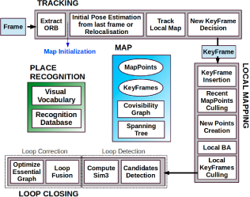

// В литературе можно найти множество различных подходов к зада-
// че SLAM с использованием разных типов сенсоров: лидары, сонары,
// камеры [6], в данной работе речь идет об однокамерном SLAM. Од-
// нокамерный SLAM - область компьютерного зрения, применяемая в
// робототехнике для автономной навигации и составления карты местно-
// сти по видео изображению с одной камеры (в отличии от стерео SLAM,
// где используется две камеры). 
// Один из подходов однокамерного SLAM
// заключается в том, что из изображения извлекаются так называемые
// особые точки (feature points), положение которых затем отслеживают-
// ся на последующих изображениях - таким образом формируются тре-
// ки проекций особых точек. Имея данные о проекциях особой точки на
// изображения и данные о положении камеры, в момент взятия этих изоб-
// ражений, можно решить 
// задачу вычисления пространственных коорди-
// нат материальной точки, которую можно трактовать как известную в
// более широком смысле задачу bundle adjustment

== SLAM, применение, описание контекста, интро

== ORB SLAM - моно слам

описание процедуры Bundle Adjustment (BA)

// tag::related_work[]

Bundle Adjustment, как известно, обеспечивает точные оценки местоположения камеры, а также разреженную геометрическую реконструкцию [1, 2], учитывая, что обеспечивается сильная сеть совпадений и хорошие начальные предположения. Долгое время такой подход считался недоступным для приложений реального времени, таких как визуальная одновременная локализация и отображение (Visual SLAM).
Визуальный SLAM имеет цель оценить траекторию камеры при реконструкции окружающей среды. В настоящее время мы знаем, что для достижения точных результатов при непомерно высоких вычислительных затратах алгоритм SLAM в реальном времени должен обеспечивать BA:

- Соответствующие наблюдения за функциями сцены (точки карты) среди подмножества выбранных кадров (ключевых кадров). Поскольку сложность растет с увеличением количества ключевых кадров, при их выборе следует избегать ненужной избыточности.
- Сильная сетевая конфигурация ключевых кадров и точек для получения точных результатов, то есть хорошо распределенный набор ключевых кадров, наблюдающих точки со значительным параллаксом и с большим количеством совпадений замыкания цикла.
- Первоначальная оценка положений ключевых кадров и местоположений точек для нелинейной оптимизации.
- Местная карта в исследовании, где оптимизация направлена ​​на достижение масштабируемости.
- Возможность выполнять быструю глобальную оптимизацию (например, граф позы) для закрытия циклов в реальном времени.

Первым применением BA в реальном времени была работа Mouragon et. al. [3], за которой последовала новаторская работа Кляйна и Мюррея по SLAM [4], известная как Parallel Tracking and Mapping (PTAM). Этот алгоритм, хотя и ограничен мелкомасштабными операциями, предоставляет простые, но эффективные методы для выбора ключевых кадров, сопоставления функций, точечной триангуляции, локализации камеры для каждого кадра и перемещения после сбоя отслеживания. К сожалению, несколько факторов серьезно ограничивают его применение: отсутствие закрытия цикла и адекватной обработки окклюзий, низкая инвариантность с точки зрения перемещения и необходимость вмешательства человека для начальной загрузки карты.

В этой работе мы опираемся на основные идеи PTAM, работу по распознаванию мест Гальвеса-Лопеса и Тардоса [5], замыкание цикла с учетом масштаба, выполненное Strasdat et. al [6] и использование информации о совместимости для крупномасштабных операций [7, 8] для разработки с нуля ORB-SLAM, новой монокулярной системы SLAM, основные вклады которой:

- Использование одних и тех же функций для всех задач: отслеживание, отображение, перемещение и закрытие цикла. Это делает нашу систему более эффективной, простой и надежной. 

Алгоритм использует функции ORB (oriented FAST & rotated BRIEF) [9], которые позволяют работать в реальном времени без графических процессоров, обеспечивая хорошую инвариантность к изменениям точки обзора и освещения.
- Работа в реальном времени в больших средах. Благодаря использованию графа совместимости, отслеживание и отображение сосредоточены в локальной видимой области, независимо от размера глобальной карты.
- Закрытие цикла в реальном времени на основе оптимизации графа позы, который мы называем Essential Graph. Он построен из остовного дерева, поддерживаемого системой, ссылок замыкания цикла и сильных ребер из графа ковидимости.
- Перемещение камеры в реальном времени со значительной инвариантностью к точке обзора и освещению. Это позволяет восстановиться после сбоя отслеживания, а также улучшает повторное использование карты.
- Новая автоматическая и надежная процедура инициализации, основанная на выборе модели, которая позволяет создавать начальную карту плоских и неплоских сцен.
- Выживание наиболее подходящего подхода к выбору точек карты и ключевых кадров, который щедр при порождении, но очень ограничен при отбраковке. Эта политика улучшает надежность отслеживания и увеличивает срок службы, поскольку избыточные ключевые кадры отбрасываются.

// tag::related_work[]

// tag::Bundle_Adjustment[]

=== Bundle_Adjustment
Bundle Adjustment (BA) is known to provide accurate estimates of camera localizations as well as a sparse geometrical reconstruction [1, 2], given that a strong network of matches and good initial guesses are provided. For long time this approach was considered unaffordable for real time applications such as Visual Simultaneous Localisation and Mapping (Visual SLAM). 
Visual SLAM has the goal of estimating the camera trajectory while reconstructing the environment. Nowadays we know that to achieve accurate results at non-prohibitive computational cost, a real time SLAM algorithm has to provide BA with:

- Corresponding observations of scene features (map points) among a subset of selected frames (keyframes). As complexity grows with the number of keyframes, their selection should avoid unnecessary redundancy. 
- A strong network configuration of keyframes and points to produce accurate results, that is, a well spread set of keyframes observing points with significant parallax and with plenty of loop closure matches. 
- An initial estimation of the keyframe poses and point locations for the non-linear optimization. 
- A local map in exploration where optimization is focused to achieve scalability. 
- The ability to perform fast global optimizations (e.g. pose graph) to close loops in real-time.

The first real time application of BA was the visual odometry work of Mouragon et. al. [3], followed by the ground breaking SLAM work of Klein and Murray [4], known as Parallel Tracking and Mapping (PTAM). This algorithm, while limited to small scale operation, provides simple but effective methods for keyframe selection, feature matching, point triangulation, camera localization for every frame, and relocalization after tracking failure. Unfortunately several factors severely limit its application: lack of loop closing and adequate handling of occlusions, low invariance to viewpoint of the relocalization and the need of human intervention for map bootstrapping.

In this work we build on the main ideas of PTAM, the place recognition work of Gálvez-López and Tardós [5], the scale-aware loop closing of Strasdat et. al [6] and the use of covisibility information for large scale operation [7, 8], to design from scratch ORB-SLAM, a novel monocular SLAM system whose main contributions are:

- Use of the same features for all tasks: tracking, mapping, relocalization and loop closing. This makes our system more efficient, simple and reliable. We use ORB features [9] which allow real-time performance without GPUs, providing good invariance to changes in viewpoint and illumination.
- Real time operation in large environments. Thanks to the use of a covisibility graph, tracking and mapping is focused in a local covisible area, independent of global map size.
- Real time loop closing based on the optimization of a pose graph that we call the Essential Graph. It is built from a spanning tree maintained by the system, loop closure links and strong edges from the covisibility graph.
- Real time camera relocalization with significant invariance to viewpoint and illumination. This allows recovery from tracking failure and also enhances map reuse.
- A new automatic and robust initialization procedure based on model selection that permits to create an initial map of planar and non-planar scenes.
- A survival of the fittest approach to map point and keyframe selection that is generous in the spawning but very restrictive in the culling. This policy improves tracking robustness, and enhances lifelong operation because redundant keyframes are discarded.
// end::Bundle_Adjustment[]

Ii-a Place Recognition 
// tag::place_recognition[]
The survey by Williams et al. [13] compared several approaches for place recognition and concluded that techniques based on appearance, that is image to image matching, scale better in large environments than map to map or image to map methods. Within appearance based methods, bags of words techniques [14], such as the probabilistic approach FAB-MAP [15], are to the fore because of their high efficiency. DBoW2 [5] used for the first time bags of binary words obtained from BRIEF descriptors [16] along with the very efficient FAST feature detector [17]. This reduced in more than one order of magnitude the time needed for feature extraction, compared to SURF [18] and SIFT [19] features that were used in bags of words approaches so far. Although the system demonstrated to be very efficient and robust, the use of BRIEF, neither rotation nor scale invariant, limited the system to in-plane trajectories and loop detection from similar viewpoints. In our previous work [11], we proposed a bag of words place recognizer built on DBoW2 with ORB [9]. ORB are binary features invariant to rotation and scale (in a certain range), resulting in a very fast recognizer with good invariance to viewpoint. We demonstrated the high recall and robustness of the recognizer in four different datasets, requiring less than 39ms (including feature extraction) to retrieve a loop candidate from a 10K image database. In this work we use an improved version of that place recognizer, using covisibility information and returning several hypotheses when querying the database instead of just the best match.
// end::place_recognition[]

Ii-B Map Initialization 
// tag::Map_Initialization[]

Monocular SLAM requires a procedure to create an initial map because depth cannot be recovered from a single image. One way to solve the problem is to initially track a known structure [20]. In the context of filtering approaches, points can be initialized with high uncertainty in depth using an inverse depth parametrization [21], which hopefully will later converge to their real positions. The recent semi-dense work of Engel et al. [10], follows a similar approach initializing the depth of the pixels to a random value with high variance.

Initialization methods from two views either assumes locally scene planarity [4, 22] and recover the relative camera pose from a homography using the method of Faugeras et. al [23], or compute an essential matrix [24, 25] that models planar and general scenes, using the five-point algorithm of Nister [26], which requires to deal with multiple solutions. Both reconstruction methods are not well constrained under low parallax and suffer from a twofold ambiguity solution if all points of a planar scene are closer to one of the camera centers [27]. On the other hand if a non-planar scene is seen with parallax a unique fundamental matrix can be computed with the eight-point algorithm [2] and the relative camera pose can be recovered without ambiguity.

We present in Section IV a new automatic approach based on model selection between a homography for planar scenes and a fundamental matrix for non-planar scenes. A statistical approach to model selection was proposed by Torr et al. [28]. Under a similar rationale we have developed a heuristic initialization algorithm that takes into account the risk of selecting a fundamental matrix in close to degenerate cases (i.e. planar, nearly planar, and low parallax), favoring the selection of the homography. In the planar case, for the sake of safe operation, we refrain from initializing if the solution has a twofold ambiguity, as a corrupted solution could be selected. We delay the initialization until the method produces a unique solution with significant parallax.

// end::Map_Initialization[]

Ii-C Monocular SLAM 
// tag::Monocular_SLAM[]

filtering approach

keyframe-based approaches

// Monocular SLAM was initially solved by filtering [20, 29, 30, 21]. In that approach every frame is processed by the filter to jointly estimate the map feature locations and the camera pose. It has the drawbacks of wasting computation in processing consecutive frames with little new information and the accumulation of linearization errors. On the other hand keyframe-based approaches [3, 4] estimate the map using only selected frames (keyframes) allowing to perform more costly but accurate bundle adjustment optimizations, as mapping is not tied to frame-rate. Strasdat et. al [31] demonstrated that keyframe-based techniques are more accurate than filtering for the same computational cost.

// features: FAST corners matched by patch correlation

// The most representative keyframe-based SLAM system is probably PTAM by Klein and Murray [4]. It was the first work to introduce the idea of splitting camera tracking and mapping in parallel threads, and demonstrated to be successful for real time augmented reality applications in small environments. The original version was later improved with edge features, a rotation estimation step during tracking and a better relocalization method [32]. The map points of PTAM correspond to FAST corners matched by patch correlation. This makes the points only useful for tracking but not for place recognition. In fact PTAM does not detect large loops, and the relocalization is based on the correlation of low resolution thumbnails of the keyframes, yielding a low invariance to viewpoint.

// motion-only BA, and a back-end based on sliding-window BA
// loop closing with 7DoF pose graph optimization
// the Essential Graph

// Strasdat et. al [6] presented a large scale monocular SLAM system with a front-end based on optical flow implemented on a GPU, followed by FAST feature matching and motion-only BA, and a back-end based on sliding-window BA. Loop closures were solved with a pose graph optimization with similarity constraints (7DoF), that was able to correct the scale drift appearing in monocular SLAM. From this work we take the idea of loop closing with 7DoF pose graph optimization and apply it to the Essential Graph defined in Section III-D

// covisibility graph
// frame-rate relocalization and loop detection, loop closing

// Strasdat et. al [7] used the front-end of PTAM, but performed the tracking only in a local map retrieved from a covisibility graph. They proposed a double window optimization back-end that continuously performs BA in the inner window, and pose graph in a limited-size outer window. However, loop closing is only effective if the size of the outer window is large enough to include the whole loop. In our system we take advantage of the excellent ideas of using a local map based on covisibility, and building the pose graph from the covisibility graph, but apply them in a totally redesigned front-end and back-end. Another difference is that, instead of using specific features for loop detection (SURF), we perform the place recognition on the same tracked and mapped features, obtaining robust frame-rate relocalization and loop detection.

// loop closing, relocalization

// Pirker et. al [33] proposed CD-SLAM, a very complete system including loop closing, relocalization, large scale operation and efforts to work on dynamic environments. However map initialization is not mentioned. The lack of a public implementation does not allow us to perform a comparison of accuracy, robustness or large-scale capabilities.

// orb is more general system, have global relocalization, loop closing and reuse the map

// The visual odometry of Song et al. [34] uses ORB features for tracking and a temporal sliding window BA back-end. In comparison our system is more general as they do not have global relocalization, loop closing and do not reuse the map. They are also using the known distance from the camera to the ground to limit monocular scale drift.

LSD-SLAM, large scale semi-dense maps, using direct methods, semi-dense map, with more potential applications for robotics than the sparse output generated by feature-based SLAM.
camera localization accuracy is significantly lower than in our system and PTAM

// The recent work of Engel et. al [10], known as LSD-SLAM, is able to build large scale semi-dense maps, using direct methods (i.e. optimization directly over image pixel intensities) instead of bundle adjustment over features. Their results are very impressive as the system is able to operate in real time, without GPU acceleration, building a semi-dense map, with more potential applications for robotics than the sparse output generated by feature-based SLAM. Nevertheless they still need features for loop detection and their camera localization accuracy is significantly lower than in our system and PTAM, as we show experimentally in Section VIII-B. This surprising result is discussed in Section IX-B.

quadracopters: Without requiring to extract features in every frame they are able to operate at high frame-rates semi-direct visual odometry SVO of Forster [22].

// In a halfway between direct and feature-based methods is the semi-direct visual odometry SVO of Forster et al. [22]. Without requiring to extract features in every frame they are able to operate at high frame-rates obtaining impressive results in quadracopters. However no loop detection is performed and the current implementation is mainly thought for downward looking cameras.

keyframe selection: cost-effective approach(PTAM)/robustness(ORB_SLAM)

// Finally we want to discuss about keyframe selection. All visual SLAM works in the literature agree that running BA with all the points and all the frames is not feasible. The work of Strasdat et al. [31] showed that the most cost-effective approach is to keep as much points as possible, while keeping only non-redundant keyframes. The PTAM approach was to insert keyframes very cautiously to avoid an excessive growth of the computational complexity. This restrictive keyframe insertion policy makes the tracking fail in hard exploration conditions. Our survival of the fittest strategy achieves unprecedented robustness in difficult scenarios by inserting keyframes as quickly as possible, and removing later the redundant ones, to avoid the extra cost.

// end::Monocular_SLAM[]

difference betw Monocular_SLAM and stereo_slam

Iii System Overview 

// tag::ORB_SLAM_System_Overview[]

// end::ORB_SLAM_System_Overview[]

Iii-a Feature Choice 
// tag::Feature_Choice[]
One of the main design ideas in our system is that the same features used by the mapping and tracking are used for place recognition to perform frame-rate relocalization and loop detection. This makes our system efficient and avoids the need to interpolate the depth of the recognition features from near SLAM features as in previous works [6, 7]. We requiere features that need for extraction much less than 33ms per image, which excludes the popular SIFT (∼300ms) [19], SURF (∼300ms) [18] or the recent A-KAZE (∼100ms) [35]. To obtain general place recognition capabilities, we require rotation invariance, which excludes BRIEF [16] and LDB [36].

We chose ORB [9], which are oriented multi-scale FAST corners with a 256 bits descriptor associated. They are extremely fast to compute and match, while they have good invariance to viewpoint. This allows to match them from wide baselines, boosting the accuracy of BA. We already shown the good performance of ORB for place recognition in [11]. While our current implementation make use of ORB, the techniques proposed are not restricted to these features.
// end::Feature_Choice[]

Iii-B Three Threads: Tracking, Local Mapping and Loop Closing 
// tag::ORB_SLAM_Threads[]

.ORB-SLAM system overview, showing all the steps performed by the tracking, local mapping and loop closing threads. The main components of the place recognition module and the map are also shown.
 

Our system, see an overview in Fig. 1, incorporates three threads that run in parallel: tracking, local mapping and loop closing. The tracking is in charge of localizing the camera with every frame and deciding when to insert a new keyframe. We perform first an initial feature matching with the previous frame and optimize the pose using motion-only BA. If the tracking is lost (e.g. due to occlusions or abrupt movements), the place recognition module is used to perform a global relocalization. Once there is an initial estimation of the camera pose and feature matchings, a local visible map is retrieved using the covisibility graph of keyframes that is maintained by the system, see Fig. 2(a) and Fig. 2(b). Then matches with the local map points are searched by reprojection, and camera pose is optimized again with all matches. Finally the tracking thread decides if a new keyframe is inserted. All the tracking steps are explained in detail in Section V. The novel procedure to create an initial map is presented in Section IV.

The local mapping processes new keyframes and performs local BA to achieve an optimal reconstruction in the surroundings of the camera pose. New correspondences for unmatched ORB in the new keyframe are searched in connected keyframes in the covisibility graph to triangulate new points. Some time after creation, based on the information gathered during the tracking, an exigent point culling policy is applied in order to retain only high quality points. The local mapping is also in charge of culling redundant keyframes. We explain in detail all local mapping steps in Section VI.

The loop closing searches for loops with every new keyframe. If a loop is detected, we compute a similarity transformation that informs about the drift accumulated in the loop. Then both sides of the loop are aligned and duplicated points are fused. Finally a pose graph optimization over similarity constraints [6] is performed to achieve global consistency. The main novelty is that we perform the optimization over the Essential Graph, a sparser subgraph of the covisibility graph which is explained in Section III-D. The loop detection and correction steps are explained in detail in Section VII.

We use the Levenberg-Marquardt algorithm implemented in g2o [37] to carry out all optimizations. In the Appendix we describe the error terms, cost functions, and variables involved in each optimization.

// end::ORB_SLAM_Threads[]

Iii-C Map Points, KeyFrames and their Selection 

// tag::snippets[]
// end::snippets[]

=== описание основных элементов, обработка данных

== ORB SLAM 2 - стерео, глубина, описать изменения

=== описание изменений, как работать со стерео,

=== сравнение с аналогами

=== применение

== ORB SLAM 3

=== что поменялось

=== метрики

== результаты, вывод

Abstract
// This paper presents ORB-SLAM, a feature-based monocular SLAM system that operates in real time, in small and large, indoor and outdoor environments. The system is robust to severe motion clutter, allows wide baseline loop closing and relocalization, and includes full automatic initialization. Building on excellent algorithms of recent years, we designed from scratch a novel system that uses the same features for all SLAM tasks: tracking, mapping, relocalization, and loop closing. A survival of the fittest strategy that selects the points and keyframes of the reconstruction leads to excellent robustness and generates a compact and trackable map that only grows if the scene content changes, allowing lifelong operation.

xxx

