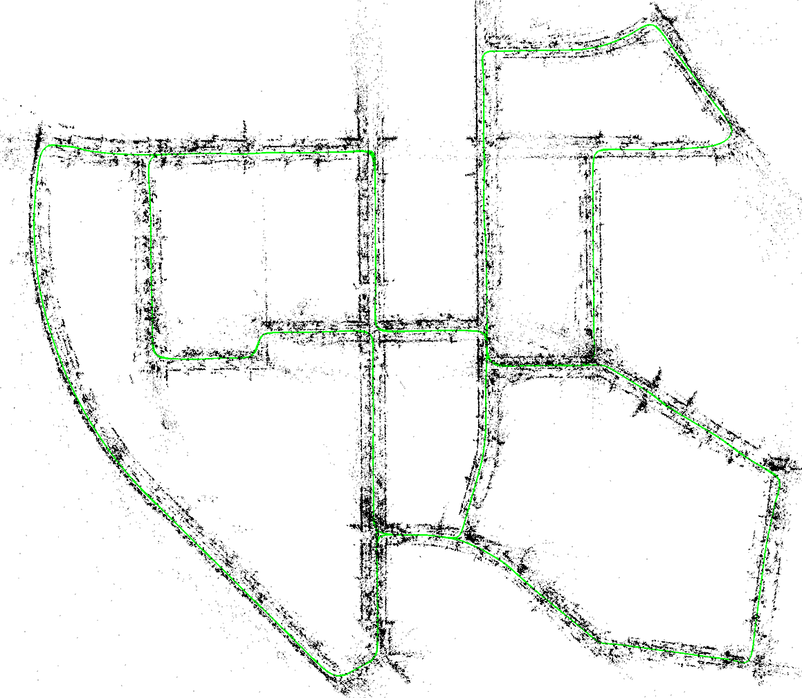
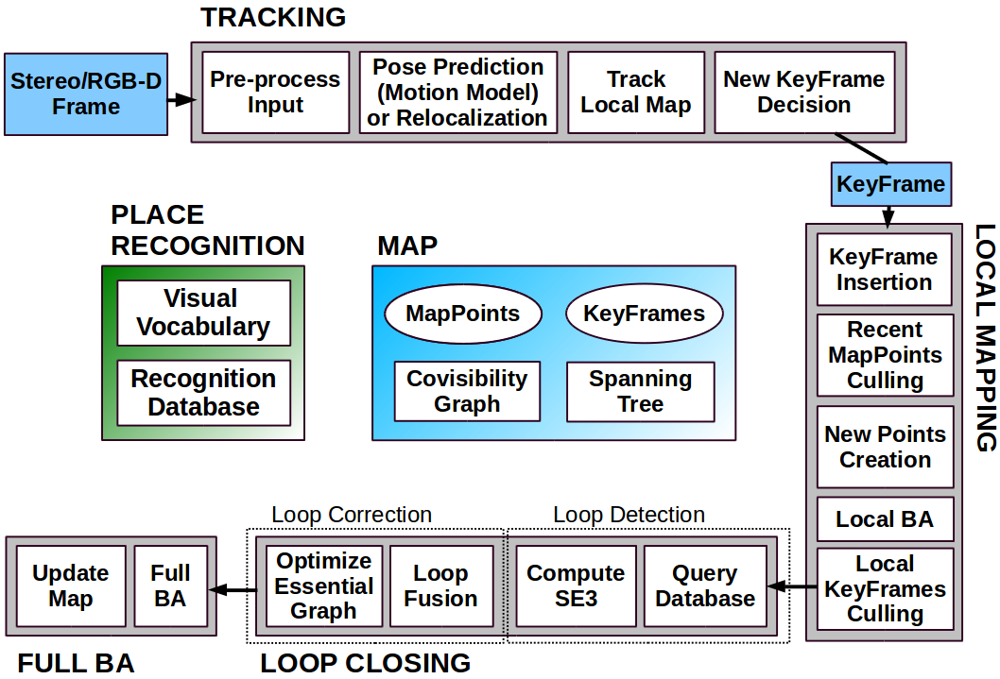
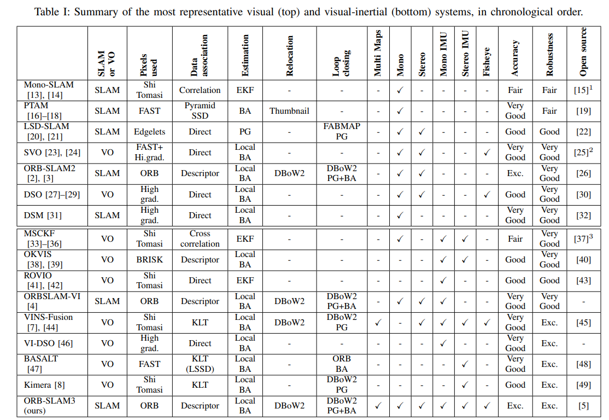
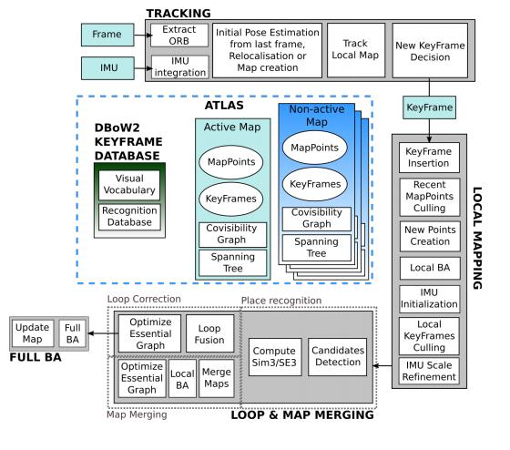
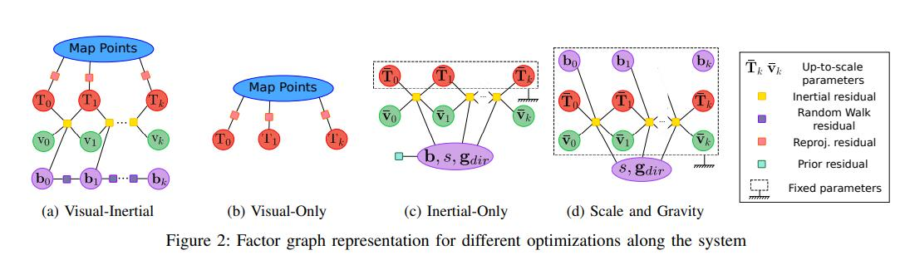

= Описание алгоритмов ORB SLAM, особенно методов ИИ, используемых в них.

* [ ] написать структуру документа
* [ ] есть описание по orb--slam, взять описание основных методов
* [ ] есть описание по orb--slam3, нужно отформатировать
* [ ] выбрать тезисы которые вообще надо указать в документе

====
* "ROS. Стек навигации / Хабр" https://habr.com/ru/post/327888/
* "robotics-smoothing-and-mapping/README.md at master · ccorcos/robotics-smoothing-and-mapping" https://github.com/ccorcos/robotics-smoothing-and-mapping/blob/master/README.md
* "raulmur/ORB_SLAM2: Real-Time SLAM for Monocular, Stereo and RGB-D Cameras, with Loop Detection and Relocalization Capabilities" https://github.com/raulmur/ORB_SLAM2
* "ORB-SLAM3 paper summary - Programmer Sought" https://programmersought.com/article/85105331899/
* "Computer Vision Group - Visual SLAM - LSD-SLAM: Large-Scale Direct Monocular SLAM" https://vision.in.tum.de/research/vslam/lsdslam?redirect=1
* "💤 Vision-based SLAM: стерео- и depth-SLAM / Хабр" https://habr.com/ru/company/singularis/blog/279035/
* "Deep learning combined with SLAM research status - Programmer Sought" https://programmersought.com/article/87761070085/
====

== структура документа

. SLAM, применение, описание контекста, интро
. ORB SLAM - моно слам
* описание основных элементов, обработка данных
. ORB SLAM 2 - стерео, глубина, описать изменения
* описание изменений, как работать со стерео,
* сравнение с аналогами
* применение
. ORB SLAM 3
* что поменялось
* метрики
. результаты, вывод

В это документе представлен алгоритм ORB-SLAM, функциональная монокулярная система SLAM, работающая в реальном времени в малых и больших помещениях и на открытом воздухе. Система устойчива к серьезным помехам от движения, позволяет закрывать и перемещать широкий базовый цикл, а также включает в себя полную автоматическую инициализацию. Основываясь на превосходных алгоритмах последних лет, мы разработали с нуля новую систему, которая использует одни и те же функции для всех задач SLAM: отслеживание, отображение, перемещение и замыкание цикла. Стратегия выживания наиболее приспособленной, которая выбирает точки и ключевые кадры реконструкции, приводит к превосходной надежности и создает компактную и отслеживаемую карту, которая увеличивается только при изменении содержимого сцены, что позволяет работать в течение всей жизни. Мы представляем исчерпывающую оценку в 27 последовательностях из самых популярных наборов данных. ORB-SLAM обеспечивает беспрецедентную производительность по сравнению с другими современными монокулярными подходами SLAM. В интересах сообщества мы публикуем исходный код.

Одной из основных задач связанных с проблемой навигации является построение локальной карты. Данная задача как правило решается алгоритмами SLAM - одновременной локализации и навигации.

Среди современных алгоритмов SLAM можно выбрать несколько основных методов которые будут решать задачу в выбранном контксте максимали эффективно.

Выбор алгоритмов осуществляется на основе сравнения алгоритмов для опоределенной цели использования. Одним из наиболее надежных, проверенных и развитых алгоритмов является ORB-SLAM. Существующие аналоги будут незначитетельно отличаться по производительности, сам алгоритм должен удовлетворять всем общепринятым критериям, 
возможная интеграция позволяет без значительных усилий заменить элементы  данного алгоритма.
// заменить элементы и блоки данного алгоритма на соответст.

Подробнее о свойствах и работе самого алгоритма ORB-SLAM далее.

== Вступление

Алгоритм ORB-SLAM позволяет осуществлять одновременную локализацию и навигацию, облодает рядом преимуществ перед другими решениями SLAM, интегрирован во множестве решений и проверен историей использования.

Более поздние научные работы рассматривают возможную интеграцию данного метода и его аналогов с нейросетевыми системами, с целью улучшения отдельных частей работы алгоритма.

Документ представлен в следующем порядке:

* разбор основных методов и задач в области применения алгоритмов SLAM
* обзор работы алгоритма ORB-SLAM, его ключевые элементы
* подробный разбор отдельных ключевых блоков алгоритма

Разбор алгоритма ведется в историческом порядке разработки системы, от первой версии алгоритма к последней ORB-SLAM3.

//  по типу применения, типам источника данных, алгоритмической сложности можно выбрать несколько 

// Среди существующих методов локализации и навигации, наиболее силь
== Введение

// NTRODUCTION

Simultaneous Localization and Mapping (SLAM) has been
a hot research topic in the last two decades in the Computer Vi-
sion and Robotics communities, and has recently attracted the
attention of high-technological companies. 
SLAM techniques
build a map of an unknown environment and localize the
sensor in the map with a strong focus on real-time operation.

Among the different sensor modalities, cameras are cheap
and provide rich information of the environment that allows
for robust and accurate place recognition. Therefore Visual
SLAM solutions, where the main sensor is a camera, are of
major interest nowadays. 

Place recognition is a key module
of a SLAM system to close loops (i.e. detect when the sensor
returns to a mapped area and correct the accumulated error
in exploration) and to relocalize the camera after a tracking
failure, due to occlusion or aggressive motion, or at system
re-initialization.

почему моно слам недостаточно

Visual SLAM can be performed by using just a monocular
camera, which is the cheapest and smallest sensor setup.
However as depth is not observable from just one camera,
the scale of the map and estimated trajectory is unknown.

как происходит построение карты, необходимо сначала снять локацию с разных точек

не проблема если мы заинересованы преимущественно в локализации и навигации, для реалтайм нужно использовать стерео или глубину

In addition the system bootstrapping require multi-view or
filtering techniques to produce an initial map as it cannot
be triangulated from the very first frame. Last but not least,

основное применение, статистика??

// Stereo input: trajectory and sparse reconstruction of an urban environment
// with multiple loop closures.
 

// RGB-D input: keyframes and dense pointcloud of a room scene with one
// loop closure. The pointcloud is rendered by backprojecting the sensor depth
// maps from estimated keyframe poses. No fusion is performed.

// что такое pointcloud, dense pointcloud, sensor depth maps, keyframe, fusion, как хранится карта, виды данных, типы методов...

// ORB-SLAM2 processes stereo and RGB-D inputs to estimate camera
// trajectory and build a map of the environment. The system is able to close
// loops, relocalize, and reuse its map in real-time on standard CPUs with high
// accuracy and robustness.

// bundle adjustment - Регулировка связности графа

== ORB SLAM

read from paper, translate, correct 
https://www.arxiv-vanity.com/papers/1502.00956/

include::orb-slam-supporting.adoc[tag=Bundle_Adjustment]

== ORB-SLAM2: an Open-Source SLAM System for Monocular, Stereo and RGB-D Cameras

чот за метод, особенности

II. RELATED WORK

A. Stereo SLAM

B. RGB-D SLAM

III. ORB-SLAM2

// ORB-SLAM2 for stereo and RGB-D cameras is built on
// our monocular feature-based ORB-SLAM

A general overview of the system is shown in Fig. 2. The system
has three main parallel threads: 1) the tracking to localize
the camera with every frame by finding feature matches to
the local map and minimizing the reprojection error applying
motion-only BA, 2) the local mapping to manage the local
map and optimize it, performing local BA, 3) the loop closing
to detect large loops and correct the accumulated drift by
performing a pose-graph optimization. This thread launches
a fourth thread to perform full BA after the pose-graph
optimization, to compute the optimal structure and motion
solution. 

The system has embedded a Place Recognition module
based on DBoW2 [16] for relocalization, in case of tracking
failure (e.g. an occlusion) or for reinitialization in an already
mapped scene, and for loop detection. The system maintains
a covisibiliy graph [8] that links any two keyframes observing
common points and a minimum spanning tree connecting
all keyframes. These graph structures allow to retrieve local
windows of keyframes, so that tracking and local mapping
operate locally, allowing to work on large environments, and
serve as structure for the pose-graph optimization performed
when closing a loop.
The system uses the same ORB features [17] for tracking,
mapping and place recognition tasks. These features are robust
to rotation and scale and present a good invariance to camera
auto-gain and auto-exposure, and illumination changes. More-
over they are fast to extract and match allowing for real-time
operation and show good precision/recall performance in bag-
of-word place recognition [18].
In the rest of this section we present how stereo/depth
information is exploited and which elements of the system
are affected. 

// For a detailed description of each system block,
// we refer the reader to our monocular publication [1].

A. Monocular, Close Stereo and Far Stereo Keypoints

.ORB-SLAM2 is composed of three main parallel threads: tracking, local mapping and loop closing, which can create a fourth thread to perform full BA after a loop closure. The tracking thread pre-processes the stereo or RGB-D input so that the rest of the system operates independently of the input sensor. Although it is not shown in this figure, ORB-SLAM2 also works with a monocular input as in [1].
 

== ORB SLAM3

TODO:: copy from ORB-SLAM3 paper summary https://programmersought.com/article/85105331899/

Tracking and mapping

* Map fusion and closed loop detection
** Visual map fusion

// * Описание алгоритмА ORB SLAM

from
https://doi.org/10.1002/rob.21831

// == orb slam notation

// ORB-SLAM2 [Mur-Artal and Tardós, 2017] and S-PTAM [Pire et al., 2017] are currently two of
// the best state-of-the-art feature-based visual SLAM approaches that can be used with a stereo
// camera. More recently, ProSLAM [Schlegel et al., 2017] has been released (only benchmark tools
// available at this time) to provide a comprehensive open source package using well know visual
// SLAM techniques. For ORB-SLAM2, it can be also used with a RGB-D camera. They are all
// graph-based SLAM approaches. For ORB-SLAM2 and S-PTAM, when a loop closure is detected
// using DBoW2 [Gálvez-López and Tardós, 2012], the map is optimized using bundle adjustment.
// Graph optimization after loop closure is done in a separate thread to avoid influencing camera
// tracking frame rate performance. For ProSLAM, loop closures are detected by direct comparison
// of the descriptors in the map, instead of using a bag-of-words approach. For all these approaches,
// loop closure detection and graph optimization processing time increases as the map grows, which
// can make loop closure correction happening with a significant delay after being detected. The
// approaches maintain a sparse feature map. Without occupancy grid or dense point cloud outputs
// available out-of-the-box like lidar approaches, they can be then difficult to use on a real robot.

// ORB-SLAM2 [Mur-Artal and Tardós, 2017]
// S-PTAM [Pire et al., 2017]
// ProSLAM [Schlegel et al., 2017]
// DBoW2 [Gálvez-López and Tardós, 2012]
// loop closure detection
// graph optimization processing
// bundle adjustment
// descriptors in the map
// sparse feature map
// occupancy grid or dense point cloud
// graph-based SLAM approaches
// visual
// SLAM

=== references

https://programmersought.com/article/85105331899/
// https://githubmemory.com/repo/Mauhing/ORB_SLAM3
// ORB-SLAM3 Related Publications: https://github.com/UZ-SLAMLab/ORB_SLAM3
//
// [ORB-SLAM3] Carlos Campos, Richard Elvira, Juan J. Gómez Rodríguez, José M. M. Montiel and Juan D. Tardós, ORB-SLAM3: An Accurate Open-Source Library for Visual, Visual-Inertial and Multi-Map SLAM, IEEE Transactions on Robotics 37(6):1874-1890, Dec. 2021. PDF.
//
// [IMU-Initialization] Carlos Campos, J. M. M. Montiel and Juan D. Tardós, Inertial-Only Optimization for Visual-Inertial Initialization, ICRA 2020. PDF
//
// [ORBSLAM-Atlas] Richard Elvira, J. M. M. Montiel and Juan D. Tardós, ORBSLAM-Atlas: a robust and accurate multi-map system, IROS 2019. PDF.
//
// [ORBSLAM-VI] Raúl Mur-Artal, and Juan D. Tardós, Visual-inertial monocular SLAM with map reuse, IEEE Robotics and Automation Letters, vol. 2 no. 2, pp. 796-803, 2017. PDF.
//
// [Stereo and RGB-D] Raúl Mur-Artal and Juan D. Tardós. ORB-SLAM2: an Open-Source SLAM System for Monocular, Stereo and RGB-D Cameras. IEEE Transactions on Robotics, vol. 33, no. 5, pp. 1255-1262, 2017. PDF.
//
// [Monocular] Raúl Mur-Artal, José M. M. Montiel and Juan D. Tardós. ORB-SLAM: A Versatile and Accurate Monocular SLAM System. IEEE Transactions on Robotics, vol. 31, no. 5, pp. 1147-1163, 2015. (2015 IEEE Transactions on Robotics Best Paper Award). PDF.
//
// [DBoW2 Place Recognition] Dorian Gálvez-López and Juan D. Tardós. Bags of Binary Words for Fast Place Recognition in Image Sequences. IEEE Transactions on Robotics, vol. 28, no. 5, pp. 1188-1197, 2012. PDF
