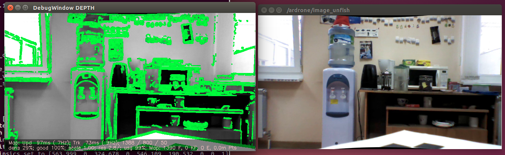
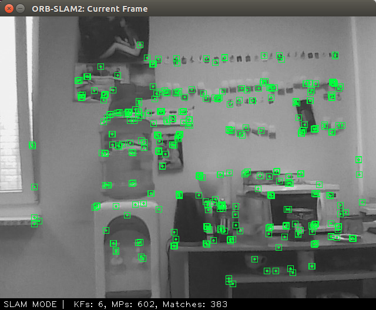

= reading

:imagesdir: images
:toc: preamble

:author: timur chikichev
:email: t.chikichev@navigine.ru

:pygments-style: Coderay

:toc: macro

SAM
Smoothing and mapping, алгоритм оптимизации карты (iSAM, GTSAM)
Sensor fusion
Алгоритмы комплексирования различной навигационной информации

Карта препятствий (Occupancy Map, Grid)
Облако точек (PointCloud)
Плотное облако точек(Octomap, dense point cloud)

// include::rgbd-camera-usage.adoc[leveloffset=1]
//
//
// include::rgb-camera-usage.adoc[leveloffset=1]
// include::orb-slam.adoc[leveloffset=1]

статья по методам ии, описание текстом, смотрю сейчас
https://programmersought.com/article/87761070085/

ORB SLAM2 https://github.com/raulmur/ORB_SLAM2

Когда использовать LSD SLAM? https://habr.com/ru/company/singularis/blog/277537/
// Если Вам необходима плотная карта местности (например, для построения карты препятствий), или окружение не содержит достаточно фич (features), то есть включает слаботекстурированные крупные объекты, и Ваша платформа предоставляет достаточные вычислительные возможности, тогда Вам подойдет LSD SLAM.

.LSD SLAM

.ORB SLAMv2

smoothing-and-mapping: https://github.com/ccorcos/robotics-smoothing-and-mapping/blob/master/README.md

SLAM (с англ. одновременная локализация и картография),
Навигация в плотных (и не очень) облаках точек, Планирование по Карте Препятствий (OccupancyMap)

https://habr.com/ru/post/327888/

// - 50 стр.

=== READING

- review-taxonomy-of-slams-backend-optimization
https://gisbi.medium.com/review-taxonomy-of-slams-backend-optimization-d1fa08ffec39

- reference awesome-SLAM-list Visual Odometry (image based only)
https://github.com/OpenSLAM/awesome-SLAM-list

- Real-Time Appearance-Based Mapping http://introlab.github.io/rtabmap/
- Four Kilometers Walk in Forest (an uncut real-time visual SLAM demo) https://www.youtube.com/watch?v=G-5jesjNfLc

- Vision-based SLAM: стерео- и depth-SLAM https://habr.com/ru/company/singularis/blog/279035/

- Kimera: an Open-Source Library for Real-Time Metric-Semantic Localization and Mapping https://arxiv.org/abs/1910.02490
