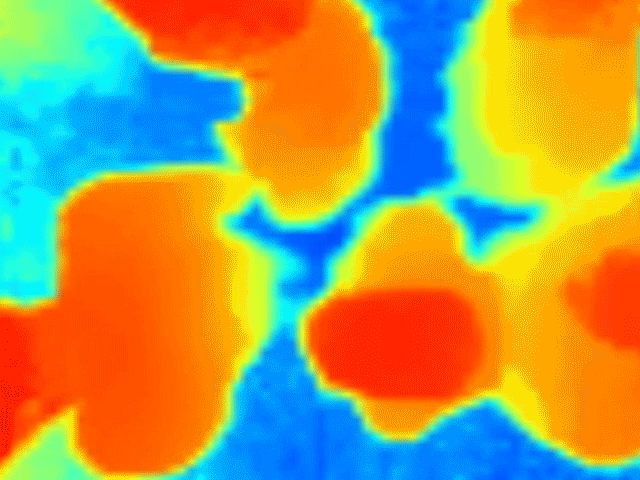

= Использование камер глубины в задачах навигации внутри и вне помещений.
// - 20 стр.
:imagesdir: images-rgbd

.задачи навигации внутри и вне помещений
* какие задачи (навигация объекта, контроль с внешних камер(локализация, навигация, трекинг))
* какие носители (коптер, робот, автомобиль, человек со смартфоном )
* контекст

.задачи навигации внутри и вне помещений
* движение по маршруту, позиционирование
* контроль окружения (определение объектов, людей) - избежание столкновений
* todo about navigation

TODO:: describe navigation

https://www.terabee.com/depth-sensors-precision-personal-privacy/

Depth sensing aims to change the way digital systems understand real environments to automate processes that would typically require human observation.

This requires three closely-linked tasks:
image acquisition, processing, and analysis.

Time-of-Flight depth sensors have proven foundational in the research and development (R&D) of unique depth cameras that can perform precise real-time distance imaging for myriad applications.

Depth sensors are now routinely used in advanced human machine interfaces (gesture recognition, motion tracking, etc.), multi-point level sensing, object counting, and navigation systems for unmanned robotic vehicles.

// What are Depth Sensors?:: xx

== Камеры глубины

https://habr.com/ru/post/457524/

Камера глубины, восстанавливает карту глубины в области обзора в соответствии с определенным физическим принципом.
Оценить качество устройства можно по тем же принципам что и у обычных камер:
разрешение изображения(*количество пикселов*), частота съемки (кадров в секунду, FPS)
// Восстановленная глубина измеряется посредством косвенных измерений.

// опоределение точности ргбд камер, физические метрики

.По принципу работы, камеры глубины можно классифицировать на следующие основные подгруппы:
- Structured Light камеры, камеры структурного света, снимающая структурный свет от собственного инфракрасного проектора;
- Time of Flight камеры измеряют задержку распространения отраженного света;
- Depth from Stereo - бинокулярное зрение для реконструкции глубины в изображении
- Light Field Camera
// они же камеры светового поля или пленоптические камеры, про которые был отдельный подробный пост;
- Lidar-устройства -
// описать принцип лидара, метрики, формальное определение
** Solid State Lidars, которые работают без отказа примерно в 100 раз дольше обычных лидаров и выдают привычную прямоугольную картинку.

.камера глубины:
* принципиальо работает как камера, иммеет ограниченный обзора
* одновременно определяет информацию о расстоянии до многих точек в поле зрения
** количество точек определяемых одновременно - разрешающая способность
* часто совместно используются несколько сенсоров для увеличение точности за счет трилатерации

камеры работающие по принципу отраженного света: излучатель, засветка, невозможжно использовать совместно

камеры вообще: сильно зависят от свойств окружения, освещенности и т.д.

плюсы камер: количество информации, точные угловые измерения, возможность получать качественные измерения в ближайшем окружении

минусы
