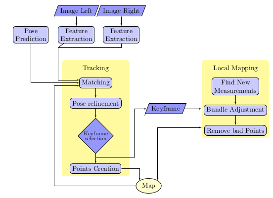

== Использование RGB-камер (моно, стерео) в задачах навигации внутри и вне помещений.
// - 20 стр.

from ds-ptam - stereo parallel

One of the SLAM methods that has had the greatest
impact on mobile robotics was PTAM (Parallel Track-
ing and Mapping) [14]. This method poses a new paradigm
that applies to Visual SLAM issues in which it is pro-
posed to separate localization and mapping tasks into
independent threads by optimizing performance in multi-
core processors.

addressing the problem of
SLAM for large scale environment.

Many of the developments that are part of the state
of the art in the area of distributed visual SLAM sys-
tems address the problem of collaboration between de-
vices for a more complete mapping of the environment,
most of them working on airborne vehicles or mobile de-
vices, such as tablets or cell phones [26, 15, 8, 25, 24].

// Forster, C., Lynen, S., Kneip, L., Scaramuzza, D.:
// Collaborative monocular slam with multiple micro
// aerial vehicles.
// In: IROS, pp. 3962–3970. IEEE
// (2013).
// URL http://dblp.uni-trier.de/db/conf/

// Mahdoui, N., Natalizio, E., Frémont, V.: Multi-UAVs
// network communication study for distributed visual si-
// multaneous localization and mapping. In: Proceedings of

// Wendel, A., Maurer, M., Graber, G., Pock, T., Bischof,
// H.: Dense reconstruction on-the-fly. In: Proceedings of
// the 2012 IEEE Conference on Computer Vision and Pat-
// tern Recognition (CVPR), CVPR ’12, pp. 1450–1457.
// IEEE Computer Society, Washington, DC, USA (2012).
// DOI 10.1109/CVPR.2012.6247833

// Williams, R., Konev, B., Coenen, F.: Multi-agent En-
// vironment Exploration with AR.Drones, pp. 60–71.
// Lecture Notes in Computer Science. Springer Inter-
// national Publishing, Cham (2014).
// DOI 10.1007/
// 978-3-319-10401-0 6. URL https://doi.org/10.1007/
// 978-3-319-10401-0_6

// Williams, R., Konev, B., Coenen, F.: Scalable distributed
// collaborative tracking and mapping with Micro Aerial
// Vehicles. In: Proceedings of the 2015 IEEE/RSJ Inter-
// national Conference on Intelligent Robots and Systems
// (IROS), pp. 3092–3097 (2015). DOI 10.1109/IROS.2015.
// 7353804

[S-PTAM]
S-PTAM (Stereo Parallel Tracking and Mapping) [19]
is an open-source method that addresses the problem of
SLAM based on stereo vision. It was developed using
the ROS framework [20] with the objective of being
executed in real time in large environments,

// 19
// Pire, T., Fischer, T., Civera, J., De Cristóforis, P., Berlles,
// J.J.: Stereo parallel tracking and mapping for robot local-
// ization. In: Proceedings of the IEEE/RSJ International
// Conference on Intelligent Robots and Systems (IROS),

// 20
// Quigley, M., Conley, K., Gerkey, B.P., Faust, J., Foote,
// T., Leibs, J., Wheeler, R., Ng, A.Y.: ROS: an open-source
// Robot Operating System. In: ICRA Workshop on Open
// Source Software (2009)

[initialized]
At the beginning of its execution, S-PTAM assumes
that the stereo camera is located at the origin of world
coordinates and without a map of its environment. Then,
upon receiving the first stereo frame captured by the
camera, the map is initialized by triangulating the ex-
tracted features in the left frame and right frame. The
triangulated points are called map points. Thereafter,
the subsequent stereo frames received will be located by
estimating the camera pose based on the existing map.

[decay-velocity]
imu - decay-velocity model —based in previous poses—
predicts an initial estimate of the camera pose.

[correspondences,descriptors]
This estimation is adjusted by projecting the 3D points on the
plane of each image and looking for the correspondences
with the features extracted in it by comparing each
of their descriptors. The obtained correspondences of
this procedure are called 2D-3D matches or constraints
because they represent the observation of a point in
space by the stereo camera.

[keyframes]
those stereo
frames that observe an unexplored part of the world
are selected to be included in the map, adding new map
points and new constraints to the map. These frames
are called keyframes.

[refinements,Bundle-Adjustment,BA]
Running concurrently with Tracker, another execu-
tion thread called Mapper is started, which will be in
charge of adjusting camera poses and map point, i.e.
performing map refinements. These refinements are car-
ried out using the Bundle Adjustment method [23]. This
thread also looks for new matches between keyframes
and map points to increase the constraints between
them. In addition, it removes both map points and mea-
surements considered spurious or inconsistent by the
Bundle Adjustment method.

// Triggs, B., McLauchlan, P.F., Hartley, R.I., Fitzgib-
// bon, A.W.: Bundle Adjustment — A Modern Synthesis,
// chap. 21, pp. 298–372. Springer Berlin Heidelberg, Berlin,
// Heidelberg (2000). DOI 10.1007/3-540-44480-7 21. URL
// http://dx.doi.org/10.1007/3-540-44480-7_21

.S-PTAM structure diagram [19].
 

// Pire, T., Fischer, T., Civera, J., De Cristóforis, P., Berlles,
// J.J.: Stereo parallel tracking and mapping for robot local-
// ization. In: Proceedings of the IEEE/RSJ International
// Conference on Intelligent Robots and Systems (IROS),

ds-ptam compared with orb-slam,, no accuracy data,

[ORB-SLAM3]
ORB-SLAM3, system able to perform visual, visual-inertial and multi-map SLAM
with monocular, stereo and RGB-D cameras, using pin-hole and
fisheye lens models. fully relies on Maximum-a-
Posteriori (MAP) estimation, even during the IMU initialization
phase.

[accuracy,ORB-SLAM3]
Notably, our stereo-inertial
SLAM achieves an average accuracy of 3.5 cm in the EuRoC
drone and 9 mm under quick hand-held motions in the room of
TUM-VI dataset, a setting representative of AR/VR scenarios.

[AR/VR scenarios..........]
TODO: wrie bout AR/VR scenarios

[stereo-systems]
LSD-SLAM
[20], [21]

Seq.	VINS- Mono	ORB- SLAM3	OKVIS	ROVIO	BASALT	ORB- SLAM3	Моно	Стерео	Моно + IMU	Стерео + IMU	Length (m)
rooml	0.07	0.01	0.06	0.16	0.09	0.01	0.026	0.077	0.009	0.008	146,00
room2	0.07	0.02	0.11	0.33	0.07	0.01	0.028	0.055	0.018	0.012	142,00
room3	0.11	0.04	0.07	0.15	0.13	0.01	0.046	0.076	0.008	0.011	135,00
room4	0.04	0.01	0.03	0.09	0.05	0.01	0.046	0.071	0.009	0.008	68,00
room5	0.20	0.02	0.07	0.12	0.13	0.01	0.043	0.066	0.014	0.010	131,00
room6	0.08	0.01	0.04	0.05	0.02	0.01	0.039 	0.063	0.006	0.006	67,00

