= Событийная стереовизуальная одометрия

Система событийного стереозрения построена по аналогии с биологическими системами зрения у животных, где каждая часть изображения обрабатывается параллельно и независимо с двух глаз. Все участки независимо и асинхронно реагируют на изменение яркости с микросекундной разрешающей способностью. Эти преимущества позволяют решать сложные задачи в робототехнике, такие как высокоскоростные сцены и сцены с высоким динамическим диапазоном. 
Представляется система визуальной одометрии на основе данных, полученных стереокамерой, основанной на событиях. 
Система использует параллельный подход отслеживания и отображения, где новые решения для каждой подпроблемы (трехмерное (3-D) построение карты пространства и оценка положения камеры) разработаны с целями быть принципиальными и эффективными для работы в реальном времени с аппаратным обеспечением. 
Это достигается за счет максимизации пространственно-временной согласованности данных, основанных на стереособытиях, используя при этом простое и эффективное представление. В частности, модуль отображения строит полуплотную трехмерную карту сцены, объединяя оценки глубины с нескольких точек обзора (полученные благодаря пространственно-временной согласованности) в вероятностном режиме. Модуль отслеживания восстанавливает позу стереосистемы, решая проблему регистрации, которая естественно возникает из-за выбранной карты и представления данных о событиях. 
Эксперименты на общедоступных наборах данных демонстрируют универсальность предложенного метода в естественных сценах с общим 6-DoF движением. Система успешно использует преимущества камер, основанных на событиях, для выполнения визуальной одометрии в сложных условиях освещенности, таких как низкая освещенность и высокий динамический диапазон, работая при этом в реальном времени на стандартном процессоре. 
// Мы выпускаем программное обеспечение и набор данных под лицензией с открытым исходным кодом для содействия исследованиям в развивающейся теме одновременной локализации и картирования на основе событий.
// Индексные термины - компьютерное зрение, системы реального времени, системы технического зрения роботов, стереовидение, одновременная локализация и картирование, интеллектуальные камеры.

// ВВЕДЕНИЕ

Событийный метод работы с камерами, как называются его авторы () позволяет ослеживать ситуации когда происходит пиксельные скачкообразные изменения интенсивности, так называемые "события". 

Событийные камеры отдают кадры асинхроннно только в момент фиксации события. Этот асинхронный и дифференциальный принцип работы подавляет временную избыточность (необходимость фильтровать кадры на видео для определения ключевых кадров в обычных SLAM методах) и, следовательно, снижает энергопотребление и вычислительные затраты. Фактически основное отличие заключается в том что фильтрация
ключевых кадров осуществлена аппаратно.
Обладая микросекундным разрешением, событийные камеры способны фиксировать высокоскоростные движения, которые на стандартных камерах вызвали бы сильное смазывание движения, что также актуально для работы в динамических системах.
Кроме того, событийные камеры имеют очень высокий динамический диапазон (HDR) (например, 140 дБ по сравнению с 60 дБ у стандартных камер), что позволяет использовать их в широких условиях освещенности. Таким образом, событийные камеры открывают возможности для решения сложных задач в робототехнике, таких как высокоскоростное и/или HDR отслеживание объектов [3]-[5], отслеживание камеры [6]-[9], управление [10]-[12], одновременная локализация и отображение (SLAM) [13]-[16].
Основная проблема восприятия с помощью этих датчиков заключается в разработке новых алгоритмов, которые обрабатывают незнакомый поток изменений интенсивности ("событий") и способны раскрыть потенциал камеры [2]. В некоторых работах эта проблема решалась путем объединения событийных камер с дополнительными датчиками, такими как датчики глубины [17] или стандартные камеры [18], [19], чтобы упростить задачу восприятия. 
Однако это создает сложности в синхронизации таких систем и добавляет узкие места в работу системы, поскольку комбинированная система всегда ограничена скоростью самого медленного датчика и его динамическим диапазоном.

В работе () реашется проблема стерео визуальной одометрии (ВО) с помощью камер событий в естественных сценах и произвольном 6-DoF движении. Для этого разработана система, которая обрабатывает стереопоток событий в реальном времени и выдает эго-движение стереосистемы и карту трехмерной (3-D) сцены (см. рис. 1). 
Предлагаемая система в основном следует философии параллельного отслеживания и картографирования [20], где основные модули работают в чередующемся режиме, оценивая движение камеры и трехмерную структуру сцены соответственно (более подробный обзор системы приведен на рис. 2). 

Система содержит новый метод отображения стереокадров в пространственные координаты, основанный на оптимизации целевой функции, предназначенной для измерения пространственно-временной согласованности потоков стереособытий.
Выроботана стратегия слияния на основе вероятностных характеристик оцененной обратной глубины для улучшения плотности и точности восстановленной трехмерной структуры.
Представлен новый метод отслеживания камеры на основе 3D.2D регистрации, который использует соответствующую полю глубины природу компактного и эффективного представления событий.
Система также эффективна с вычислительной точки зрения и работает в реальном времени, что позволяет рассматривать возможность использования такой или ааналогичной сиситемы для задач быстрой локализации и навигации.

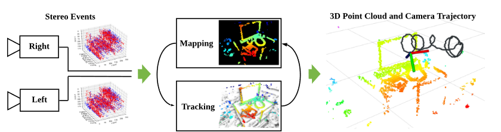 
Рис. 1. Система принимает на вход асинхронные данные, полученные парой камер в стерео конфигурации (слева), и восстанавливает движение камер, а также полуплотную карту сцены (справа). Система использует пространственно-временную согласованность событий в плоскостях изображения камер для решения подпроблем локализации (т.е. отслеживания 6-DoF) и отображения (т.е. оценки глубины) визуальной одометрии (средняя). Система работает в реальном времени на стандартном процессоре.

Работа () значительно расширяет стандартные методы решения проблемы стерео отображения при работе в реальном времени.
// Стерео VO является первостепенной задачей в навигации роботов, и мы стремимся привнести преимущества событийного зрения в сценарии применения этой задачи. Насколько нам известно, это первый опубликованный алгоритм стерео VO для событийных камер (см. раздел II).

// Конспект: Остальная часть статьи организована следующим образом. В разделе II рассматриваются связанные работы по трехмерной реконструкции и оценке эго-движения с помощью событийных камер. В разделе III представлен обзор предлагаемой системы стерео VO на основе событий, модули отображения и отслеживания которых описаны в разделах IV и V, соответственно. В разделе VI проводится широкая оценка предложенной системы на общедоступных данных, демонстрирующая ее эффективность. Наконец, раздел VII завершает данную статью.

== Работы в области событийной стерео визуальной одометрии
Событийная стерео визуальная одометрия (ВО) связана с несколькими проблемами оценки структуры и движения с помощью событийных камер, таких как динамический датчик зрения (DVS). 
// Эти проблемы
// интенсивно изучались в последние годы, особенно после того, как стали коммерчески доступны (2008 г.) камеры событий, такие как динамический датчик зрения (DVS) [1]. Здесь мы рассмотрим некоторые из этих работ. Более подробный обзор представлен в [2].

=== Оценка глубины на основе событий (3-D реконструкция)
Мгновенное стерео: В литературе по оценке глубины стерео на основе событий преобладают методы, которые решают проблему трехмерной реконструкции с использованием данных от пары синхронизированных и жестко закрепленных событийных камер в течение очень короткого времени (в идеале - на основе каждого события). Цель состоит в том, чтобы использовать преимущества событийных камер для реконструкции динамических сцен на очень высокой скорости и с низким энергопотреблением. Эти работы [22]-[24] обычно следуют классическому двухэтапному подходу к задаче поиска эпиполярных совпадений и последующей триангуляции 3-D точки [25]. 
Сопоставление событий часто решается путем наложения нескольких ограничений, включая временную когерентность (например, одновременность) событий на обеих камерах. Например, [26] объединили эпиполярные ограничения, временную несогласованность, несогласованность движения и фотометрическую ошибку (доступную только для полутоновых событий, полученных с помощью камер ATIS [27]) в объективную функцию для вычисления наилучших совпадений. 

Другие работы, такие как [28]-[30], расширяют кооперативное стерео [31] на случай событийных камер [32]. Эти методы хорошо работают со статичными камерами в незагроможденных сценах, так что совпадения событий легко найти среди небольшого количества движущихся объектов.

Монокулярные методы: Оценка глубины с помощью камеры с одним событием была показана в [13], [33] и [34]. Поскольку мгновенная оценка глубины в монокулярных установках нестабильна, эти методы решают проблему оценки глубины для VO или SLAM: следовательно, они требуют знания движения камеры, чтобы интегрировать информацию от событий за более длительный промежуток времени и быть в состоянии произвести полуплотную трехмерную реконструкцию сцены. Одновременность событий не применяется, следовательно, временную когерентность гораздо сложнее использовать для сопоставления событий во времени, поэтому разрабатываются другие методы.

=== Оценка позы камеры на основе событий
Исследования локализации камеры на основе событий развивались путем тестирования сценариев все большей сложности. С точки зрения типа движения, ограниченные движения, такие как чистое вращение [8], [35]-[37] или плоское движение [38], [39] были изучены до исследования наиболее общего случая произвольного 6-DoF движения.
Что касается типа сцен, то решения для искусственных моделей, таких как высококонтрастные текстуры и/или структуры (линейные или плоскостные карты) [6], [38], [40], были предложены до решения более сложных случаев: естественных сцен с произвольной трехмерной структурой и фотометрическими вариациями [7], [9], [36].

С точки зрения методологии, вероятностные фильтры [7], [36], [38] обеспечивают обновление навигации по событиям, достигая таким образом минимальной задержки (микросекунды), в то время как методы, основанные на кадрах (часто нелинейная оптимизация), дают компромисс между задержкой и более стабильными и точными результатами [8], [9].

=== Событийная визуальная одометрия (ВО) и SLAM, основанные на событиях

Монокулярный SLAM: Два метода выделяются как решение проблемы монокулярного событийного VO для 6-DoF движений в естественных трехмерных сценах. В подходе [13] одновременно работают три чередующихся байесовских фильтра, которые оценивают интенсивность изображения, глубину и положение камеры. Восстановление информации об интенсивности и регуляризация глубины делают метод вычислительно трудоемким, поэтому для работы в реальном времени требуется специальное оборудование (GPU). В отличие от этого,  [14] предложили геометрический подход, основанный на технике полуплотного отображения из [33] (фокусировка событий [41]) и трекере выравнивания изображений, который работает на изображениях событий. Он не требует восстановления абсолютной интенсивности и работает в реальном времени на центральном процессоре. До сих пор ни один из этих методов не опубликован и не может быть протестирован.

Стерео: 
// демонстратор производителем событийных камер [42]; однако его детали не были раскрыты. Таким образом, насколько нам известно, это первый опубликованный алгоритм стерео VO для событийных камер. В экспериментах (см. раздел VI) мы сравниваем предложенный алгоритм с 
метод итеративно-ближайшей точки (ICP) лежит в основе технологии работы большинства реконструкторов стерео в трехмерную сцену.
Метод () основан на нашей предыдущей работе [21], переработанной, и новом устройстве слежения за камерой, которое повторно использует структуры данных, используемые для отображения. Для отображения не используется классическая модель сопоставления событий плюс триангуляция, а используется подход прямой проекции, который позволяет оценивать глубину без явного установления соответствия событий. 
// Вместо этого мы переформулируем временную когерентность, используя компактное представление пространства-времени, обеспечиваемое временными поверхностями [43]. 
Для отслеживания используется нелинейнуя оптимизация на временных поверхностях, что напоминает парадигму, основанную на кадрах, которая дает компромисс между задержкой и эффективностью и точностью. Как и в [14], система () не нуждается в восстановлении абсолютной интенсивности и является эффективной, способной работать в реальном времени без специального оборудования (GPU); достаточно стандартного оборудования, такого как CPU ноутбука.

== ОБЗОР СИСТЕМЫ

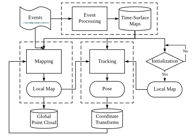 
Рис. 2. Блок-схема системы. Основные модули системы, включая Предварительная обработка событий (см. раздел III-A), картирование (см. раздел IV) и отслеживание (см. раздел V) отмечены пунктирными прямоугольниками. Единственным входным сигналом для системы являются необработанные стереоизображения с калиброванных камер, а выходной сигнал состоит из поз камер и облака точек трехмерных краев сцены.

Предлагаемая стереосистема VO принимает на вход только необработанные события от калиброванных камер и одновременно определяет позу стереокамеры и реконструирует окружение с помощью полуплотных карт глубины. Обзор системы приведен на рис. 2, где основные модули выделены пунктирными линиями. Аналогично классическим SLAM конвейерам [20], ядро системы () состоит из двух чередующихся модулей: локализация (отображение) и картирование. 
Кроме того, существует третий ключевой модуль: предварительная обработка событий.

// Давайте кратко представим функциональность каждого модуля и объясним, как они работают совместно. Прежде всего, 

Модуль обработки событий генерирует представление событий, называемое картами временных поверхностей (или просто "временными поверхностями"), которые используются другими модулями. Теоретически, эти карты времени обновляются асинхронно, с каждым входящим событием (наносекундное время обновления). Однако, учитывая, что одно событие не приносит много информации для обновления состояния системы VO, временные поверхности стерео обновляются с более практичной скоростью: например, при наступлении определенного количества событий или с фиксированной частотой (например, 100 Гц в нашей реализации). 

Краткая история временных поверхностей хранится в базе данных (см. правую верхнюю часть рис. 2) для доступа других модулей. Во-вторых, после фазы инициализации модуль отслеживания непрерывно оценивает положение левой камеры относительно локальной карты. Полученные оценки позы хранятся в базе данных преобразований координат (например, TF в ROS [44]), которая способна вернуть позу в любой момент времени путем интерполяции в SE(3). Наконец, модуль сопоставления
берет события, временные поверхности и оценки позы и обновляет
локальную карту (представленную в виде вероятностной полуплотной карты глубины), которая используется модулем отслеживания. Локальные карты хранятся в базе данных глобального облака точек для визуализации.

Инициализация: Для начальной загрузки системы применен стереометод (модифицированный метод SGM [45], о котором говорится в разделе VI-C), который обеспечивает грубую начальную карту. Это позволяет модулю отслеживания начать работу, в то время как модуль отображения также запущен и создает лучшую полуплотную обратную карту глубины (более точную и плотную).

=== Представление событий

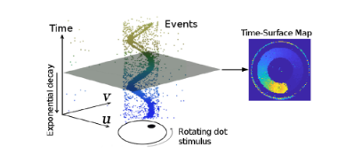 
Рис. 3.   Представление событий. Слева: выход камеры событий при просмотре вращающейся точки. Справа: Карта временной поверхности в момент времени, которая измеряет, насколько далеко во времени (относительно текущего) произошло последнее событие в каждом пикселе. Чем ярче цвет, тем более позднее событие было вызвано.  [46].

Как показано на рис. 3 слева, выходной сигнал камеры событий представляет собой поток асинхронных событий. Каждое событие состоит из пространственно-временных координат, в которых произошло изменение интенсивности заданного размера, и знака этого изменения.
Предлагаемая система (см. рис. 2) использует как отдельные события так и альтернативное представление, называемое временной поверхностью (см. рис. 3- справа). Временная поверхность (ВП) - это двухмерная карта, где каждый пиксель хранит одно значение времени, например, временную метку последнего события в этом пикселе [47]. Используя ядро экспоненциального распада [43], 
которое увеличивает вес последних событий по сравнению с старыми. 

Как показано на рис. 3-справа, значение времени пикселя представляют недавнюю историю движущихся краев в компактном виде (с использованием 2-мерной сетки). Обсуждение нескольких представлений событий (воксельные сетки, рамки событий и т.д.) можно найти в [2] и [48].
Такой подход эффективен с точки зрения памяти и вычислений, представления информативны (края - наиболее описательные области сцены для SLAM), интерпретируемы и потому что они доказали свою успешность для движения (оптический поток) [47], [49], [50] и оценки глубины [21]. В частности, для отображения (см. раздел IV) применяется попиксельное сравнение стереопары TS [21] в качестве замены критерия фотосогласованности стандартных камер [51]. 
Поскольку значение времени пикселя кодирует временную информацию, сравнение пятен на этом представлении равносильно измерению пространственно-временной согласованности на небольших объемах данных на плоскостях изображения. Для сопоставления изобрадения в локализации (см. раздел V)  применен тот факт, что значение времени пикселя действует как анизотропное поле расстояний [52], определяемое последними местоположениями краев, для регистрации событий относительно трехмерной карты. Для удобства визуализации и обработки (1) масштабируется из [0,1] в диапазон [0, 255].

== КАРТОГРАФИРОВАНИЕ: ОЦЕНКА ГЛУБИНЫ СТЕРЕОИЗОБРАЖЕНИЯ ПО ПРОСТРАНСТВЕННО-ВРЕМЕННАЯ СОГЛАСОВАННОСТЬ И СЛИЯНИЕ

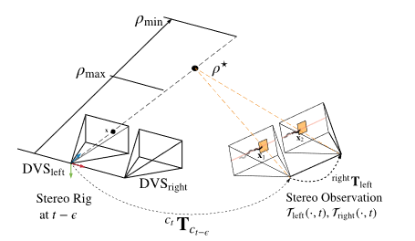 
Рис. 4. Картирование. Геометрия (обратной) оценки глубины. Трехмерные точки, совместимые с событием e = (x,t E, p) на левой камере, параметризуются обратной глубиной ρ на луче обзора через пиксель x в момент времени t E. Истинное местоположение 3D-точки, вызвавшей событие, соответствует значению ρ*, которое максимизирует временную согласованность по всему стереонаблюдению.
left( , t), right( , t). Интервал поиска [ρmin , ρ max] определяется для ограничения оптимизации вдоль луча обзора.

Модуль отображения состоит из двух этапов: 
1) вычисление оценок глубины событий и 2) объединение таких оценок глубины в точную и наполненную карту глубины. 
Обзор модуля отображения представлен на рис. 7(a).

Основополагающими принципами, часто используемыми для оценки глубины стерео на основе событий, являются совместное существование событий и эпиполярное ограничение, которые просто означают, что трехмерная грань должна быть зафиксироована на двух одновременных событиях на соответствующих эпиполярных линиях обеих камер. Однако, как показано в [28] и [53], стерео-временное совпадение не является строго верным на уровне пикселей из-за задержек, дрожания и несоответствия пикселей (например, различия в частоте срабатывания событий). Следовательно, критерий временной согласованности стереоизображения можно определить по пространственно-временным окрестностям событий, а не путем сравнения временных меток событий в двух отдельных пикселях. В работе () представлены такие окрестности с помощью временных поверхностей (благодаря их свойствам и естественной интерпретации как информации, связанной во времени) и преобразуют проблену реконструкци трехмерной сцены в задачу минимизации по выбранному критерию.

В работе [21] был использован вышеупомянутый двухэтапный процесс и принцип. Основные различия обусловлены целью работы в реальном времени: 

- Целевая функция построена только по временной несогласованности для одногоо события карты времени-поверхности
а не на более длительных промежутках времени (таким образом, предлагаемый подход
становится ближе к стратегии из [51], чем из [54]). 
- Система может быть модифицирована предложенным новым алгоритмом глубинного слияния, которыйпостроен на основе исследования вероятностных характеристик временных остатков и обратной репараметризации глубины, чтобы обеспечить точную оценку глубины на более длительных временных интервалах по сравнению с одной стереокартой временной поверхности.
-  Начальное предположение для минимизации цели определяется с помощью метода блочного сопоставления, который более эффективен, чем перебор [21]. 
- Неотрицательные невязки по блокам изображений [21] заменяются на подписанные попиксельные невязки, что гарантирует ненулевые якобианы для достоверного распространения неопределенности в динамической модели движения и обновления карты.

=== Обратная репараметризация глубины для события

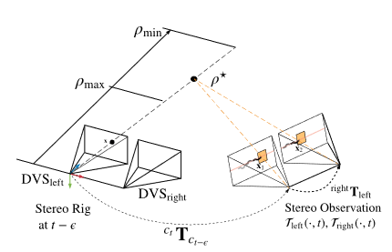 
Рис. 4 иллюстрирует геометрию предлагаемого подхода. Без потери общности применена обратная репараметризация глубины, используя левую камеру. Обозначен интервал сопоставления [min, max] глубины, в котором проводится оптимизация. 

Для оценки обратной глубины событий, произошедших до стереонаблюдения в момент времени применена процедура оптимизации энергии модели.

Стереонаблюдение в момент времени t относится к паре временных поверхностей левой и правой (left( , t), right( , t)), созданных с помощью (1) [см. также рис. 5(c) и (d)].
Система решает задачу стереосопоставления кадров как задачу минимизацию выбранного критерия. Предполагается, что калибровка камеры (внутренние и внешние параметры) известна и не меняется.

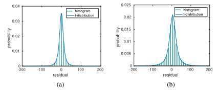 
Рис. 6.    Распределение вероятностей временных остатков r i: эмпирическое (зеленая гистограмма) и t-образное распределение Стьюдента (синяя кривая). (a) simulation_3planes [58].
(b) upenn_flying1 [55].

    
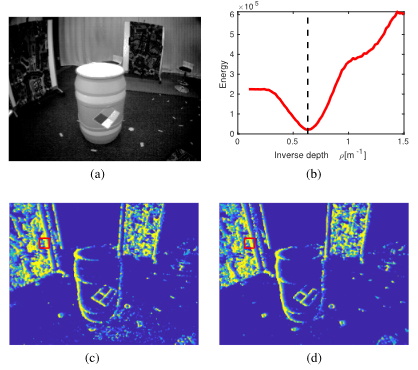 
Рис. 5. Сопоставление. Пространственно-временная согласованность. (a) Кадр интенсивности показывает визуальный вид сцены. Наш метод не использует кадры интенсивности; только события. (b) Объективная функция измеряет несоответствие между содержанием истории движения [временные поверхности (c) и (d)] на левой и правой сетчатках, заменяя таким образом фотометрическую ошибку в стерео на основе кадров. В частности, (b) изображает изменение C(x, ρ, left( , t), right( , t), T tδt:t) с обратной глубиной ρ. Вертикальная пунктирная линия (черная) указывает на обратную глубину. (c),
(d) показывают временные поверхности стереокамеры событий в момент наблюдения, где пиксели для измерения временного остатка в (b) 
выделены красным цветом. (a) Сцена в наборе данных [55]. (b) Целевая функция (3) (красным цветом).
(c) Временная поверхность (левый DVS). (d) Временная поверхность (правая DVS).

// триангуляции за один шаг, работая в режиме прямой проекции (3-D 2-D). 

Как показано на рис. 4, предположение об обратной глубине ρ дает трехмерную точку (x, ρ), проекция которой на обе плоскости стереоизображения в момент времени t дает точки x 1(ρ) и x 2(ρ), окрестности которых сравниваются в объективной функции.
Следовательно, обратная гипотеза глубины ρ устанавливает кандидата на совпадение стереособытий, а наилучшее совпадение обеспечивается тем ρ, который минимизирует цель.
Нелинейный решатель для оценки глубины: Объективная функция оптимизируется с помощью нелинейных методов наименьших квадратов, таких как метод Гаусса-Ньютона, которые итеративно находят корень из необходимого условия оптимальности.

Каждое событие трассформируется с использованием положения камеры в момент его временной метки. 
Функция отобрадения проецирует трехмерную точку на плоскость изображения камеры, а ее обратная функция обратно проецирует пиксель в трехмерное пространство с учетом обратной глубины ρ. right2left преобразование обозначает преобразование от левой камеры события к правой, которое является постоянным. Все координаты события x не искажаются и стереокорректируются с помощью известной функции калибровки камер.

На рис. 5 показан пример объективной функции из реальной стереопоследовательности события с камерой [55], которая имеет истинную глубину. Это подтверждает, что предложенная объективная функция (3) действительно приводит к оптимальной глубине для общего события. Она визуализирует профиль
Аналитические производные используются для ускорения вычислений.

Инициализация нелинейного решателя: Успешное решение обратной оценки глубины (7) зависит от хорошего начального значения ρ0 . Для этого, вместо того, чтобы проводить интенсивный поиск по сетке инверсной глубины [21], мы применяем более эффективную стратегию, использующую каноническую стерео конфигурацию: сопоставление блоков по эпиполярным линиям стерео наблюдения left( , t), right( , t) с использованием целопиксельной сетки диспаратности. То есть, мы максимизируем нулевую нормированную кросскорреляцию (ZNCC), используя центры патчей (пиксельные координаты события).

Сопоставление изображений: Обратите внимание, что данный подход отличается от классических двухэтапных методов обработки событий [22]-[24], [26], которые сначала решают задачу стереосопоставления, а затем триангулируют трехмерную точку. Такие двухэтапные подходы работают по принципу "обратной проекции", отображая двухмерные измерения событий в трехмерное пространство. 
В отличие от них, данный подход объединяет сопоставление и
t E, не компенсируется в xt 1, x t2. Тем не менее, эта аппроксимация обеспечивает повторное и эффективное начальное предположение ρ (используя d), временное
согласованность уточняется в ходе последующей нелинейной оптимизации.

// Можно сделать вывод, что обратная оценка глубины для заданного события на левой камере сведена в алгоритм 1. Входными данными алгоритма являются: событие e t−E(пространственно-временные координаты), a

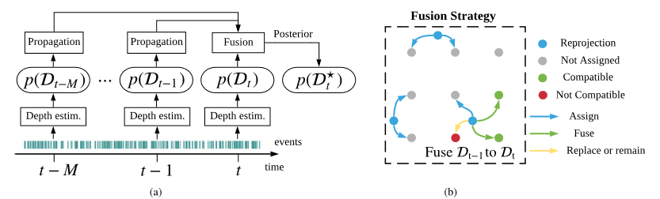 
Рис. 7. Модуль картирования: (a) Стереонаблюдения (временные поверхности) создаются в выбранные моменты времени t, ...,t - M (например, 20 Гц) и подаются в модуль отображения вместе с событиями и положением камеры. Обратные оценки глубины, представленные вероятностными распределениями p(D t−k), распространяются на общее время t и объединяются для получения обратной карты глубины p(D*). Для создания p(D*) мы объединяем оценки из 20 стереонаблюдений (т.е. M = 19). (b) Принимая слияние от t - 1 до t в качестве примера, правила слияния указаны в пунктирном прямоугольнике, который представляет собой область 3 × 3 плоскости изображения (пиксели отмечены сеткой серых точек). Трехмерная точка, соответствующая средней глубине p(D t−1), проецируется на плоскость изображения в момент времени t в виде синей точки. Такая синяя точка и p(D t−1) влияют (т.е. присваивают, объединяют или заменяют) распределения p(D*), оцененные по четырем ближайшим пикселям. (a) Блок-схема модуля отображения. (b) Правила слияния глубины в местах на сетке 3 × 3 пикселя.

Алгоритм 1: Обратная оценка глубины.

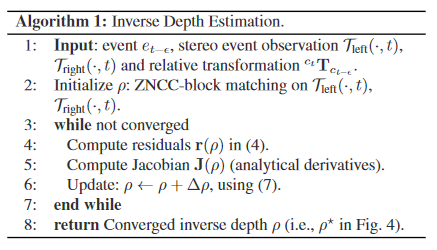 

Для каждого события, выбрать соотвутствующий патч, провести оптимизацию с учетом Якобиана.

* пока не найдено решение
** Вычислите остатки r(ρ) в (4).
** Вычислить якобиан J(ρ) (аналитические производные). 
** Обновление: ρρ + Δρ, используя (7).
- возврат результата конвергированной обратной глубины ρ (т.е. ρ *на рис. 4).

Такая реконструкция приближается к полуплотному уровню, создавая значения глубины для большинства краевых пикселей.

Вероятностная модель оценки обратной глубины: моделируется обратная глубина в пикселе на опорном виде не числом ρ, а фактическим распределением вероятности. Алгоритм 1 обеспечивает "среднее" значение ρ. Теперь известно
как распространяется неопределенность (т.е. разброс вокруг среднего) поступательное движение стереоустановки между периодами событий и можно провести эмпирическое исследование для определения распределения 
события и стереонаблюдения, а также оценить постоянные внешние параметры между обеими камерами. 

Обратная глубина каждого рассматриваемого события оценивается независимо, поэтому вычисления можно распараллелить.

=== Полуплотная реконструкция

Метод трехмерной реконструкции (алгоритм 1), производит обратные оценки глубины для отдельных событий, и в соответствии с параметризацией (см. рис. 4) каждая оценка имеет свою временную метку. 

Система представляет вероятностный подход для слияния обратных оценок глубины для создания полуплотной карты глубины в текущий момент времени (см. рис. 7), которая в дальнейшем используется для отслеживания. Слияние глубин очень важно, поскольку позволяет отнести все оценки глубины к единому времени, уменьшает неопределенность оцениваемой трехмерной структуры и улучшает плотность реконструкции. Далее используются вероятностные характеристики обратных оценок глубины. На основе этих характеристик представлена стратегия слияния, которая применяется постепенно по мере получения оценок глубины по новым стереонаблюдениям.

// На последней итерации метода Гаусса-Ньютона (7) обратная глубина обновляется следующим образом
// ρ* ← ρ + Δρ(r)    (8)
// где Δρ является функцией остатков (4) r. Используя события, глубину наземной истины и позы из двух наборов данных, мы вычислили большое количество остатков (4) для эмпирического определения их вероятностной модели. На рис. 6 показана гистограмма остатков r вместе с параметрической моделью. В эксперименте мы обнаружили, что t-распределение Стьюдента хорошо подходит к гистограмме. Полученная вероятностная модель r обозначается r St(μ r, s 2, ν r), где μ r, s r, ν r- параметры модели, а именно среднее, масштаб и степень свободы, соответственно. 

Гистограммы остатков функции глубины представлены на рис. 6 и кажутся хорошо центрированными на нуле (по сравнению с их разбросом и диапазоном абсцисс), и поэтому мы можем установить μ r0. Параметры подогнанных t-распределений Стьюдента приведены в таблице I для двух использованных последовательностей из двух различных наборов данных.

// Поскольку обобщенные гиперболические распределения (ОГР) замкнуты при аффинных преобразованиях, а распределение t Стьюдента является частным случаем ОГР, мы заключаем, что аффинная трансфор-.
// оценка z = Ax + b (с несингулярной матрицей A и вектором b) случайного вектора x St(μ, S, ν), который следует многомерному распределению Стьюдента t (со средним вектором μ, масштабной матрицей S и
Соответствующее место в плоскости целевого изображения обычно имеет нецелую координату x float. Следовательно, распространяемая обратная глубина будет влиять на распределения в четырех ближайших точках пикселя x [int4см. рис. 7(b)]. Используя x качестве примера, слияние выполняется на основе следующих правил.
Если в точке xint не существует предыдущего распределения, оно инициализируйтся с помощью
степени свободы ν)
// , также следует распределению t Стьюдента [56], в форме z ∼ St(Aμ + b, ASA ×, ν).
// Применяя эту теорему к (7), при r ∼ St(μ r, s 2, ν r) и
// St(μ a, s 2, ν a).
Если уже существует обратное распределение глубины в точке и оно
примерно соответствует распределению t Стьюдентато проверяется совместимость двух гипотез ρ a, 
// ρ bоценивается путем проверки
// где σ b= s     νb b/(νb     2). 
Если две гипотезы совместимы, они объединяются в одну инверсную глубину распределение
//  с помощью (12)
, в противном случае остается распределение с наименьшей дисперсией.

Стратегия слияния показана пунктирным прямоугольником на рисунке 7.

Надежная оценка: Полученная вероятностная модель может быть использована для робастной оценки обратной глубины в присутствии шума и выбросов, поскольку тяжелые хвосты t-распределения Стьюдента учитывают их. Для этого каждый квадратичный остаток в (3) перевзвешивается на коэффициент ω(ri ), который является функцией вероятностно-биллистической модели p(r). Полученная оптимизационная задача решается с помощью итеративно перевзвешенного метода наименьших квадратов (IRLS), заменяющего решатель Гаусса-Ньютона в алгоритме 1. Подробности о выводе весовой функции приведены в [52] и [57].

Инверсные фильтры глубины: Объединение обратных оценок глубины, полученных от нескольких стереопар, выполняется в два этапа. Во-первых, обратные оценки глубины распространяются от времени каждого события до времени стерео наблюдения (т.е. текущего времени). Это делается аналогично операции распространения неопределенности в (9) и (10). Во-вторых, распространяемая обратная оценка глубины сливается (обновляется) с предыдущими оценками на данном пикселе. Шаг обновления выполняется с использованием робастного байесовского фильтра для распределения Стьюдента t. 

Вероятностные оценки в различные моменты времени распространяются и объединяются с распределением карты обратной глубины в самый последний момент времени t, p( *). Предложенное слияние приводит к полуплотной обратной карте глубины *с достаточно хорошим соотношением сигнал-шум, что необходимо для метода слежения, обсуждаемого в следующем разделе.

Примечания: Все события участвуют в создании временных поверхностей, которые используются для отслеживания и отображения. Однако глубина не оценивается для каждого события, поскольку это дорого, а мы стремимся достичь работы в реальном времени при ограниченных вычислительных ресурсах (см. раздел VI-F).

Количество слитых стереонаблюдений, M+1 = 20 на рис. 7, было определено эмпирически как разумный выбор для получения хорошей плотности полуплотной карты глубины в большинстве тестируемых последовательностей. Более теоретическим подходом было бы
иметь адаптивное число, основанное на статистических критериях, таких как кажущаяся плотность точек или уменьшение неопределенности в слитой глубине, но это остается будущей работой.

== СЛЕЖЕНИЕ ЗА КАМЕРОЙ

Модуль слежения в алгоритме, представленный на рис. 2 принимает события и локальную карту в качестве входных данных и вычисляет положение стереосистемы относительно карты. 
В принципе, каждое событие имеет свою временную метку и, следовательно, разную координату камеры при перемещении стереосистемы. Но, как правило, нет необходимости
вычислять позы с микросекундным разрешением, следовательно можно применять более точные подходы в ущерб волее высокочастотным.

// Вероятностное слияние обратной глубины: Предполагая, что предполагаемая обратная глубина соответствует распределению St(μ a, s 2, ν a), ее
// позиция стереонаблюдения (т.е. временные поверхности).

// Теперь рассмотрим два подхода, прежде чем представить наше решение. i) Предполагается, что полуплотная обратная карта глубины доступна в опорном кадре и последующее стерео наблюдение является

// временной (и, следовательно, пространственной) близости к опорному кадру, относительная поза (между опорным кадром и стереонаблюдением) может быть охарактеризована как такая, которая при переносе карты глубины на левый и правый кадры стереонаблюдения дает минимальное пространственно-временное несоответствие. Однако эта характеристика является лишь необходимым условием для решения задачи слежения, а не достаточным. Причина в том, что неправильная относительная поза может перенести полуплотную карту глубины на "пустые" области как левой, так и правой временных поверхностей, что приведет к нежелательному минимуму. ii) Альтернативным подходом к критерию пространственно-временной согласованности может быть рассмотрение только левой временной поверхности стереонаблюдения (поскольку правая камера жестко закреплена) и использование метода выравнивания краевой карты из монокулярной системы [14]. Однако это требует создания дополнительных изображений событий.
Решение вероятностного слияния обратной глубины предложенное в () заключается в использовании всех преимуществ временных поверхностей, уже определенных для отображения. 
Для этого реалтзован метод отслеживания, основанный на глобальной регистрации изображений с использованием "негативов" временных поверхностей. Он вдохновлен методом выравнивания краев для RGB-D камер с использованием полей смещения [52]. Далее формально определяется задачу слежения и решается с помощью прямого композиционного метода Лукаса-Канаде [60]. 

=== Использование временных поверхностей как полей расстояний

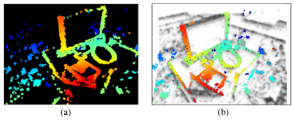 
Рис. 8. Отслеживание. Облако точек, восстановленное по инверсной карте глубины (а), деформируется в негатив временной поверхности в текущий момент времени (б) с использованием оцененной относительной позы. Результат (b) - хорошее выравнивание между проекцией облака точек и минимумами (темными областями) отрицательной временной поверхности. (a) Карта глубины в опорной точке обзора с известной позой. (b) Искаженная карта глубины, наложенная на негатив временной поверхности в текущий момент времени.

TS (см. раздел III-A) кодирует историю движения краев в сцене. Большие значения TS (1) соответствуют недавно произошедшим событиям, т.е. текущему расположению края. Обычно эти большие значения имеют пандус с одной стороны (сигнализирующий о предыдущих местоположениях края) и "обрыв" с другой. Это можно интерпретировать как анизотропное поле расстояний: следуя по рампе, можно плавно достичь текущего местоположения края.

// край. Действительно, определяя "негатив" (как в обработке изображений) TS T (x, t) через
// T¯ (x, t) = 1 -T (x, t)    (14)
// позволяет нам интерпретировать малые значения как текущее местоположение края, а рампы - как поле расстояния до края. Этот отрицательный переход также позволяет нам сформулировать задачу регистрации как задачу минимизации, а не максимизации. Как и TS, (14) масштабируется в диапазоне [0, 255].
// Суть предлагаемого метода слежения заключается в выравнивании темных областей негатива TS и опоры инверсной карты глубины при деформации кадра TS на позу кандидата. Таким образом, м

Метод выравнивании темных областей негатива TS и опоры инверсной карты глубины при деформации кадра TS на позу кандидата представляется как метод выравнивания по изображениям, при этом изображения представляют информацию о времени, а края сцены - "нулевое время". На рис. 8(b) приведен пример успешного отслеживания, демонстрирующий выравнивание по карте краев. 
// Основываясь на результатах полуплотного прямого отслеживания для покадрового отслеживания
// камеры на основе [51], мы используем только левый TS для отслеживания, потому что

// === Постановка проблемы отслеживания
// Более конкретно, задача формулируется следующим образом. Пусть Fref = x i- это набор пикселей с действительной обратной глубиной ρ iв опорном кадре (т.е. refподдержка полуплотной карты глубины    Fref    *). Предполагая, что TS отрицательна в момент времени k
// имеется, обозначается ¯left( , k), цель состоит в том, чтобы найти позу
// T таким образом, чтобы поддержка деформированной полуплотной карты T ( Fref ) хорошо совпадала с минимумами ¯left( , k), как показано на рис. 8. Общая цель регистрации состоит в том, чтобы найти

// где функция искривления
// // W (x, ρ; θ) . π left(T (π −1(x, ρ), G(θ)))    (16)
// переносит точки из текущего кадра refв текущий. Он состоит из цепочки преобразований: обратная проекция из refтрехмерного пространства в трехмерное с учетом обратной глубины, изменение координат в пространстве
// (используя параметры движения кандидата), и перспективное проецирование на текущий кадр. Функция G(θ) : R 6SE(3) дает матрицу преобразования, соответствующую параметрам движения.
// eters θ = (c× , t× )×, где c = (c1 , c2 , c 3)× - параметры Кейли [61] для ориентации R, а t = (t x, t y, t z) ×- перевод.  Функция π −1( ) обратно проецирует пиксель x в пространство, используя известную обратную глубину ρ, в то время как π left( ) проецирует
// преобразованную точку пространства на плоскость изображения левой камеры. T ( ) выполняет изменение координат, преобразуя трехмерную точку с движением G(θ) из refв левый кадр изk
// текущее стереонаблюдение (время k). Мы предполагаем, что выпрямленные и
// неискаженная стереоконфигурация, что упрощает операции за счет использования однородных координат.

=== Композиционный алгоритм
Мы переформулируем задачу определдения положения камеры с помощью прямого композиционного метода Лукаса-Канаде [60], который итеративно уточняет инкрементные параметры позы. 

Он минимизирует
включение правильного TS не приводит к значительному увеличению точности, в то время как затраты на вычисления удваиваются.

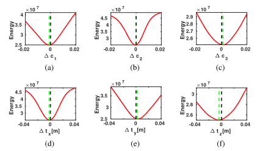 
Рис. 9.    Отслеживание. Срезы объективной функции (15). Графики (a)-(c) и (d)-
(f) показаны изменения объективной функции относительно каждого DoF в ориентации и переводе, соответственно. Вертикальная черная пунктирная линия обозначает истинную позу, а зеленая - минимизатор функции. 
(a-f) Соответствующие компоненты целевой функции.

// относительно Δθ на каждой итерации и затем обновляет оценку искривления как

// W (x, ρ; θ) ← W (x, ρ; θ) ◦ W (x, ρ; Δθ).    (18)

Композиционный подход более эффективен, чем аддитивный метод (15), поскольку некоторые части якобиана остаются постоянными на протяжении всей итерации и могут быть предварительно вычислены. Это связано с тем, что линеаризация всегда выполняется в позиции нулевого приращения. В качестве примера на рис. 9 показаны срезы
объективной функции относительно каждой степени свободы θ, оцениваемой вокруг наземной истинной относительной позы Δθ = 0. Очевидно, что объективная функция, сформулированная с использованием композиционного
метода является гладкой, дифференцируемой и имеет уникальный локальный оптимум вблизи реального значения. Чтобы увеличить область сходимости, применяется гауссово размытие (размер ядра 5 пикселей).

=== Надежная и эффективная оценка движения
Насколько мы заметили, нелинейный решатель методом наименьших квадратов уже достаточно точен. Однако для повышения устойчивости при наличии шума и выбросов в обратной карте глубины рассматривается робастная норма. Для эффективности применяется норма Хубера, а для решения полученной задачи используется метод IRLS.
Для ускорения оптимизации мы решаем задачу методом Левенберга-Марквардта(LM) со стохастической стратегией выборки (как в [14]). На каждой итерации случайным образом выбирается только партия из N pтрехмерных точек в системе отсчета, которые используются для оценки
объективной функции (обычно Np = 300). Метод LM может справиться с неотрицательностью остатка и выполняется только одна итерация на партию. Пять итераций часто достаточно для успешного сближения, поскольку начальная поза обычно близка к оптимальной.

== ЭКСПЕРИМЕНТЫ

Теперь давайте оценим предложенную систему стерео VO на основе событий. Сначала мы представим наборы данных и стереокамеру, используемую в качестве источника данных о событиях (см. раздел VI-A). Затем мы оценим эффективность метода с помощью двух наборов экспериментов.
В первом наборе мы показываем эффективность одного только модуля отображения, используя исходные позы, предоставленные внешней системой захвата движения. Мы показываем, что 

Предложенный вероятностный подход с использованием коэффициента Стьюдента приводит к более точным обратным оценкам глубины, чем стандартные наименьшие квадраты (см. раздел VI-B)

// Сравнение предложенного метод отображения с тремя базовыми методами стерео 3-D реконструкции.

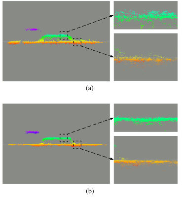 
Рис. 11. Сопоставление. Качественное сравнение между стандартным LS-решателем и IRLS-решателем на основе распределения Стьюдента t. Области, выделенные пунктиром, увеличены для лучшей визуализации деталей. (a) Стандартный LS-решатель. (b) IRLS-решатель на основе распределения t Стьюдента.

ТАБЛИЦА III Сравнение между стандартным LS-решателем и решателем на основе распределений стьюдента 

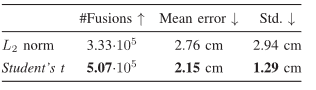 

// Производительность всей системы, по данным события и сравнения расчетных траектории камер с истинными. 

// Возможности метода () с использованием камер, основанных на событиях, для выполнения VO в сложных условиях освещенности, таких как низкая освещенность и высокое разрешение видео. 

// Анализ вычислительной производительности системы VO, ее ограничения.

=== Экспериментальная установка и используемые наборы данных

Оценка алгоритма стерео VO на данных из общедоступных наборов данных и симуляторов [21], [55], [58]. Данные, представленные в [21], были собраны с помощью ручной стереокамеры в помещении. Последовательности, использованные в [55], были собраны с помощью стереокамеры, установленной на беспилотнике, летающем в просторном помещении. Симулятор [58] предоставляет синтетические последовательности с простой структурой (например, плоскопараллельные структуры, геометрические примитивы и т.д.) и "идеальной" моделью камеры событий.

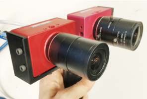 
Рис. 10.  Пользовательская стереокамера, состоящая из двух камер DAVIS346 с горизонтальной базовой линией 7,5 см.

Кроме вышеупомянутых наборов данных, использованы несколько последовательностей, используя стереосистему событийной камеры, показанную на рис. 10. Стереокамера состоит из двух динамических и активных пиксельных датчиков зрения (DAVIS 346).
346 260 пикселей, которые калибруются внутренне и внешне. DAVIS состоит из кадровой камеры и датчика событий (DVS) на одном пиксельном массиве, поэтому калибровка может быть выполнена стандартными методами по кадрам интенсивности и
применяется к событиям. Алгоритм () работает с неискаженными и стерео-правильными координатами, которые предварительно вычисляются с учетом калибровки камеры. 

Сравнение критериев оптимизации картирования: 

// IRLS против LS
// С помощью этого эксперимента мы кратко обосновали вероятностную модель глубины в стихах, полученную из эмпирических наблюдений распределения остатков время-поверхность (см. рис. 6); две очень разные, но связанные величины (10). 

IRLS против LS:
Используя синтетические данные из [58], рис. 11 показывают, что предложенный вероятностный подход приводит к более точным трехмерным реконструкциям, чем метод, используемый в [58].
стандартный объективный критерий наименьших квадратов (LS). Синтетическая сцена на рис. 11 состоит из трех плоскостей, параллельных плоскостям изображения камер на разной глубине. Результаты реконструкции на рис. 11(b) показывают более точные плоские структуры, чем на рис. 11(a). Стандартное отклонение ошибки глубины для задачи на основе распределения Стьюдента t в 2-3 раза меньше, чем для стандартной задачи LS, что объясняет более компактные плоские реконструкции на рис. 11(b) по сравнению с (a).

=== Сравнение методов стерео 3-D реконструкции

Производительность системы оценивается в сравнении с тремя стереометодами. 
Базовые методы сокращенно называются GTS [26], SGM [45] и CopNet [62].

Описание базовых методов: Метод в [26] предлагает сопоставить события, используя критерий соответствия, основанный на времени каждого события, который также работает для полутоновых событий с камеры ATIS [27]; после этого классическая триангуляция обеспечивает 3-D местоположение точки. 

Алгоритм semiglobal matching (SGM) [45], доступный в OpenCV, изначально разработан для решения задачи стереосовмещения в плотном режиме на основе кадров. Он адаптирован к данной задаче, с помощью запуска его на временных стереоповерхностях и маскирования полученной карты глубины так, чтобы оценки глубины давались только для пикселей, в которых произошли последние события. 

Метод в [62] (CopNet) применяет стратегию кооперативного стерео [31] в асинхронном режиме. Использована реализация [63], где применяются идентичные параметры.

Для справедливого сравнения с предложенным методом (), который последовательно объединяет последовательные оценки глубины, также распространяются оценки глубины, полученные GTS и SGM.

Поскольку данные методы не предоставляют оценок неопределенности, просто искажаются оценки глубины от прошлого к настоящему времени (т.е. к моменту, когда слияние запускается в нашем методе). Все методы запускаются и завершаются в одно и то же время и используют наземные истинные позы для распространения оценок глубины во времени, чтобы оценка не зависела от модуля слежения. 

// Из-за несовместимости программного обеспечения распространение не было применено к CopNet. Поэтому CopNet вызывается только во время оценки; однако плотность получаемой им обратной карты глубины является удовлетворительной при подаче достаточного количества событий (15 000 событий [63]).
Результаты: На рис. 12 сравниваются обратные карты глубины, полученные вышеупомянутыми стереометодами. В первом столбце показаны необработанные кадры в градациях серого из программы DAVIS [64], которые только иллюстрируют внешний вид сцен, поскольку методы не используют информацию об интенсивности. Со второго по последний столбцы показаны обратные карты глубины, созданные GTS, SGM, CopNet и нашим методом, соответственно. 

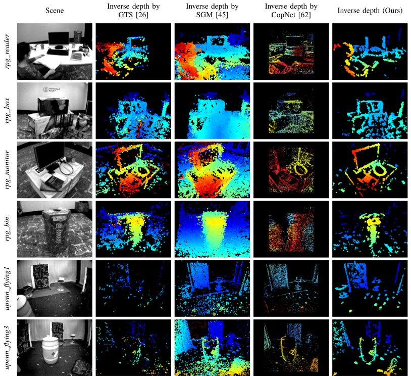 
Рис. 12. Картирование. Качественное сравнение результатов картирования (оценки глубины) на нескольких последовательностях с использованием различных стереоалгоритмов. В первом столбце показаны кадры интенсивности с камеры DAVIS (не используется, только для визуализации). В колонках со 2 по 5 показаны результаты обратной оценки глубины GTS [26], SGM [45], CopNet [62] и нашего метода, соответственно. Карты глубины имеют цветовую кодировку от красного (близко) до синего (далеко) на черном фоне в диапазоне 0,55-6,25 м для четырех верхних строк (последовательности из [21]) и в диапазоне 1-6,25 м для двух нижних строк (последовательности из [55]).

Как и ожидалось, поскольку камеры реагируют на видимое движение краев, методы создают полуплотные карты глубины, которые представляют трехмерные края сцены. 

Это более очевидно в GTS, CopNet и нашем методе, чем в SGM, потому что регуляризатор в SGM помогает сгладить оценки глубины в областях, где пространственно-временная согласованность неоднозначна,
что приводит к наиболее плотным картам глубины. 

Хотя CopNet дает удовлетворительные результаты по плотности, он работает хуже предложенного метода с точки зрения точности глубины. Это может быть связано с тем, что диспаратность на выходе CopNet квантуется с точностью до пикселя. Кроме того, используемый относительно большой размер окрестности (предложенный создателями [62]) вносит эффект пересглаживания. 

Наконец, можно заметить, что предложенный метод дает лучшие результаты с точки зрения компактности и отношения сигнал/шум. Это связано с тем, что мы моделируем как (обратную) глубину, так и ее неопределенность, что обеспечивает принципиальное слияние глубины в нескольких ракурсах и отсечение ненадежных оценок. Поскольку метод инкрементально объединяет последовательные оценки глубины, плотность результирующих карт глубины остается стабильной, даже если скорость потока событий может меняться.

По количественной оценке ошибок глубины для последовательностей рис. 12, где доступна истинная глубина (полученная с помощью LiDAR [55]), рассмотренный метод превосходит базовые методы по всем критериям: среднее значение, медиана и относительная ошибка (относительно диапазона глубин).

// == Полная оценка системы

// Чтобы показать производительность полной системы VO, мы сообщаем результаты оценки эго-движения с помощью двух стандартных метрик: относительной ошибки позы и абсолютной ошибки траектории [65]. Поскольку проектов VO/SLAM, основанных на событиях, с открытым исходным кодом пока не существует, мы реализовали базовый вариант, который использует общепринятые методы оценки глубины и жестких движений в компьютерном зрении. Кроме того, мы проводим сравнение с современной системой SLAM на основе кадров (ORB-SLAM2 [66]), работающей на полутоновых кадрах, полученных стереосистемой DAVIS.
// Более конкретно, базовое решение, называемое "SGM+ICP", состоит из комбинации метода SGM [45] для оценки плотной глубины и метода ICP [67] для оценки относительной позы между последовательными картами глубины (т.е. облаками точек). Вся траектория получается путем последовательной конкатенации относительных поз.
// Оценка выполнена на шести последовательностях с истинными траекториями, а результаты оценки приведены в таблицах V и VI. Лучшие результаты по каждой последовательности выделены жирным шрифтом. Очевидно, что наш метод превосходит базовое решение на основе событий во всех последовательностях. Чтобы сравнение с ORB-SLAM2 было справедливым, глобальная корректировка пучков (BA) была отключена; тем не менее, результаты с включенной глобальной BA также представлены в таблицах для справки. Наша система немного менее точна, чем ORB-SLAM2 на наборе данных rpg, но при этом показывает
// ТАБЛИЦА V
// ОТНОСИТЕЛЬНАЯ ПОЗОРНАЯ ОШИБКА (RMS) [R: °/S, t: CM/S].

// Числа в скобках в ORB_SLAM2 представляют среднеквадратичные ошибки с включенной корректировкой по пучкам.

// ТАБЛИЦА VI
// АБСОЛЮТНАЯ ОШИБКА ТРАЕКТОРИИ (среднеквадратичная) [t: CM]

// image::3-12-2021-08-37-34-AM.png[] 
Оценка производительности полной системы VO выполнена на шести последовательностях с истинными траекториями, а результаты оценки приведены в таблицах V и VI. Лучшие результаты по каждой последовательности выделены жирным шрифтом. Очевидно, что наш метод превосходит базовое решение на основе событий во всех последовательностях. Чтобы сравнение с ORB-SLAM2 было справедливым, глобальная корректировка пучков (BA) была отключена; тем не менее, результаты с включенной глобальной BA также представлены в таблицах для справки. Наша система немного менее точна, чем ORB-SLAM2 на наборе данных rpg, но при этом показывает
лучшую производительность на наборе данных upenn_indoor_flying. 
Это связано с эффектом мерцания в наборе данных rpg, вызванным системой захвата движения, который немного ухудшает производительность нашего метода, но не проявляется на полутоновых кадрах, используемых ORB-SLAM2.

Сравнение траекторий, полученных методами, основанными на событиях, представлено на рис. 13. Наш метод значительно превосходит базовый метод SGM+ICP, основанный на событиях. Оценка полной системы VO с помощью рис. 13 оценивает, остаются ли отображение и отслеживание согласованными друг с другом. Это требует, чтобы модуль отображения был устойчив к ошибкам, вызванным модулем отслеживания, и наоборот. Наша система отлично справляется с этой задачей.
В результате вышеупомянутых явлений мерцания в наборах данных rpg пространственно-временная согласованность между стереокартами "время-поверхность" может не всегда сохраняться. Мы обнаружили, что наша система устойчиво работает в этом сложном сценарии, если это не происходит во время инициализации. Читатели могут получить лучшее представление о феномене мерцания, посмотрев сопровождающее видео.

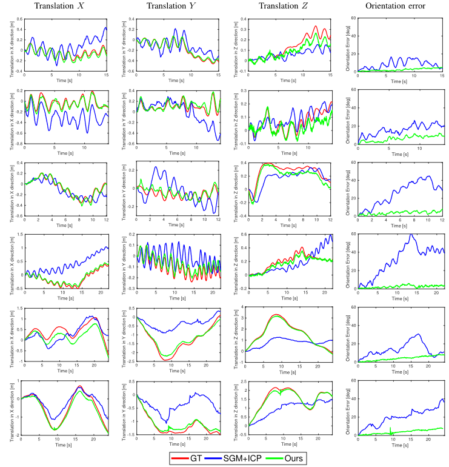 
Рис. 13.   Отслеживание - графики DoF. Сравнение двух методов отслеживания с истинной траекторией камеры, предоставленной системой захвата движения. Столбцы 1-3 показывают трансляционные степени свободы (в метрах). Последний столбец показывает вращательную ошибку в терминах геодезического расстояния в SO(3) (угол относительного вращения между истинным и расчетным вращением). Каждая строка соответствует отдельной последовательности: rpg_bin, rpg_box, rpg_desk, rpg_monitor, upenn_flying1 и upenn_flying3, соответственно. Красным цветом () изображена грунтовая истина, синим () - метод "SGM+ICP", зеленым () - наш метод. На графиках ошибок "грунтовая истина" соответствует эталону, т.е. нулю. Последовательности rpg [21] сняты с помощью ручной стерео установки, движущейся в условиях локально зацикленного поведения (верхние четыре строки). В отличие от них, последовательности upenn_flying [55] получены с помощью стереоустановки, установленной на беспилотнике, который переключается между зависанием и преимущественно поступательным движением (два нижних ряда).

Результаты VO на наборе данных upenn показывают худшую точность по сравнению с результатами на наборе данных rpg. Это может быть объяснено следующими двумя причинами. 
// Во-первых, модель движения (доминирующий перевод с небольшим вращением) определяет, что не восстанавливаются структуры, параллельные базовой линии стереосистемы [как будет обсуждаться на рис. 17(d)]. Эти отсутствующие структуры могут привести к менее точной оценке движения в соответствующей степени свободы. Во-вторых, т
Точность системы (слежения и отображения) ограничена относительно небольшим пространственным разрешением датчика. Использование камер событий с более высоким разрешением (например, VGA [68]) повысило бы точность системы. Также, что когда дрон останавливается и замирает, генерируется мало событий, и поэтому временные поверхности, срабатывающие с постоянной скоростью, становятся ненадежными. Это может привести к тому, что описанная система () будет переинициализирована. 
Это поведение можно смягчить, используя более сложные стратегии для сигнализации о создании временных поверхностей, например, постоянное или адаптивное количество событий [69]. 

Таким образом, на динамическом участке набора данных система показывает хорошую производительность.

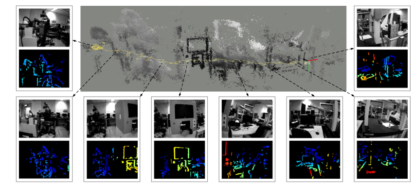 
Рис. 14.    Расчетная траектория движения камеры и трехмерная реконструкция последовательности hkust_lab. Вычисленные обратные карты глубины в выбранных точках обзора визуализируются последовательно, слева направо. Кадры интенсивности показаны только для визуализации.

Приведена оценка предложенной системы на примере сцены hkust_lab, собранной с помощью стереокамеры. Сцена представляет собой загроможденную среду, состоящую из различных машинных установок. Стереокамера была ручной и перемещалась слева направо при локально зацикленном поведении. Трехмерное облако точек вместе с траекторией движения датчика отображаются на экране.
на рис. 14. 
Кроме того, показаны оцененные обратные карты глубины на выбранных ракурсах.

=== Эксперименты в условиях низкой освещенности и HDR-среды

Помимо оценки в условиях нормальной освещенности, мы тестируем систему VO в сложных условиях для камер, основанных на кадрах. Для этого мы запустили алгоритм на двух сериях, собранных в темной комнате. Одна из них освещена лампой

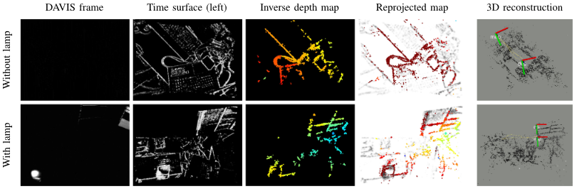 
Рис. 15. Сцены с низкой освещенностью и HDR. Верхний ряд: результаты в темной комнате; нижний ряд: результаты в темной комнате с направленной лампой. Слева направо: полутоновые кадры (только для визуализации), временные поверхности, расчетные карты глубины, репроецированные карты на негативы временных поверхностей (отслеживание) и 3-D реконструкция с наложенными оценками траектории движения камеры, соответственно.

для увеличения диапазона изменения яркости сцены, создавая условия высокого динамического диапазона. Результаты показаны на рис. 15. В таких условиях датчик DAVIS на основе кадров (с динамическим диапазоном 55 дБ) практически ничего не видит в темных областях, используя встроенную автоэкспозицию, что привело бы к сбою в работе конвейеров VO, работающих с этой визуальной модальностью. В отличие от этого, представленный метод, основанный на событиях, способен устойчиво работать в таких сложных условиях освещенности благодаря чуствительности и высокого разрешения событийных камер (диапазон 120 дБ).

=== Вычислительная производительность
Вышеописанная система стереовизуальной одометрии реализована на языке C++ в ROS и работает в реальном времени на ноутбуке с процессором Intel Core i7-8750H. 
// Ее вычислительная производительность составляет
// сведены в Таблицу VII. 
Для ускорения обработки некоторые узлы (отображения и отслеживания) реализованы с использованием технологии гиперпоточности.
//  Количество потоков, используемых каждым узлом, указано в скобках рядом с названием узла.
// ТАБЛИЦА VII
// ВЫЧИСЛИТЕЛЬНАЯ ПРОИЗВОДИТЕЛЬНОСТЬ

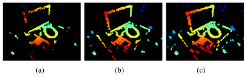 
Рис. 16. Влияние количества событий, используемых для (обратной) оценки глубины, на плотность слитой карты глубины. (a) 500 событий. (b) 1000 событий. (в) 2000 событий.

Создание карт "время-поверхность" занимает около 5-10 мс, в зависимости от разрешения датчика. Узел инициализации, активный только во время загрузки, занимает 12-17 мс (в зависимости от разрешения датчика) для создания первой локальной карты (карта глубины, заданная методом SGM и замаскированная картой событий).
Узел сопоставления использует 4 потока и занимает около 41 мс, расходуясь на три основные функции. 1) Функция сопоставления занимает 6 мс для поиска 1000 соответствующих пятен на паре временных поверхностей. Успешность совпадения составляет 40-50%, в зависимости от того, насколько хорошо сохраняется пространственно-временная согласованность в данных.
2) Функция уточнения глубины возвращает 500 обратных оценок глубины за 15 мс. 3) Функция слияния (шаги распространения и обновления) выполняет 60 000 операций за 20 мс. Таким образом, узел отображения работает с типичной частотой 20 Гц.
Что касается выбора количества событий, учитываемых при обратной оценке глубины (т.е. 1000, как упоминалось ранее), мы обосновываем его, показывая его влияние на плотность структуры оценочных карт глубины. На рис. 16 показаны результаты картографирования с использованием 500, 1000 и 2000 событий для обратной оценки глубины. Выбираются эти события случайным образом из последних 10 000 событий. Для корректного сравнения количество шагов слияния остается постоянным. Как видно, чем больше событий используется, тем более плотной становится обратная карта глубины. 

Карта, полученная при использовании 500 событий, является самой ненасыщенной. Тажке заметно, что использование 1000 или 2000 событий дает практически одинаковую плотность реконструкции, последний вариант (2000 событий) более затратный с вычислительной точки зрения (время вычислений примерно пропорционально количеству событий), поэтому для работы в реальном времени лучше использовать 1000 событий.
Узел слежения использует 2 потока и требует 10 мс для решения задачи оценки позы с помощью IRLS-решателя (партия из 300 точек случайным образом выбирается на каждой итерации и выполняется не более пяти итераций). Следовательно, алгоритм может работать с частотой до 100 Гц (0.36 метра смещения на кадр при движении автомобиля со скоростью 100 км/ч).

// === Обсуждение: Отсутствующие края в реконструкциях
// Здесь мы отмечаем эффект, который проявляется в некоторых реконструкциях, даже когда они вычисляются с использованием истинных поз (см. раздел VI- C). Мы наблюдаем, что края, параллельные базовой линии стереосистемы, такие как верхний край монитора в rpg_reader и обручи на бочке в upenn_flying3 (см. рис. 12), трудно восстановить независимо от движения. Все стерео методы страдают от этого: хотя GTS, SGM и CopNet могут вернуть оценки глубины для этих параллельных структур, они обычно ненадежны; наш метод способен рассуждать о неопределенности и, следовательно, отвергает такие оценки. В этом отношении,

// image::3-12-2021-08-38-58-AM.png[] 
// Рис. 17. Неопределенность глубины позволяет отфильтровать ненадежные оценки. (a) Временная поверхность. (b) (Обратная) неопределенность глубины. (c) Карта глубин до обрезки оценок с низкой неопределенностью. (d) Карта глубин после обрезки оценок с низкой неопределенностью.

// На рис. 17 показаны две горизонтальные детали [выделенные желтыми эллипсами на рис. 17(a)] и соответствующие им неопределенности [см. рис. 17(b)], которые больше, чем у других краев. Путем порогового выделения карты неопределенности глубины [см. рис. 17(c)] мы получаем более надежную, хотя и более разреженную карту глубины [см. рис. 17(d)]. Улучшение полноты реконструкций, страдающих от вышеупомянутого эффекта, остается в качестве будущей работы.

// === Зависимость пространственно-временной согласованности от движения
// Временные поверхности зависят от движения, и, следовательно, даже в случае отсутствия шума предложенный критерий пространственно-временной согласованности может быть не совсем верным, когда стереосистема претерпевает некоторые специфические движения. 

// Одним из крайних случаев может быть чистое вращение левой камеры вокруг своей оптической оси; таким образом, правая камера будет вращаться и переводиться. Интуитивно понятно, что дополнительный компонент перевода правой камеры создаст пространственно-временную несогласованность между временными поверхностями слева и справа, в результате чего пострадает модуль отображения. Чтобы проанализировать чувствительность модуля отображения к пространственно-временной согласованности, мы провели следующий эксперимент (см. рис. 18). Мы использовали симулятор камеры событий [70] для создания последовательностей с идеальным контролем над движением. В частности, мы генерировали последовательности с чистым вращением левой камеры вокруг оптической оси (оси Z) и сравнивали результаты отображения с результатами чистого поступательного движения вдоль оси X или Y камеры. Слитые карты глубины были немного хуже в первом случае (отчасти потому, что меньше событий срабатывает в центре плоскости изображения), но они все равно были точными в большинстве пикселей [см. рис. 18(a) и (b)]. Кроме того, мы проанализировали темпо-ральную несогласованность с помощью гистограммы временных остатков (как на рис. 6). Гистограмма остатков для поворота вокруг оси Z [см. рис. 18(d)] шире, чем для перевода вокруг осей X/Y [см. рис. 18(c)]. Численно,

// условиях. Мы также продемонстрировали потенциальные преимущества, которые дают камеры событий для стерео SLAM в сложных условиях освещенности. Система эффективна с вычислительной точки зрения и работает в реальном времени на стандартном процессоре. Программное обеспечение, конструкция стереосистемы и наборы данных, использованные для оценки, были открытыми. Дальнейшая работа может включать объединение предложенного метода с инерциальными наблюдениями (т.е. визуально-инерциальная одометрия стерео на основе событий) и исследование новых методов поиска соответствий во времени на каждой камере событий (т.е. "временное" стерео на основе событий). Эти темы тесно связаны с рассматриваемой здесь проблемой событийного стерео VO.

// image::3-12-2021-09-26-00-AM.png[] 
// Рис. 18.
// нализ пространственно-временной согласованности. (a), (b) Обратная оценка глубины при двух различных типах движения. (c), (d) Соответствующие гистограммы временных остатков. Окружение: toy_room в наборе данных[9]. (a) (Инверсная) карта глубины при чистом переводе вдоль оси Y. (b) (обратная) карта глубины при чистом вращении вокруг оси Z. (c) Распределение остатков для чистого перевода вдоль оси Y.
// (d) Распределение остатков для чистого вращения вокруг оси Z.

// масштабные значения t-распределения составляют strans_Y = 14,995 и srot_Z = 21,838. По сравнению с данными на рис. 6, остатки на рис. 18(d) похожи на остатки последовательности upenn_flying1.
// Мы пришли к выводу, что, несмотря на то, что временные поверхности не зависят от движения, мы не наблюдали значительной временной несогласованности, которая бы разрушила систему в априори сложных движениях для стерео. На самом деле предложенный метод хорошо работает на практике, как показали все предыдущие эксперименты с реальными данными. Мы оставляем более теоретический и детальный анализ таких движений для будущих исследований, поскольку считаем, что в данной работе рассматривается наиболее общий случай движения.

== Общий анализ системы

Представленная система визуальной стерео одометрии Event-Based Stereo Visual Odometry на основе событий для пары калиброванных и синхронизированных событийных камер в стерео конфигурации показывает хорошую производительность, точность и позволяет осуществлять работу с новым типом камер с большим разрешением и частотой, не подерживаемых в стандартных ORB-SLAM методах. Это первая опубликованная работа, в которой решается данная проблема. 

Описанный метод отображения основан на оптимизации объективной функции, предназначенной для измерения пространственно-временной согласованности потоков стереособытий. Для повышения плотности и точности восстановленной трехмерной структуры использована стратегия слияния, основанная на изученных вероятностных характеристиках оцененной обратной глубины. Метод отслеживания основан на 3d-2d регистрации, которая использует природу поля расстояний, присущую компактному и эффективному представлению событий (временные поверхности).

Приведены данные оценки работы системы на общедоступных наборах данных, которые демонстрируют универсальность данной системы. Производительность сопоставима со зрелыми, современными методами визуальной локализаци и навигации для работы стереокамер в нормальных условиях.

== ССЫЛКИ

E. Mueggler, G. Gallego, H. Rebecq, and D. Scaramuzza, "Continuous- time visual-inertial odometry for event cameras," IEEE Trans. Robot. , vol. 34, no. 6, pp. 1425-1440, Dec. 2018.
D. Вайкерсдорфер, Д. Б. Адриан, Д. Кремерс и Дж. Конрадт, "Событийный 3D SLAM с датчиком динамического зрения, дополненным глубиной", в Proc. IEEE Int. Conf. Robot. Autom. , 2014, pp. 359-364.
A. Censi и D. Scaramuzza, "Low-latency event-based visual odometry," in Proc. IEEE Int. Conf. Robot. Autom. , 2014, pp. 703-710.
B. Kueng, E. Mueggler, G. Gallego, and D. Scaramuzza, "Low-latency visual odometry using event-based feature tracks," in Proc. IEEE/RSJ Int. Conf. Intell. Robot. Syst. , 2016, pp. 16-23.
Г. Клейн и Д. Мюррей, "Параллельное отслеживание и отображение для небольших рабочих пространств AR", в Proc. IEEE ACM Int. Symp. Mixed Augmented Reality, Nara, Japan, Nov. 2007, pp. 225-234.
Y. Zhou, G. Gallego, H. Rebecq, L. Kneip, H. Li, and D. Scaramuzza, "Semi-dense 3D reconstruction with a stereo event camera," in Proc. Eur. Conf. Comput. Vis. , 2018, pp. 242-258.
J. Kogler, M. Humenberger, and C. Sulzbachner, "Event-based stereo matching approaches for frameless address event stereo data," Proc. Int. Symp. Adv. Vis. Comput., 2011, pp. 674-685.
P. Rogister, R. Benosman, S.-H. Ieng, P. Lichtsteiner, and T. Delbruck, "Asynchronous event-based binocular stereo matching," IEEE Trans. Neu- ral Netw. Learn. Syst. , том 23, № 2, стр. 347-353, февраль 2012 г.
L. A. Camunas-Mesa, T. Serrano-Gotarredona, S. H. Ieng, R. B. Benos- man, and B. Linares-Barranco, "On the use of orientation filters for 3D re- construction in event-driven stereo vision," Front. Neurosci. , vol. 8, no. 48, pp. 1-17, 2014.
R. Хартли и А. Зиссерман, Геометрия множественных представлений в компьютерном зрении,
2-е изд. Cambridge, U.K.: Cambridge Univ. Press, 2003.
S.-H. Ieng, J. Carneiro, M. Osswald, and R. Benosman, "Neuromor- phic event-based generalized time-based stereovision," Front. Neurosci. , vol. 12, no. 442, pp. 1-13, 2018.
C. Posch, D. Matolin, and R. Wohlgenannt, "A QVGA 143 dB dynamic range frame-free PWM image sensor with lossless pixel-level video com- pression and time-domain CDS," IEEE J. Solid-State Circuits, vol. 46, no. 1, pp. 259-275, Jan. 2011.
E. Piatkowska, A. N. Belbachir, and M. Gelautz, "Cooperative and asyn- chronous stereo vision for dynamic vision sensors," Meas. Sci. Technol. , vol. 25, no. 5, Apr. 2014, Art. no. 055108.
M. Фирузи и Дж. Конрадт, "Асинхронное кооперативное стереосопоставление на основе событий с использованием нейроморфных кремниевых ретин", Neural Proc. Lett. , vol. 43, no. 2, pp. 311-326, 2016.
M. Osswald, S.-H. Ieng, R. Benosman, and G. Indiveri, "A spiking neural network model of 3D perception for event-based neuromorphic stereo vision systems," Sci. Rep. , vol. 7, no. 1, pp. 1-12, Jan. 2017.
D. Марр и Т. Поджио, "Кооперативное вычисление стереодиспаратности".
Science, vol. 194, no. 4262, pp. 283-287, 1976.
L. Штеффен, Д. Райхард, Й. Вайнланд, Й. Кайзер, А. Рённау и Р. Диллманн, "Нейроморфное стереозрение: Обзор биоинспирированных сенсоров и алгоритмов", Front. Neurorobot. , vol. 13, no. 275, pp. 1-20, 2019.
H. Rebecq, G. Gallego, E. Mueggler, and D. Scaramuzza, "EMVS: Event- based multi-view stereo-3D reconstruction with an event camera in real- time," Int. J. Comput. Vis. , vol. 126, no. 12, pp. 1394-1414, Dec. 2018.
Г. Галлего, Х. Ребек и Д. Скарамуцца, "Единая схема максимизации контраста для камер событий, с приложениями к оценке движения, глубины и оптического потока", в Proc. IEEE Conf. Comput. Vis. Pattern Recognit. , 2018, pp. 3867-3876.
M. Кук, Л. Гугельманн, Ф. Джуг, К. Краутц и А. Штегер, "Взаимодействующие карты для быстрой визуальной интерпретации", в Proc. Int. Joint Conf. Neural Netw. , 2011, pp. 770-776.
H. Kim, A. Handa, R. Benosman, S.-H. Ieng, and A. J. Davison, "Simulta- neous mosaicing and tracking with an event camera," in Proc. Brit. Mach. Vis. Conf. , 2014, pp. 1-12.
C. Райнбахер, Г. Мунда и Т. Пок, "Панорамное отслеживание в реальном времени для камер событий", в Proc. IEEE Int. Conf. Comput. Photography, 2017, pp. 1-9.
D. Вайкерсдорфер и Дж. Конрадт, "Фильтрация частиц на основе событий для самолокализации робота", в Proc. IEEE Int. Conf. Robot. Биомиметика, 2012, стр. 866-870.
D. Вайкерсдорфер, Р. Хоффманн и Дж. Конрадт, "Одновременная локализация и отображение для систем технического зрения, основанных на событиях", в Proc. Int. Conf. Comput. Vis. Syst. , 2013, pp. 133-142.
E. Mueggler, B. Huber, and D. Scaramuzza, "Event-based, 6-DOF pose tracking for high-speed maneuvers," in Proc. IEEE/RSJ Int. Conf. Intell. Robot. Syst. , 2014, pp. 2761-2768.
Г. Галлего, М. Гериг и Д. Скарамуцца, "Фокус - это все, что вам нужно: Функции потерь для видения, основанного на событиях", в Proc. IEEE Conf. Comput. Vis. Pattern Recognit. , 2019, pp. 12 272-12281.
D. Миглиоре (Prophesee), "Чувствительность мира с помощью камер, основанных на событиях", в IEEE Int. Conf. Robot. Autom. Workshops, Jun. 2020. [Online]. Avail- able:https://robotics.sydney.edu.au/icra-workshop/
X. Lagorce, G. Orchard, F. Gallupi, B. E. Shi, and R. Benosman, "HOTS: Иерархия временных поверхностей на основе событий для распознавания образов", IEEE Trans. Pattern Anal. Mach. Intell. , vol. 39, no. 7, pp. 1346-1359, Jul. 2017.
M. Quigley et al. , "ROS: операционная система для роботов с открытым исходным кодом", in IEEE Int. Conf. Robot. Autom. Workshops, May 2009, pp. 1-6.
H. Хиршмюллер, "Стереообработка с помощью полуглобального соответствия и взаимной информации", IEEE Trans. Pattern Anal. Mach. Intell. , том 30, № 2, стр. 328-341, февраль 2008.
S.-C. Лю и Т. Дельбрук, "Нейроморфные сенсорные системы", Current Opin. Neurobiol. , vol. 20, no. 3, pp. 288-295, 2010.
T. Дельбрук, "Безкадровое динамическое цифровое зрение", в Proc. Int. Symp. Secure-Life Electron., 2008, pp. 21-26.
D. Gehrig, A. Loquercio, K. G. Derpanis, and D. Scaramuzza, "End-to-end learning of representations for asynchronous event-based data," in Proc. Int. Conf. Comput. Vis. , 2019, pp. 5633-5643.
R. Benosman, C. Clercq, X. Lagorce, S.-H. Ieng, and C. Bartolozzi, "Event-based visual flow," IEEE Trans. Neural Netw. Learn. Syst. , vol. 25, no. 2, pp. 407-417, Feb. 2014.
A. Z. Zhu, L. Yuan, K. Chaney, and K. Daniilidis, "EV-FlowNet: Самоконтролируемая оценка оптического потока для камер, основанных на событиях", в Proc. Robot., Sci. Syst. Pittsburgh, Pennsylvania, Jun. 2018, pp. 1-9, doi: 10.15607/RSS.2018.XIV.062.
J. Энгель, Й. Шёпс и Д. Кремерс, "LSD-SLAM: крупномасштабный ди-ректный монокулярный SLAM", в Proc. Eur. Conf. Comput. Vis. , 2014, pp. 834-849.
Y. Zhou, H. Li, and L. Kneip, "Canny-VO: визуальная одометрия с RGB- D камерами на основе геометрического выравнивания краев 3-D-2-D", IEEE Trans. Robot. , vol. 35, no. 1, pp. 184-199, Feb. 2019.
R. Benosman, S.-H. Ieng, P. Rogister, and C. Posch, "Asynchronous event- based hebbian epipolar geometry," IEEE Trans. Neural Netw. , том 22, № 11, стр. 1723-1734, ноябрь 2011.
R. А. Ньюкомб, С. Дж. Лавгроув и А. Дж. Дэвисон, "DTAM: плотное отслеживание и отображение в реальном времени", в Proc. Int. Conf. Comput. Vis. , 2011, pp. 2320-2327.
A. Z. Zhu, D. Thakur, T. Ozaslan, B. Pfrommer, V. Kumar, and K. Daniilidis, "The multivehicle stereo event camera dataset: Набор данных камер событий для трехмерного восприятия", IEEE Robot. Autom. Lett. , vol. 3, no. 3, pp. 2032-2039, Jul. 2018.
S. Kotz and S. Nadarajah, Multivariate T-Distributions and Their Appli- cations. Cambridge, U.K.: Cambridge Univ. Press, 2004.
C. Керл, Дж. Штурм и Д. Кремерс, "Надежная оценка одометрии для камер RGB- D", в Proc. IEEE Int. Conf. Robot. Autom. , 2013, pp. 3748-3754.
E. Мюгглер, Х. Ребек, Г. Галлего, Т. Дельбрук и Д. Скарамуцца, "Набор данных и симулятор событийной камеры: Данные на основе событий для оценки позы, визуальной одометрии и SLAM", Int. J. Robot. Res. , vol. 36, no. 2, pp. 142-149, 2017.
M. Рот, Т. Ардешири, Э. Озкан и Ф. Густафссон, "Надежная байесовская фильтрация и сглаживание с использованием t-распределения студента", 2017, с. 1-34.
S. Бейкер и И. Мэтьюс, "Лукас-канада 20 лет спустя: A unifying frame- work," Int. J. Comput. Vis. , vol. 56, no. 3, pp. 221-255, 2004.
A. Кейли, "Об алгебраической структуре ортогональной группы и других классических групп в поле характеристики ноль или простой характеристики", Reine Angewandte Mathematik, vol. 32, no. 1846, pp. 1-6, 1846.
E. Piatkowska, J. Kogler, N. Belbachir, and M. Gelautz, "Improved cooperative stereo matching for dynamic vision sensors with ground truth evaluation," in Proc. IEEE Conf. Comput. Vis. Pattern Recognit. Workshops, 2017, pp. 53-60.
A. Z. Zhu, Y. Chen, and K. Daniilidis, "Realtime time time synchronized event- based stereo," in Proc. Eur. Conf. Comput. Vis. , 2018, pp. 438-452.
C. Brandli et al., "Адаптивное выделение линий импульсным лазером для реконструкции местности с помощью динамического датчика зрения", Front. Neurosci. , vol. 7, no. 275, pp. 1-9, 2014.

J. Sturm, N. Engelhard, F. Endres, W. Burgard, and D. Cremers, "A bench- mark for the evaluation of RGB-D SLAM systems," in Proc. IEEE/RSJ Int. Conf. Intell. Robot. Syst. Oct. 2012, pp. 573-580.
R. Мур-Артал и Ж. Д. Тардос, "ORB-SLAM2: Система SLAM с открытым исходным кодом для монокулярных, стерео и RGB-D камер", IEEE Trans. Robot. , vol. 33, no. 5, pp. 1255-1262, Oct. 2017.
P. J. Besl и N. D. McKay, "Метод регистрации трехмерных форм", IEEE Trans. Pattern Anal. Mach. Intell. , том 14, № 2, стр. 239-256, февраль 1992 года.
B. Son et al. , "A 640 480 dynamic vision sensor with a 9 μm pixel and 300Meps address-event representation," in Proc. IEEE Intl. Solid-State Circuits Conf. , 2017, pp. 66-67.
M. Лю и Т. Дельбрук, "Адаптивный алгоритм оптического потока с временными срезами и блочным сопоставлением для динамических датчиков зрения", в Proc. Mach. Vis. Conf. , 2018, pp. 1-12.
H. Ребек, Д. Гериг и Д. Скарамуцца, "ESIM: открытый симулятор камеры событий", в Proc. Conf. Robot. Learn. , 2018, pp. 969-982.
Гильермо Гальего (старший член IEEE) получил степень доктора философии в области электротехники и вычислительной техники в Технологическом институте Джорджии, Атланта, штат Джорджия, США, в 2011 году,
Он является доцентом кафедры электротехники и вычислительной техники Берлинского технического университета и Центра цифрового будущего Эйнштейна, оба в Берлине, Германия. Его докторская степень была поддержана стипендией Фулбрайта. С 2011 по 2014 год он был исследователем по программе Марии Кюри в Мадридском политехническом университете (Испания).
С 2014 по 2019 год он был постдокторским исследователем в Группе робототехники и перцепции Цюрихского университета, Швейцария. Его научные интересы включают робототехнику, компьютерное зрение, обработку сигналов, оптимизацию и геометрию.

В 2012 году И Чжоу получил степень бакалавра наук в области авиастроения и машиностроения в Пекинском университете аэронавтики и астронавтики, Пекин, Китай, а в 2018 году - степень доктора философии в области компьютерных наук и машиностроения в Исследовательской школе машиностроения Австралийского национального университета, Канберра, ACT, Австралия.
С 2019 года он является постдокторским исследователем в Гонконгском университете науки и техники, Гонконг. Его исследовательские интересы включают визуальную одометрию/ одновременную локализацию и картографию.
пинг, геометрические проблемы в компьютерном зрении и динамические датчики зрения.
В 2017 году доктор Чжоу получил стипендию NCCR за исследования в области видения, основанного на событиях, от Швейцарского национального научного фонда через Национальный центр компетенции в области исследовательской робототехники.

Шаоцзе Шен (член IEEE) получил степень бакалавра электронной инженерии в Гонконгском университете науки и технологии, Гонконг, в 2009 году, степень магистра робототехники и степень доктора философии в области электротехники и систем в Университете Пенсильвании, Филадельфия, штат Пенсильвания, США, в 2011 и 2014 годах соответственно.
Он начал работать на факультете электронной и компьютерной инженерии Гонконгского университета науки и технологии в сентябре 2014 года в качестве ассистента профессора и был повышен до доцента.
Профессор в 2020 году. В сферу его научных интересов входят робототехника и беспилотные летательные аппараты, с упором на оценку состояния, объединение датчиков, компьютерное зрение, локализацию и картографирование, а также автономную навигацию в сложных средах.

[1]	P. Lichtsteiner, C. Posch, and T. Delbruck, “A 128 120 dB 15 μs latency asynchronous temporal contrast vision sensor,” IEEE J. Solid-State Cir- cuits, vol. 43, no. 2, pp. 566–576, Feb. 2008.
[2]	G. Gallego et al., “Event-based vision: A survey,” IEEE Trans. Pattern Anal. Mach. Intell., 2020, doi: 10.1109/TPAMI.2020.3008413.
[3]	X. Lagorce, C. Meyer, S.-H. Ieng, D. Filliat, and R. Benosman, “Asyn- chronous event-based multikernel algorithm for high-speed visual fea- tures tracking,” IEEE Trans. Neural Netw. Learn. Syst., vol. 26, no. 8, pp. 1710–1720, Aug. 2015.
[4]	A. Z. Zhu, N. Atanasov, and K. Daniilidis, “Event-based feature tracking with probabilistic data association,” in Proc. IEEE Int. Conf. Robot. Autom., 2017, pp. 4465–4470.
[5]	D. Gehrig, H. Rebecq, G. Gallego, and D. Scaramuzza, “EKLT: Asyn- chronous photometric feature tracking using events and frames,” Int. J. Comput. Vis., vol. 128, pp. 601–618, 2020.
[6]	E. Mueggler, G. Gallego, and D. Scaramuzza, “Continuous-time trajectory estimation for event-based vision sensors,” in Proc. Robot., Sci. Syst., Rome, Italy, Jun. 2015, pp. 1–9, doi: 10.15607/RSS.2015.XI.036.
[7]	G. Gallego, J. E. A. Lund, E. Mueggler, H. Rebecq, T. Delbruck, and
D. Scaramuzza, “Event-based, 6-DOF camera tracking from photometric depth maps,” IEEE Trans. Pattern Anal. Mach. Intell., vol. 40, no. 10, pp. 2402–2412, Oct. 2018.
[8]	G. Gallego and D. Scaramuzza, “Accurate angular velocity estimation with an event camera,” IEEE Robot. Autom. Lett., vol. 2, no. 2, pp. 632–639, Apr. 2017.
[9]	S. Bryner, G. Gallego, H. Rebecq, and D. Scaramuzza, “Event-based, direct camera tracking from a photometric 3D map using nonlinear opti- mization,” in Proc. IEEE Int. Conf. Robot. Autom., 2019, pp. 325–331.
[10]	J. Conradt, M. Cook, R. Berner, P. Lichtsteiner, R. J. Douglas, and T. Delbruck, “A pencil balancing robot using a pair of AER dynamic vision sensors,” in Proc. IEEE Int. Symp. Circuits Syst., 2009, pp. 781–784.
[11]	T. Delbruck and M. Lang, “Robotic goalie with 3 ms reaction time at 4% CPU load using event-based dynamic vision sensor,” Front. Neurosci., vol. 7, no. 223, pp. 1–7, 2013.
[12]	D. Falanga, K. Kleber, and D. Scaramuzza, “Dynamic obstacle avoidance for quadrotors with event cameras,” Sci. Robot., vol. 5, no. 40, Mar. 2020, Art. no. eaaz9712.
[13]	H. Kim, S. Leutenegger, and A. J. Davison, “Real-time 3D reconstruction and 6-DoF tracking with an event camera,” in Proc. Eur. Conf. Comput. Vis., 2016, pp. 349–364.
[14]	H. Rebecq, T. Horstschäfer, G. Gallego, and D. Scaramuzza, “EVO: A geometric approach to event-based 6-DOF parallel tracking and mapping in real-time,” IEEE Robot. Autom. Lett., vol. 2, no. 2, pp. 593–600, Apr. 2017.
[15]	A. Rosinol Vidal, H. Rebecq, T. Horstschaefer, and D. Scaramuzza, “Ultimate SLAM? Combining events, images, and IMU for robust visual SLAM in HDR and high speed scenarios,” IEEE Robot. Autom. Lett., vol. 3, no. 2, pp. 994–1001, Apr. 2018.
[16]	E. Mueggler, G. Gallego, H. Rebecq, and D. Scaramuzza, “Continuous- time visual-inertial odometry for event cameras,” IEEE Trans. Robot., vol. 34, no. 6, pp. 1425–1440, Dec. 2018.
[17]	D. Weikersdorfer, D. B. Adrian, D. Cremers, and J. Conradt, “Event-based 3D SLAM with a depth-augmented dynamic vision sensor,” in Proc. IEEE Int. Conf. Robot. Autom., 2014, pp. 359–364.
[18]	A. Censi and D. Scaramuzza, “Low-latency event-based visual odometry,” in Proc. IEEE Int. Conf. Robot. Autom., 2014, pp. 703–710.
[19]	B. Kueng, E. Mueggler, G. Gallego, and D. Scaramuzza, “Low-latency visual odometry using event-based feature tracks,” in Proc. IEEE/RSJ Int. Conf. Intell. Robot. Syst., 2016, pp. 16–23.
[20]	G. Klein and D. Murray, “Parallel tracking and mapping for small AR workspaces,” in Proc. IEEE ACM Int. Symp. Mixed Augmented Reality, Nara, Japan, Nov. 2007, pp. 225–234.
[21]	Y. Zhou, G. Gallego, H. Rebecq, L. Kneip, H. Li, and D. Scaramuzza, “Semi-dense 3D reconstruction with a stereo event camera,” in Proc. Eur. Conf. Comput. Vis., 2018, pp. 242–258.
[22]	J. Kogler, M. Humenberger, and C. Sulzbachner, “Event-based stereo matching approaches for frameless address event stereo data,” Proc. Int. Symp. Adv. Vis. Comput., 2011, pp. 674–685.
[23]	P. Rogister, R. Benosman, S.-H. Ieng, P. Lichtsteiner, and T. Delbruck, “Asynchronous event-based binocular stereo matching,” IEEE Trans. Neu- ral Netw. Learn. Syst., vol. 23, no. 2, pp. 347–353, Feb. 2012.
[24]	L. A. Camunas-Mesa, T. Serrano-Gotarredona, S. H. Ieng, R. B. Benos- man, and B. Linares-Barranco, “On the use of orientation filters for 3D re- construction in event-driven stereo vision,” Front. Neurosci., vol. 8, no. 48, pp. 1–17, 2014.
[25]	R. Hartley and A. Zisserman, Multiple View Geometry in Computer Vision,
2nd ed. Cambridge, U.K.: Cambridge Univ. Press, 2003.
[26]	S.-H. Ieng, J. Carneiro, M. Osswald, and R. Benosman, “Neuromor- phic event-based generalized time-based stereovision,” Front. Neurosci., vol. 12, no. 442, pp. 1–13, 2018.
[27]	C. Posch, D. Matolin, and R. Wohlgenannt, “A QVGA 143 dB dynamic range frame-free PWM image sensor with lossless pixel-level video com- pression and time-domain CDS,” IEEE J. Solid-State Circuits, vol. 46, no. 1, pp. 259–275, Jan. 2011.
[28]	E. Piatkowska, A. N. Belbachir, and M. Gelautz, “Cooperative and asyn- chronous stereo vision for dynamic vision sensors,” Meas. Sci. Technol., vol. 25, no. 5, Apr. 2014, Art. no. 055108.
[29]	M. Firouzi and J. Conradt, “Asynchronous event-based cooperative stereo matching using neuromorphic silicon retinas,” Neural Proc. Lett., vol. 43, no. 2, pp. 311–326, 2016.
[30]	M. Osswald, S.-H. Ieng, R. Benosman, and G. Indiveri, “A spiking neural network model of 3D perception for event-based neuromorphic stereo vision systems,” Sci. Rep., vol. 7, no. 1, pp. 1–12, Jan. 2017.
[31]	D. Marr and T. Poggio, “Cooperative computation of stereo disparity,”
Science, vol. 194, no. 4262, pp. 283–287, 1976.
[32]	L. Steffen, D. Reichard, J. Weinland, J. Kaiser, A. Rönnau, and R. Dillmann, “Neuromorphic stereo vision: A survey of bio-inspired sen- sors and algorithms,” Front. Neurorobot., vol. 13, no. 275, pp. 1–20, 2019.
[33]	H. Rebecq, G. Gallego, E. Mueggler, and D. Scaramuzza, “EMVS: Event- based multi-view stereo-3D reconstruction with an event camera in real- time,” Int. J. Comput. Vis., vol. 126, no. 12, pp. 1394–1414, Dec. 2018.
[34]	G. Gallego, H. Rebecq, and D. Scaramuzza, “A unifying contrast maxi- mization framework for event cameras, with applications to motion, depth, and optical flow estimation,” in Proc. IEEE Conf. Comput. Vis. Pattern Recognit., 2018, pp. 3867–3876.
[35]	M. Cook, L. Gugelmann, F. Jug, C. Krautz, and A. Steger, “Interacting maps for fast visual interpretation,” in Proc. Int. Joint Conf. Neural Netw., 2011, pp. 770–776.
[36]	H. Kim, A. Handa, R. Benosman, S.-H. Ieng, and A. J. Davison, “Simulta- neous mosaicing and tracking with an event camera,” in Proc. Brit. Mach. Vis. Conf., 2014, pp. 1–12.
[37]	C. Reinbacher, G. Munda, and T. Pock, “Real-time panoramic tracking for event cameras,” in Proc. IEEE Int. Conf. Comput. Photography, 2017, pp. 1–9.
[38]	D. Weikersdorfer and J. Conradt, “Event-based particle filtering for robot self-localization,” in Proc. IEEE Int. Conf. Robot. Biomimetics, 2012, pp. 866–870.
[39]	D. Weikersdorfer, R. Hoffmann, and J. Conradt, “Simultaneous localiza- tion and mapping for event-based vision systems,” in Proc. Int. Conf. Comput. Vis. Syst., 2013, pp. 133–142.
[40]	E. Mueggler, B. Huber, and D. Scaramuzza, “Event-based, 6-DOF pose tracking for high-speed maneuvers,” in Proc. IEEE/RSJ Int. Conf. Intell. Robot. Syst., 2014, pp. 2761–2768.
[41]	G. Gallego, M. Gehrig, and D. Scaramuzza, “Focus is all you need: Loss functions for event-based vision,” in Proc. IEEE Conf. Comput. Vis. Pattern Recognit., 2019, pp. 12 272–12281.
[42]	D. Migliore (Prophesee), “Sensing the world with event-based cameras,” in IEEE Int. Conf. Robot. Autom. Workshops, Jun. 2020. [Online]. Avail- able:https://robotics.sydney.edu.au/icra-workshop/
[43]	X. Lagorce, G. Orchard, F. Gallupi, B. E. Shi, and R. Benosman, “HOTS: A hierarchy of event-based time-surfaces for pattern recognition,” IEEE Trans. Pattern Anal. Mach. Intell., vol. 39, no. 7, pp. 1346–1359, Jul. 2017.
[44]	M. Quigley et al., “ROS: An open-source robot operating system,” in IEEE Int. Conf. Robot. Autom. Workshops, May 2009, pp. 1–6.
[45]	H. Hirschmuller, “Stereo processing by semiglobal matching and mutual information,” IEEE Trans. Pattern Anal. Mach. Intell., vol. 30, no. 2, pp. 328–341, Feb. 2008.
[46]	S.-C. Liu and T. Delbruck, “Neuromorphic sensory systems,” Current Opin. Neurobiol., vol. 20, no. 3, pp. 288–295, 2010.
[47]	T. Delbruck, “Frame-free dynamic digital vision,” in Proc. Int. Symp. Secure-Life Electron., 2008, pp. 21–26.
[48]	D. Gehrig, A. Loquercio, K. G. Derpanis, and D. Scaramuzza, “End-to-end learning of representations for asynchronous event-based data,” in Proc. Int. Conf. Comput. Vis., 2019, pp. 5633–5643.
[49]	R. Benosman, C. Clercq, X. Lagorce, S.-H. Ieng, and C. Bartolozzi, “Event-based visual flow,” IEEE Trans. Neural Netw. Learn. Syst., vol. 25, no. 2, pp. 407–417, Feb. 2014.
[50]	A. Z. Zhu, L. Yuan, K. Chaney, and K. Daniilidis, “EV-FlowNet: Self- supervised optical flow estimation for event-based cameras,” in Proc. Robot., Sci. Syst., Pittsburgh, Pennsylvania, Jun. 2018, pp. 1–9, doi: 10.15607/RSS.2018.XIV.062.
[51]	J. Engel, J. Schöps, and D. Cremers, “LSD-SLAM: Large-scale di- rect monocular SLAM,” in Proc. Eur. Conf. Comput. Vis., 2014, pp. 834–849.
[52]	Y. Zhou, H. Li, and L. Kneip, “Canny-VO: Visual odometry with RGB- D cameras based on geometric 3-D-2-D edge alignment,” IEEE Trans. Robot., vol. 35, no. 1, pp. 184–199, Feb. 2019.
[53]	R. Benosman, S.-H. Ieng, P. Rogister, and C. Posch, “Asynchronous event- based hebbian epipolar geometry,” IEEE Trans. Neural Netw., vol. 22, no. 11, pp. 1723–1734, Nov. 2011.
[54]	R. A. Newcombe, S. J. Lovegrove, and A. J. Davison, “DTAM: Dense tracking and mapping in real-time,” in Proc. Int. Conf. Comput. Vis., 2011, pp. 2320–2327.
[55]	A. Z. Zhu, D. Thakur, T. Ozaslan, B. Pfrommer, V. Kumar, and K. Daniilidis, “The multivehicle stereo event camera dataset: An event camera dataset for 3D perception,” IEEE Robot. Autom. Lett., vol. 3, no. 3, pp. 2032–2039, Jul. 2018.
[56]	S. Kotz and S. Nadarajah, Multivariate T-Distributions and Their Appli- cations. Cambridge, U.K.: Cambridge Univ. Press, 2004.
[57]	C. Kerl, J. Sturm, and D. Cremers, “Robust odometry estimation for RGB- D cameras,” in Proc. IEEE Int. Conf. Robot. Autom., 2013, pp. 3748–3754.
[58]	E. Mueggler, H. Rebecq, G. Gallego, T. Delbruck, and D. Scaramuzza, “The event-camera dataset and simulator: Event-based data for pose estimation, visual odometry, and SLAM,” Int. J. Robot. Res., vol. 36, no. 2, pp. 142–149, 2017.
[59]	M. Roth, T. Ardeshiri, E. Özkan, and F. Gustafsson, “Robust bayesian filtering and smoothing using student’s t distribution,” 2017, pp. 1–34.
[60]	S. Baker and I. Matthews, “Lucas-kanade 20 years on: A unifying frame- work,” Int. J. Comput. Vis., vol. 56, no. 3, pp. 221–255, 2004.
[61]	A. Cayley, “About the algebraic structure of the orthogonal group and the other classical groups in a field of characteristic zero or a prime characteristic,” Reine Angewandte Mathematik, vol. 32, no. 1846, pp. 1–6, 1846.
[62]	E. Piatkowska, J. Kogler, N. Belbachir, and M. Gelautz, “Improved cooperative stereo matching for dynamic vision sensors with ground truth evaluation,” in Proc. IEEE Conf. Comput. Vis. Pattern Recognit. Workshops, 2017, pp. 53–60.
[63]	A. Z. Zhu, Y. Chen, and K. Daniilidis, “Realtime time synchronized event- based stereo,” in Proc. Eur. Conf. Comput. Vis., 2018, pp. 438–452.
[64]	C. Brandli et al., “Adaptive pulsed laser line extraction for terrain recon- struction using a dynamic vision sensor,” Front. Neurosci., vol. 7, no. 275, pp. 1–9, 2014.
 

 
[65]	J. Sturm, N. Engelhard, F. Endres, W. Burgard, and D. Cremers, “A bench- mark for the evaluation of RGB-D SLAM systems,” in Proc. IEEE/RSJ Int. Conf. Intell. Robot. Syst., Oct. 2012, pp. 573–580.
[66]	R. Mur-Artal and J. D. Tardós, “ORB-SLAM2: An open-source SLAM system for monocular, stereo, and RGB-D cameras,” IEEE Trans. Robot., vol. 33, no. 5, pp. 1255–1262, Oct. 2017.
[67]	P. J. Besl and N. D. McKay, “A method for registration of 3-D shapes,” IEEE Trans. Pattern Anal. Mach. Intell., vol. 14, no. 2, pp. 239–256, Feb. 1992.
[68]	B. Son et al., “A 640 480 dynamic vision sensor with a 9 μm pixel and 300Meps address-event representation,” in Proc. IEEE Intl. Solid-State Circuits Conf., 2017, pp. 66–67.
[69]	M. Liu and T. Delbruck, “Adaptive time-slice block-matching optical flow algorithm for dynamic vision sensors,” in Proc. Brit. Mach. Vis. Conf., 2018, pp. 1–12.
[70]	H. Rebecq, D. Gehrig, and D. Scaramuzza, “ESIM: An open event camera simulator,” in Proc. Conf. Robot. Learn., 2018, pp. 969–982.
