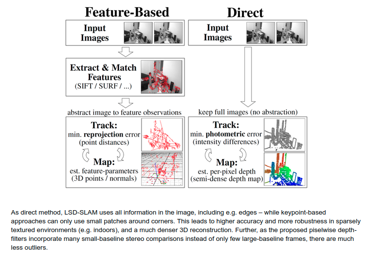
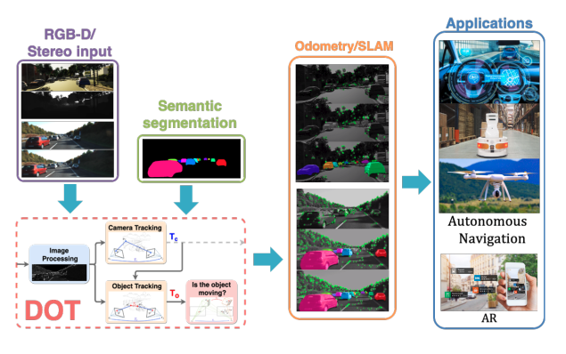
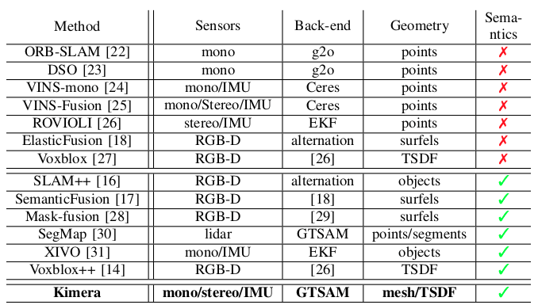
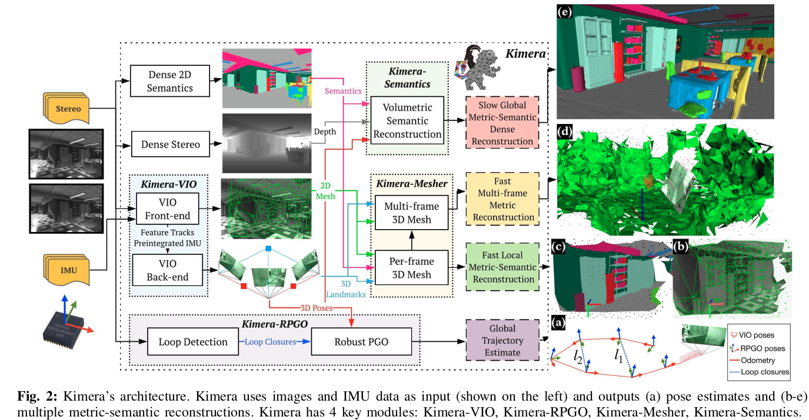

= reading on vslam

:toc: macro

// With the advent of smart devices, embedding cameras, inertial measurement units, visual SLAM (vSLAM),
// and visual-inertial SLAM (viSLAM)
//
// n this context, this paper conducts a review of
// popular SLAM approaches with a focus on vSLAM/viSLAM, both at fundamental and experimental levels. It starts with a
// structured overview of existing vSLAM and viSLAM designs and continues with a new classification of a dozen main state-of-
// the-art methods.

// smartphone localization:
Finally, the performance of vSLAM is experimentally assessed for the use case of pedestrian pose
estimation with a handheld device in urban environments.

// The performance of five open-source methods Vins-Mono, ROVIO, ORB-SLAM2, DSO, and LSD-SLAM

== работа алгоритма, этапы

=== Обработка входных данных.

Входные данные для работы алгоритма построения карты и навигации это набор изображений вдоль траектории движения, данные с сенсоров и время каждого кадра. В зависимости от устройства осуществляющего навигацию, конфигурация камер и сенсоров может отличаться.

Можно рассматривать для сравнения следующие конфигурации:

* RGBD-камера - камера глубины
* две синхронизированных камеры - стереосъемка
* лидар + камера

При доступных внешних сенсорах устройства, параллельно записывается одометрия и инерциальные данные. От применения внешних данных алгоритмы соответственно делятся на визуальную одометрию (VO) и визуально-инерциальную (VIO).

Алгоритм локализации и построения карты (SLAM) содержит как правило независимый блок для локализации (VO/VIO). Соответственно для одной реализации SLAM можно иметь различные независимые реализации для одометрии и локализации соответственно.

Основную сложность представляет алгоритм построения карты. Это многосоставной алгоритм. Для реализации построения карты в реальном времени необходимо соответственно проводить оптимизацию текущей карты в реальном времени. Для определенного набора данных может отсутствовать решение.

Основным требованием к алгоритму построения карты является его сходимость на наборе данных. Некоторые алгоритмы могут динамически отбрасывать из решения часть входных данных[].
Авторы алгоритма ORB-SLAM3 завляют о возможности использовать полный набор данных для получения решения.

=== Difference to keypoint-based methods

// Данные методы можно разделить на два класса: использующие изображение с камеры целиком и строящие плотную карту местности (direct-based SLAM), и признаковые методы, которые строят разреженную карту: из кадра извлекаются ключевые точки — наиболее выделяющиеся точки изображения, а остальная информация отбрасывается.

// https://vision.in.tum.de/research/vslam/lsdslam?redirect=1

Методы SLAM делятся по принципу построения карты на два класса, прямые и признаковые.

К прямым относится например lsdslam[]; алгоритм обрабатывает изображения напрямую и строит плотную карту местности (direct-based SLAM).

Алгоритмы из другой группы первоначально извлекают из кадра ключевые точки — наиболее выделяющиеся точки изображения, а остальную информацию отбрасывают. Существуют различные методы извлечения ключевых точек - дескрипторов (ORB, FAST, BRIEF, SIFT, SURF, ...). []
Принципиального отличия между методом извлечения ключевых точек нет.
Самым популярным методом кодирования дескрипторов с учетом точности и производительности является ORB.
Эти дескрипторы являются частью алгоритма ORB-SLAM.

Использования характерных точек изображения недостаточно для полного понимания окружения.

В ситуации автономного движения автомобиля по дороге важно понимать, принадлежит характерная точка на избражении к автомомобилю на дороге, к пешеходу, к элементу ограждения.

В ситуации с навигацией пешехода, необходимо уметь извлекать характерные точки для статичного окружения.

Можно сделать интуитивный вывод что алгоритмов класса ORB-SLAM для автономного движения недостаточно. В данной ситуации применяютя алгоритмы более высокого класса, решающие задачу динамического отлеживания объектов [DOT for visual SLAM ...].

// DOT: Dynamic Object Tracking for Visual SLAM, Irene Ballester Campos

// Семантический SLAM

Существует множество более высокоуровневых методов, которые могут улучшить точность решения навигации.

Семантические методы навигации: если извлечь семантическую информацию из изображений (границы объектов, объекты - машины, пешеходы), можно анализировать связаную с объектом информацию.

// В примере (), применение семантической визуальной одометрии позволило применить информацию с объектов вне зоны близкой видимости камеры. Учет удаленных объектов в алгоритме навигации позволил уменьшить ошибку позиционирования.
// // Алгоритм использует принцип семантического

посмотреть алгоритмы с учетом сегментации, сделать обзор

.Kimera: an Open-Source Library for Real-Time Metric-Semantic Localization and Mapping https://arxiv.org/abs/1910.02490

https://github.com/MIT-SPARK/Kimera-VIO

посмотреть то же для автомобилей, как используется

* "Камеры глубины — тихая революция (когда роботы будут видеть) Часть 1 / Хабр" https://habr.com/ru/post/457524/
* "Depth Sensing Takes Machine Vision into Another Dimension - EE Times Europe" https://www.eetimes.eu/depth-sensing-takes-machine-vision-into-another-dimension/
* "Real-Time High Resolution 3D Depth Sensing Enters the Next Round – Metrology and Quality News - Online Magazine" https://metrology.news/real-time-high-resolution-3d-depth-sensing-enters-the-next-round/
* "Products – Nerian Vision Technologies" https://nerian.com/products/
* "Depth Sensing Overview | Stereolabs" https://www.stereolabs.com/docs/depth-sensing/
* "Depth Sensors: Precision & Personal Privacy | Terabee" https://www.terabee.com/depth-sensors-precision-personal-privacy/
* "MIT-SPARK/Kimera-VIO: Visual Inertial Odometry with SLAM capabilities and 3D Mesh generation." https://github.com/MIT-SPARK/Kimera-VIO
* "[1910.02490] Kimera: an Open-Source Library for Real-Time Metric-Semantic Localization and Mapping" https://arxiv.org/abs/1910.02490
* "Vision-based SLAM: стерео- и depth-SLAM / Хабр" https://habr.com/ru/company/singularis/blog/279035/

// we have proposed a novel visual semantic odometry (VSO) frame-
// work that can be readily integrated into existing VO systems. Our method har-
// nesses the invariance of semantic object representations to incorporate medium-
// term constraints into the odometry objective. By appropriately handling the
// lack of structure of the semantic identity, we are able to effectively and signifi-
// cantly reduce translational drift
//
//
// Input Search. When dealing with cameras, the data con-
// tained in frames must first be extracted. Some methods use
// the pixel intensity to match different frames: they are called
// direct methods. In this case, the mapped elements can be
// pixel maps, i.e., the frame is relocated in the 3D map and each
// pixel is given its corresponding depth (Section 4.3). Other
// methods extract features (points in the zone of interest of
// the image, i.e., easily recognizable, or, alternatively, lines or
// curve segments) in each frame and use geometric constraints
// for matching. Feature extraction is a well-known field of
// computer vision. Feature descriptors often use intensity
// gradients to detect zones of interest. In this case, the mapped
// elements can be 3D poses of features. Famous descriptors
// include Harris [28], SURF [29], SIFT [30], FAST [31], and
// ORB [32].
